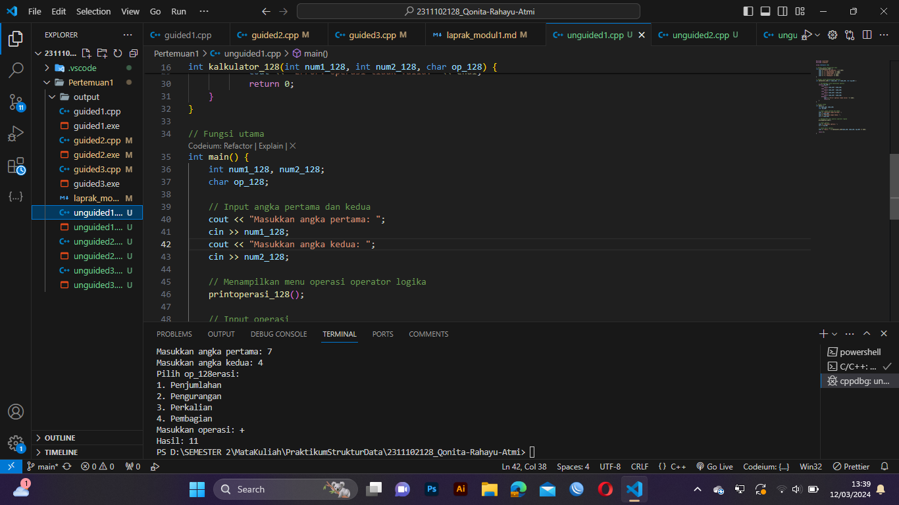
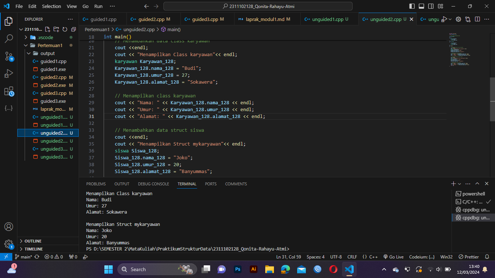
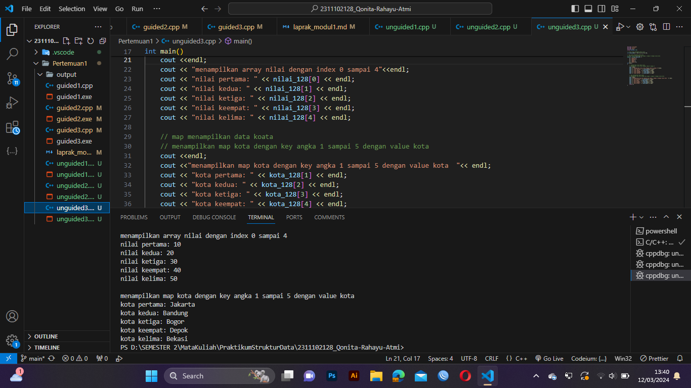

# <h1 align="center">Laporan Praktikum Modul Tipe Data</h1>
<h2 align="center">Qonita Rahayu Atmi-2311102128</h2>

## Dasar Teori

Tipe data adalah tipe data yang  disimpan  dalam  variabel. Tipe data menentukan bagaimana informasi disimpan, direpresentasikan, dan  diinterpretasikan. Tipe data berhubungan erat dengan memori  variabel karena tipe data variabel menentukan bagaimana kompiler mengisi memori. Tipe data juga menentukan  operasi dan operator mana yang dapat dilakukan dan digunakan pada variabel  yang dibentuk berdasarkan tipe data yang digunakan pada  pemrograman C++. Tipe data adalah bentuk penggabungan jenis data sesuai dengan kategori data, ukuran dan kegunaan data yang dapat ditampung oleh sebuah variabel. 

1. Tipe Data Primitif
Tipe data primitif adalah tipe data  yang hanya dapat menyimpan satu nilai di setiap  variabel. Tipe data  ini  merupakan tipe data dasar yang biasa digunakan pada program . Dimana  tipe  data  ini  memiliki fungsi dan ukuran  memori  yang tetap dan pasti, diantaranya:
- Integer: untuk menyimpan bilangan bulat, byte (8 byte), short (16 b), int (32 b), long (64 b)
- Float: untuk menyimpan bilangan bulat, float (32 byte), double(64 b), decimal(128 b), bigDecimal(256 b)
- Boolean:untuk menyimpan nilai boolean true dan false, boolean(1 bit)
- Char: untuk menyimpan bilangan bulat, char(1 byte)

2. Tipe Data Abstrak
Tipe  data abstrak adalah tipe data  tipe  data  Obyek  mulai  digunakan  pada pemrograman dengan  penggunaan  tipe  data  abstrak .Terdapat fitur Class dan struct sama sama mengelompokkan data dan fungsi terkait ke dalam tipe data dan untuk membungkus data abstrak. Bedanya dimana class private dan struct public.

3. Tipe Data Koleksi
Tipe data koleksi adalah tipe data yang berupa rangkaian atau kumpulan data ataupun obyek yang berindeks. Terdapat tiga tipe dasar yaitu:
- Array : koleksi statis dengan ukuran tetap dan hanya bisa mengelompokkan tipe data yang sama.
- vector : Berisi kumpulan elemen dengan tipe data yang sama. Setiap elemen memiliki indeks unik dan dapat diakses   secara langsung. Biasanya digunakan untuk menyimpan data berisi order yang  dapat dibuka secara acak.
- Map : koleksi  dinamis  dengan  ukuran  adaptif  dan  bisa  mengelompokkan tipe  data  yang  sama  ataupun  berbeda  dengan  menggunakan  pasangan key dan value.

## Guided 

### 1. [Tipe data primitif]

```C++
#include <iostream>
#include <iomanip>
using namespace std;
int main()
{
    char op;
    float num1, num2;

    // It allows user to enter operator i.e. +, -, *, /
    cout << "Enter operator (+, -, *, /): ";
    cin >> op;

    // It allows user to enter the operands
    cout << "Enter two operands: ";
    cin >> num1 >> num2;

    // Switch statement begins
    switch (op)
    {
    // If user enters +
    case '+':
        cout << "Result: " << num1 + num2;
        break;
    // If user enters -
    case '-':
        cout << "Result: " << num1 - num2;
        break;
    // If user enters *
    case '*':
        cout << "Result: " << num1 * num2;
        break;
    // If user enters /
    case '/':
        if (num2 != 0)
        {
            cout << "Result: " << fixed << setprecision(2) << num1 / num2;
        }
        else
        {
            cout << "Error! Division by zero is not allowed.";
        }
        break;
    // If the operator is other than +, -, * or /,
    // error message will display
    default:
        cout << "Error! Operator is not correct";
    } // switch statement ends
    return 0;
}
```
=> Penjelasan program
- Kode di atas adalah kode untuk perhitungan matematika (+, -, *, /) yang dimana kita menggunakan tipe data char untuk menampung simbol dan integer untuk menampung nilai angka. Kode akan berjalan sesuai dengan simbol yang di inputkan
(+, -, *, /) akan mengeksekusi angka inputan pertama dan kedua terkecuali pada pembagian tidak boleh berinputan nol.

### 2. [Tipe data abstrak]

```C++
#include <stdio.h>
#include <string.h>
// Struct
struct Mahasiswa
{
    char name[50];
    char address[100];
    int age;
};
int main()
{
    // menggunakan struct
    struct Mahasiswa mhs1,mhs2;
    // mengisi nilai ke struct
    strcpy(mhs1.name, "Dian");
    strcpy(mhs1.address, "Mataram");
    mhs1.age = 22;
    strcpy(mhs2.name, "Bambang");
    strcpy(mhs2.address, "Surabaya");
    mhs2.age = 23;
    // mencetak isi struct
    printf("## Mahasiswa 1 ##\n");
    printf("Nama: %s\n", mhs1.name);
    printf("Alamat: %s\n", mhs1.address);
    printf("Umur: %d\n", mhs1.age);
    printf("\n");
    printf("## Mahasiswa 2 ##\n");
    printf("Nama: %s\n", mhs2.name);
    printf("Alamat: %s\n", mhs2.address);
    printf("Umur: %d\n", mhs2.age);
    return 0;
}
```
=> Penjelasan program
- Kode di atas terdapat wadah data berupa struct untuk menampung beberapa tipe data yang berbeda. Menambahkan data kedalam struct dengan cara memanggil nama struct dan membuat variabel, selanjutnya di ikuti dengan nama variabel dan nama variabel data mahasiswa. Kemudian mencetak isi data struct menggunakan nama variabel di ikuti variabel mahasiswa.

### 3. [Tipe data koleksi]

```C++
#include <iostream>
#include <array>
using namespace std;
int main()
{
    // Deklarasi dan inisialisasi array
    int nilai[5];
    nilai[0] = 23;
    nilai[1] = 50;
    nilai[2] = 34;
    nilai[3] = 78;
    nilai[4] = 90;
    
    // Mencetak array dengan tab
    cout << "Isi array pertama : " << nilai[0] << endl;
    cout << "Isi array kedua : " << nilai[1] << endl;
    cout << "Isi array ketiga : " << nilai[2] << endl;
    cout << "Isi array keempat : " << nilai[3] << endl;
    cout << "Isi array kelima : " << nilai[4] << endl;
    return 0;
}
```
=> Penjelasan program
- Pada kode array di atas digunakan untuk menampung sebuah data nilai dengan jumlah lima dan cara menampilkannya yaitu dengan cara memanggil nama array di ikuti urutan indexnya.

## Unguided 

### 1. [Buatlah program menggunakan tipe data primitif minimal dua fungsi dan bebas. Menampilkan program, jelaskan program tersebut dan ambil kesimpulan dari materi tipe data primitif!]

```C++
#include <iostream>
#include <iomanip>

using namespace std;

// Fungsi untuk menampilkan menu
void printoperasi_128() {
    cout << "Pilih op_128erasi: " << endl;
    cout << "1. Penjumlahan" << endl;
    cout << "2. Pengurangan" << endl;
    cout << "3. Perkalian" << endl;
    cout << "4. Pembagian" << endl;  
}

// Fungsi untuk menyelesaikan operasi
int kalkulator_128(int num1_128, int num2_128, char op_128) {

    // Percabangan untuk menentukan operasi
    switch (op_128) {
        case '+':
            return num1_128 + num2_128;
        case '-':
            return num1_128 - num2_128;
        case '*':
            return num1_128 * num2_128;
        case '/':
            return num1_128 / num2_128;
        default:
            cout << "Error! operasi tidak valid." << endl;
            return 0;
    }
}

// Fungsi utama
int main() {
    int num1_128, num2_128;
    char op_128;

    // Input angka pertama dan kedua
    cout << "Masukkan angka pertama: ";
    cin >> num1_128;
    cout << "Masukkan angka kedua: ";
    cin >> num2_128;

    // Menampilkan menu operasi operator logika
    printoperasi_128();

    // Input operasi
    cout << "Masukkan operasi: ";
    cin >> op_128;

    // Cetak hasil operasi
    cout << "Hasil: " << kalkulator_128(num1_128, num2_128, op_128) << endl;

    return 0;
}
```
#### Output:


=> Penjelasan program
- Kode di atas digunakan untuk melakukan operasi bilangan penjumlahan,pengurangan,perkalian,dan pembagian menggunakan tipe data primitif berupa integer dan untuk menginputkan operator simbol menggunakan tipe data char. Kode diatas memerintahkan kita untuk menginputkan angka pertama dan angka kedua. Setelah itu kita menginputkan simbol operasi bilangan untuk mengesekusi angka satu dan kedua dan hasilnya akan ditampilkan sesuai dengan simbol yang kita inputkan.

=> Kesimpulan tipe data primitif
- Tipe data primitif merupakan tipe data yang digunakan untuk mengelempokan atau mengelola data dalam sebuah variabel yang lebih besar dan membuat parameter untuk setiap data yang dikelola.

#### Full code Screenshot:


### 2. [Jelaskan fungsi dari class dan struct secara detail dan berikan contoh programnya]

```C++
#include <iostream>
using namespace std;

// Class untuk menampung data
class karyawan
{
public:
    string nama_128;
    int umur_128;
    string alamat_128;
};
struct siswa
{
    string nama_128;
    int umur_128;
    string alamat_128;
};
int main()
{
    // Menambahkan data class karyawan
    cout <<endl;
    cout << "Menampilkan Class karyawan"<< endl;
    karyawan Karyawan_128;
    Karyawan_128.nama_128 = "Budi";
    Karyawan_128.umur_128 = 27;
    Karyawan_128.alamat_128 = "Sokawera";

    // Menampilkan class karyawan
    cout << "Nama: " << Karyawan_128.nama_128 << endl;
    cout << "Umur: " << Karyawan_128.umur_128 << endl;
    cout << "Alamat: " << Karyawan_128.alamat_128 << endl;

    // Menambahkan data struct siswa
    cout <<endl;
    cout << "Menampilkan Struct mykaryawan"<< endl;
    siswa Siswa_128;
    Siswa_128.nama_128 = "Joko";
    Siswa_128.umur_128 = 20;
    Siswa_128.alamat_128 = "Banyummas";

    // Menampilkan struct siswa
    cout << "Nama: " << Siswa_128.nama_128 << endl;
    cout << "Umur: " << Siswa_128.umur_128 << endl;
    cout << "Alamat: " << Siswa_128.alamat_128 << endl;
    return 0;
}
```
#### Output:


=> Penjelasan program
- Kode di atas terdapat class dan struct yang dimana akan menampung data dengan tipe data yang berbeda menjadi satu wadah. Pada kode diatas kita juga menginputkan karyawan dan siswa dengan tipe data yang berbeda, selanjutnya menampilkan data pada struct dan kelas dengan cara memanggil nama class dan struct dan di ikuti nama variabelnya.

=> Fungsi dari class
- Class adalah konsep OPP (Object Oriented Programming) yang digunakan untuk mengelompokkan data dan fungsi yang berkaitan dengan suatu tipe data dan untuk membungkus data abstrak. Fungsi dari class dalam C++ adalah untuk menentukan jenis data yang akan digunakan dalam program dan untuk mendefinisikan atau menggambarkan isi dari object.

=> Fungsi dari struct
- Fungsi struct dalam C++ adalah untuk mengelompokkan data dari tipe data yang berbeda. Struct digunakan apabila data yang akan dikelompokkan mempunyai tipe data yang berbeda. Struct juga dapat digunakan sebagai tipe data dalam deklarasi fungsi, memungkinkan fungsi  menerima parameter dalam bentuk struct.

#### Full code Screenshot:


### 3. [Buat dan jelaskan program menggunakan fungsi map dan jelaskan perbedaan dari array dengan map.]

```C++
#include <iostream>
#include <array>
#include <map>
using namespace std;

// array untuk menampung data nilai
int nilai_128[5] = {10, 20, 30, 40, 50};

// map untuk menampung data kota
// insert data kota dengan key angka 1 sampai 5 dengan value kota
map<int, string> kota_128 = {
    {1, "Jakarta"},
    {2, "Bandung"},
    {3, "Bogor"},
    {4, "Depok"},
    {5, "Bekasi"}};
int main()
{
    // menampilkan array data nilai
    // menampilkan array nilai dengan index 0 sampai 4
    cout <<endl;
    cout << "menampilkan array nilai dengan index 0 sampai 4"<<endl;
    cout << "nilai pertama: " << nilai_128[0] << endl;
    cout << "nilai kedua: " << nilai_128[1] << endl;
    cout << "nilai ketiga: " << nilai_128[2] << endl;
    cout << "nilai keempat: " << nilai_128[3] << endl;
    cout << "nilai kelima: " << nilai_128[4] << endl;

    // map menampilkan data koata
    // menampilkan map kota dengan key angka 1 sampai 5 dengan value kota  
    cout <<endl;
    cout <<"menampilkan map kota dengan key angka 1 sampai 5 dengan value kota  "<< endl;
    cout << "kota pertama: " << kota_128[1] << endl;
    cout << "kota kedua: " << kota_128[2] << endl;
    cout << "kota ketiga: " << kota_128[3] << endl;
    cout << "kota keempat: " << kota_128[4] << endl;
    cout << "kota kelima: " << kota_128[5] << endl;
    return 0;
}
```
#### Output:


=> Penjelasan program
- Kode di atas digunakan untuk menampung sebuah data pada wadah secara berurutan pada array dan map. Pada array akan menyimpan data tersebut sesuai dengan index yang dimulai dengan nol sampai dengan jumlah data, sedangkan pada map data akan ditampung dengan key dan value. Pada saat menampilkan data pada array kita bisa menggunakan perulangan atau memanggilnya dengan urutan index dan pada map kita menggunakan key untuk menampilkan value.

=> Penjelasan array
- Array adalah kumpulan objek bertipe sama yang menempati area memori yang berdekatan. Array di C++ adalah kumpulan data dengan indeks yang berurutan. Setiap elemen dalam array memiliki indeks yang berurutan, dan dapat mengakses melalui indeks. Ukuran array bersifat tetap dan tidak dapat diubah.

=> Penjelasan map
- Map adalah kumpulan data dengan key dan value  berurutan. Map di C++ adalah kumpulan data dengan key  dan value yang disimpan dalam bentuk pasangan key-value pair. Map memiliki ukuran yang dinamis dan dapat berubah. Map dapat digunakan untuk menyimpan berbagai jenis data  dan memiliki key yang unik.

=> Perbedaan array dan map
- Array hanya dapat menyimpan data dengan tipe yang sama, sedangkan map dapat menyimpan data dengan tipe berbeda.
- Array memiliki indeks yang berurutan, tetapi map memiliki kunci  unik.
- Array memiliki ukuran  tetap, namun map memiliki ukuran  dinamis.
- Array tidak dapat diubah, namun map tetap demikian.

#### Full code Screenshot:


## Kesimpulan
Dari materi tipe data tersebut, dapat disimpulkan tipe data primitif adalah tipe data  yang hanya dapat menyimpan satu nilai di setiap  variabel, tipe data primitif terdapat int, float, char, dan bool. Tipe data abstrak adalah kumpulan beberapa objek yang memuat beberapa operasi dan memiliki fungsi yaitu untuk merepresentasikan kumpulan data yang bermasalah dan memiliki fitur class dan struct. Kemudian, tipe data koleksi adalah tipe data yang berupa rangkaian atau kumpulan data ataupun obyek yang berindeks.

## Referensi
[1] Shofwan Hanief, I Wayan Jepriana, Konsep Algoritma dan Aplikasinya dalam Bahasa Pemrograman C++. Yogyakarta: 2020.

[2] Yeyi Gusla Nengsih, Jamaludin, Konsep Algoritma dan Pemrograman. Bandung: 2022.