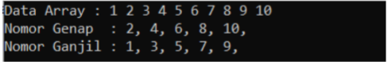
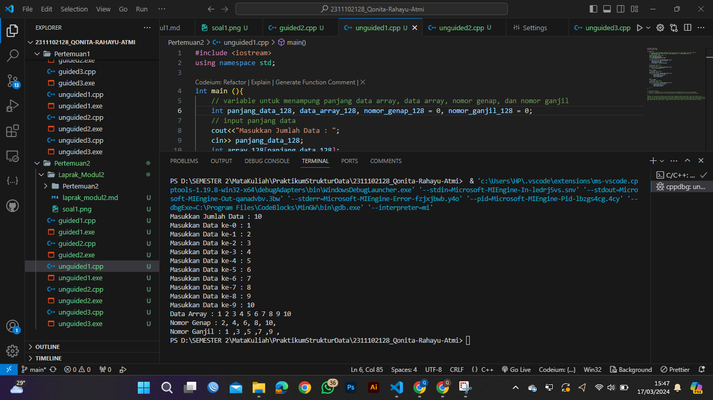

# <h1 align="center">Laporan Praktikum Modul Array</h1>
<h2 align="center">Qonita Rahayu Atmi-2311102128</h2>

## Dasar Teori

Array adalah kumpulanan variabel sejenis ( memiliki tipe data yang sama ) yang diakses menggunakan satu nama. 
Setiap data tersebut menempati lokasi atau alamat memeori yang berbeda-beda dan selanjutnya disebut elemen array. Elemen array kemudian dapat diakses melalui index yang terdapat di dalamnya. Array terdapat berbagai macam array, yaitu:

1. Array Satu Dimensi
Array saru dimensi adalah array yang penunjuk indexnya hanya satu. Sebelum variabel array digunakan maka variabel array harus dideklarasikan terlebih dahulu. Pendeklarasian variabel array satu dimensi hampir sama dengan pendeklarasian dengan variabel lain , hanya saja pendeklarasian variabel array diikuti dengan  maksimum banyaknya elemen yang dapat disimpan dalam variavel array yang dituliskan dalam pasangan tanda siku pembuka dan tanda siku penutup.

2. Array Dua Dimensi
Array dua dimensi adalah array yang setiap elemennya bertipe array (satu dimensi). Array dua mensi sering direpresentasikan sebagai tabel, yang terdiri dari baris dan kolom. Baris disebut dimensi pertama dan kolom disebut dimensi kedua. Satu baris di dalam tabel memiliki beberapa kolom. Ini sama artinya dengan satu elemen array memiliki beberapa nilai.

3. Array Tiga Dimensi
Array tiga dimensi adalah array yang terdiri dari tiga dimensi. Pada setiap elemennya bertipe array dua dimensi. Array tiga dimensi sebagai kumpulan halaman yang berisi tabel.

4. Array Multidimensi
Array multidimensi adalah array yang elemennya memiliki nilai lebih dari satu. Array multidimensi yang terdiri dari beberapa subskrip.


## Guided 

### 1. [Program Input Array Tiga Dimensi]

```C++
#include <iostream>
using namespace std;
// PROGRAM INPUT ARRAY 3 DIMENSI
int main()
{
    // Deklarasi array
    int arr[2][3][3];
    // Input elemen
    for (int x = 0; x < 2; x++)
    {
        for (int y = 0; y < 3; y++)
        {
            for (int z = 0; z < 3; z++)
            {
                cout << "Input Array[" << x << "][" << y << "][" << z << "] = ";
                cin >> arr[x][y][z];
            }
        }
        cout << endl;
    }
    // Output Array
    for (int x = 0; x < 2; x++)
    {
        for (int y = 0; y < 3; y++)
        {
            for (int z = 0; z < 3; z++)
            {
                cout << "Data Array[" << x << "][" << y << "][" << z
                     << "] = " << arr[x][y][z] << endl;
            }
        }
    }
    cout << endl;
    // Tampilan array
    for (int x = 0; x < 2; x++)
    {
        for (int y = 0; y < 3; y++)
        {
            for (int z = 0; z < 3; z++)
            {
                cout << arr[x][y][z] << ends;
            }
            cout << endl;
        }
        cout << endl;
    }
}

```
=> Penjelasan program
- Kode diatas adalah program di atas adalah program yang menggunakan array 3 dimensi. Array tersebut memiliki 2 halaman 3 kolom 3 baris. Program akan meminta input dari user untuk setiap elemen array, kemudian akan mencetak array tersebut secara berurutan. Kemudian program akan mencetak array dengan menggunakan loop untuk setiap elemen array.

### 2. [Program Mencari Nilai Maksimal pada Array]

```C++
#include <iostream>
using namespace std;
int main()
{
    // variable untuk mencari nilai maksimum
    int maks, a, i = 1, lokasi;
    // input panjang array
    cout << "Masukkan panjang array: ";
    cin >> a;
    // input angka
    int array[a];
    cout << "Masukkan " << a << " angka\n";
    for (i = 0; i < a; i++)
    {
        cout << "Array ke-" << (i) << ": ";
        cin >> array[i];
    }
    // mencari nilai maksimum pada data array yang di inputkan
    maks = array[0];
    for (i = 0; i < a; i++)
    {
        if (array[i] > maks)
        {
            maks = array[i];
            lokasi = i;
        }
    }
    // menampilkan nilai maksimum dan lokasi nilai maksimum pada indeks array
    cout << "Nilai maksimum adalah " << maks << " berada di Array ke " << lokasi << endl;
}
```
=> Penjelasan program
- Kode di atas adalah program yang membaca nilai panjang array, kemudian menginputkan nilai array banyaknya 
sesuai dengan panjang array yang diinputkan. Setelah itu, program akan mencari nilai maksimum pada array yang diinputkan dan menampilkan nilai maksimum serta lokasi nilai maksimum pada indeks array.

## Unguided 

### 1. [Buatlah program untuk menampilkan Output seperti berikut dengan data yang diinputkan oleh user!]


```C++
#include <iomanip>
using namespace std;

int main (){
    // variable untuk menampung panjang data array, data array, nomor genap, dan nomor ganjil
    int panjang_data_128, data_array_128, nomor_genap_128 = 0, nomor_ganjil_128 = 0;
    // input panjang data
    cout<<"Masukkan Jumlah Data : ";
    cin>> panjang_data_128;
    int array_128[panjang_data_128];
    // input data array
    for (int i = 0; i < panjang_data_128; i++){
        cout<<"Masukkan Data ke-"<<i<<" : ";
        cin>>data_array_128;
        array_128[i] = data_array_128;
    }
    // mencetak data array
    cout<<"Data Array : ";
    for (int i = 0; i < panjang_data_128; i++){
        cout<<array_128[i]<<" ";
    }
    cout << endl;
    // mencetak nomor genap
    cout<<"Nomor Genap : ";
    for (int i = 0; i < panjang_data_128; i++){
        if (array_128[i] % 2 == 0){
            cout<<array_128[i]<<", ";
            nomor_genap_128++;
        }
    }
    cout << endl;
    // mencetak nomor ganjil
    cout<<"Nomor Ganjil : ";
    for (int i = 0; i < panjang_data_128; i++){
        if (array_128[i] % 2 != 0){
            cout<<array_128[i]<<" ,";
            nomor_ganjil_128++;
        }
    }
}
```
#### Output:


=> Penjelasan program
- Kode atas adalah program menampung data array yang diinputkan dan menampilkan data array yang diinputkan. Pertama kali meminta input jumlah data, kemudian meminta input data array untuk elemen array. Setelah itu, program akan mencetak data array yang diinputkan dan mencetak nomor genap dan nomor ganjil pada array yang diinputkan. Pada bagian mencetak nomor genap, program akan mencetak semua elemen array yang dibagi 2 sisa nol. Pada bagian mencetak nomor ganjil, program akan mencetak semua elemen array yang tidak dibagi 2 sisa nol.

#### Full code Screenshot:


### 2. [Buatlah program Input array tiga dimensi (seperti pada guided) tetapi jumlah atau ukuran elemennya diinputkan oleh user]

```C++
#include <iostream>
using namespace std;

int main()
{
    // variable untuk menampung inputan element dari user
    int element_128;
    cout << "Masukkan Jumlah Element Array : ";
    cin >> element_128;
    // array dengan element yang akan diinputkna user
    int arr[element_128][element_128][element_128];
    // Input elemen
    for (int y = 0; y < element_128; y++)
    {
        for (int z = 0; z < element_128; z++)
        {
            for (int j = 0; j < element_128; j++)
            {
                cout << "Input Array[" << y << "][" << z << "][" << j << "] = ";
                cin >> arr[y][z][j];
            }
        }
        cout << endl;
    }
    // Output Array
    for (int y = 0; y < element_128; y++)
    {
        for (int z = 0; z < element_128; z++)
        {
            for (int j = 0; j < element_128; j++)
            {
                cout << "Data Array[" << y << "][" << z << "][" << j << "] = " << arr[y][z][j] << endl;
            }
        }
    }
    cout << endl;
    // Tampilan array
    for (int y = 0; y < element_128; y++)
    {
        for (int z = 0; z < element_128; z++)
        {
            for (int j = 0; j < element_128; j++)
            {
                cout << arr[y][z][j] << ends;
            }
            cout << endl;
        }
        cout << endl;
    }
}
```
#### Output:


=> Penjelasan program
- Kode di atas adalah program di atas menginputkan data array 3 dimensi, mengoutputkan data array 3 dimesnsi, dan menampilkan data array 3 dimensi. Pertama,menginputkan jumlah elemen arraz 3 dimensi. kedua, program menginputkan data array 3 dimensi menggunakan loop tiga kali untuk setiap dimensi array. Kemudian, program mengoutputkan data array 3 dimensi menggunakan loop tiga kali untuk setiap dimensi array. Terakhir, program menampilkan data array 3 dimensi dalam format tabel menggunakan loop tiga kali untuk setiap dimensi array.

#### Full code Screenshot:


### 3. [Buatlah program menu untuk mencari nilai Maksimum, Minimum dan Nilai rata – rata dari suatu array dengan input yang dimasukan oleh user!]

```C++
#include <iostream>
using namespace std;
int main()
{
    // variable untuk menampung panjang array, input pilih menu, nilai maksimum, minimum, dan total
    int panjang_array_128, menu_128, maksimum_128, minimum_128, total_128;
    double rata_128;

    // input panjang array
    cout << "Masukkan panjang array: ";
    cin >> panjang_array_128;
    int array_128[panjang_array_128];
    cout << "masukan panjang array : "<< panjang_array_128 << " angka"<< endl;
    for (int i = 0; i < panjang_array_128; i++)
    {
        cout << "array ke-" << (i) << ": ";
        cin >> array_128[i];
    }
    // perulangan untuk menu pilih 
    do
    {
        // input pilih menu
        cout << "Pilih menu: " << endl;
        cout << "1. Nilai maksimum" << endl;
        cout << "2. Nilai minimum" << endl;
        cout << "3. Nilai rata-rata" << endl;
        cout << "4. Keluar" << endl;
        cout << "masukan pilihan menu :";
        // input pilih menu
        cin >> menu_128;
        switch (menu_128)
        {
            // case untuk mencari nilai angka maksimum pada data array
        case 1:
            maksimum_128 = array_128[0];
            for (int i = 0; i < panjang_array_128; i++)
            {
                if (array_128[i] > maksimum_128)
                {
                    maksimum_128 = array_128[i];
                }
            }
            //menampilkan nilai maksimum 
            cout << "Nilai maksimum adalah " << maksimum_128 << endl;
            break;

            // case untuk mencari nilai angka minimum pada data array
            case 2:
            minimum_128 = array_128[0];
            for (int i = 0; i < panjang_array_128; i++)
            {
                if (array_128[i] < minimum_128)
                {
                    minimum_128 = array_128[i];
                }
            }
            cout << "Nilai minimum adalah " << minimum_128 << endl;
            break;

            // case untuk mencari nilai rata rata pada data array
            case 3:
            total_128 = 0;
            for (int i = 0; i < panjang_array_128; i++)
                total_128 += array_128[i];
                rata_128 = static_cast<double>(total_128) / panjang_array_128;
                cout << "Rata-rata dari array adalah: " << rata_128 << endl;
                break;
            cout << "Nilai rata rata adalah : " << total_128 << endl;
            break;
        
        default:
            break;
        }
    } while (menu_128 !=4);
    
    return 0;
}
```
#### Output:


=> Penjelasan program
- Kode di atas adalah program di atas merupakan program yang menampung data array, menampilkan data array, mencari nilai maksimum, minimum, dan rata-rata pada data array,dan melakukan loop sehingga user dapat memilih menu hingga menu 4 yang akan mengakhiri program. Pada switch case akan menjalankan operasi yang sesuai dengan input user, yaitu maksimum, minimum, dan rata-rata pada array yang diinputkan. Setelah itu, program akan mencetak hasil operasi yang telah dilakukan.  Setiap operasi akan menggunakan loop untuk menghitung nilai maksimum, minimum, dan rata-rata pada array yang diinputkan.Setiap operasi juga akan mencetak hasil operasi yang telah dilakukan. Kemudian setiap operasi juga akan melakukan loop sehingga user dapat memilih menu hingga menu 4 yang akan mengakhiri program.

#### Full code Screenshot:


## Kesimpulan

Dari materi array tesebut saya dapat menyimpulkan array adalah suatu kumpulan variabel dengan tipe data yang sama yang diakses menggunakan satu nama. Dan array terdapat banyak macam yaitu array satu dimensi adalah array yang penunjuk indexnya hanya satu, arrray dua dimensi adalah  array yang setiap elemennya bertipe array (satu dimensi) , array tiga dimensi adalah array yang terdiri dari tiga dimensi, dan array multidimensi adalah array yang elemennya memiliki nilai lebih dari satu. Array multidimensi yang terdiri dari beberapa subskrip.. 

## Referensi
[1] Budi Raharjo, Kursus Mandiri C++ Menjadi Programmer C++ dalam 5 Tahap. Bandung: 2021.

