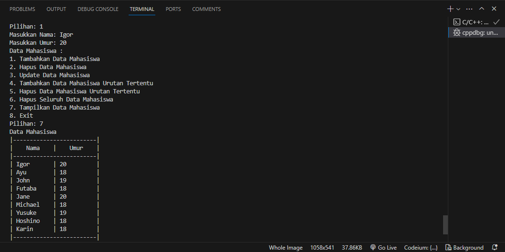
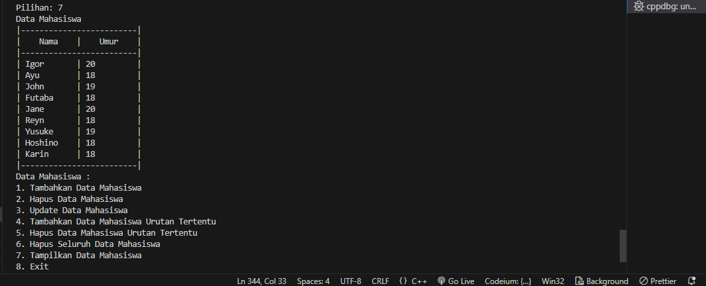
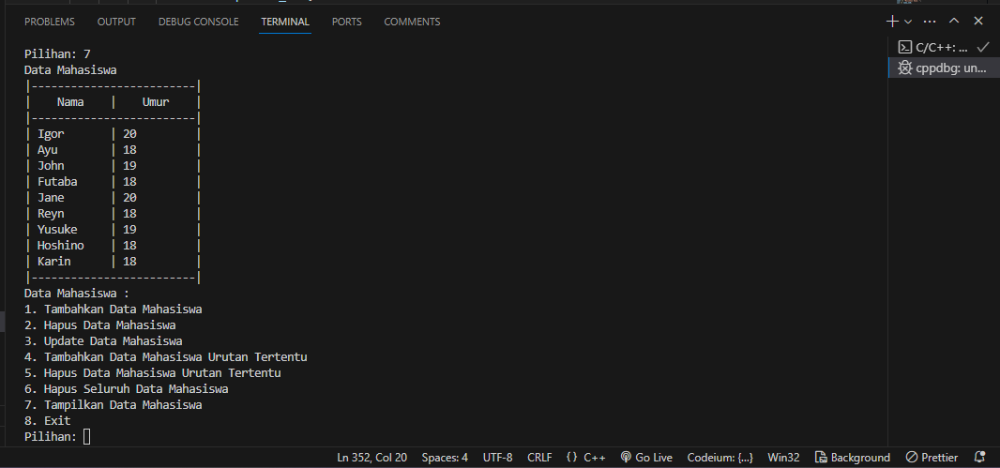
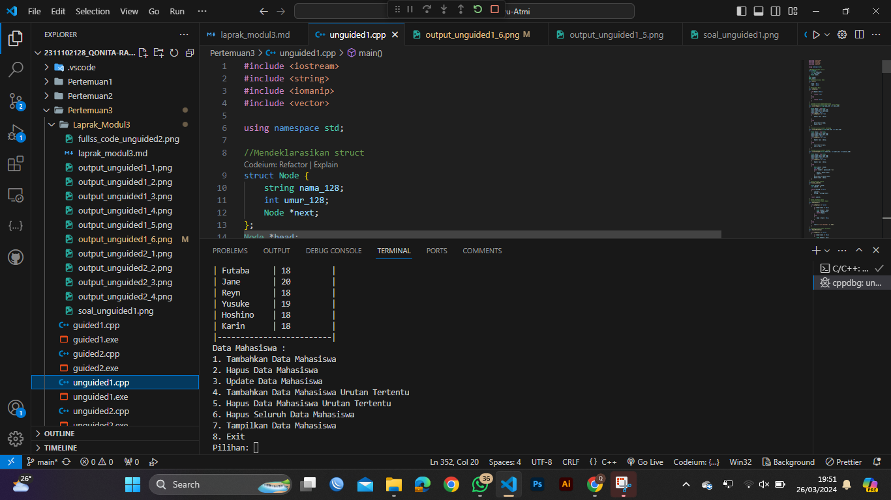
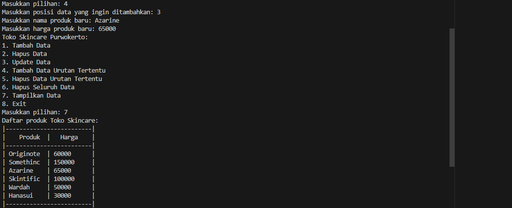

# <h1 align="center">Laporan Praktikum Modul Single And Double Linked List </h1>
<h1 align="center">Qonita Rahayu Atmi-2311102128</h1>

## Dasar Teori
Linked list adalah struktur data linier yang terdiri dari  node yang  terhubung satu sama lain melalui pointer. Setiap node menyimpan buah data dan sebuah alamat (penunjuk) ke node berikutnya dalam urutan tersebut.
Ada dua macam linked list, yaitu:

a. Single Linked List
- Single linked list adalah daftar yang dihubungkan dalam satu arah. Jadi, kita hanya dapat melintasinya dalam satu arah, yaitu dari simpul kepala ke simpul ekor.

b. Double Linked List
- Double linked list adalah daftar tertaut ganda. Jadi dapat melintasi dua arah. Berbeda dengan daftar tertaut tunggal, simpul dalam daftar tertaut ganda berisi penunjuk tambahan yang  disebut penunjuk sebelumnya. Penunjuk ini menunjuk ke node sebelumnya .

## Guided 

### 1. [Latihan Single Linked List]

```C++
#include <iostream>

using namespace std;

// PROGRAM SINGLE LINKED LIST NON-CIRCULAR
// Deklarasi Struct Node
struct Node
{
    int data;
    Node *next;
};
Node *head;
Node *tail;
// Inisialisasi Node
void init()
{
    head = NULL;
    tail = NULL;
}
// Pengecekan
bool isEmpty()
{
    if (head == NULL)
        return true;
    else
        return false;
}
// Tambah Depan
void insertDepan(int nilai)
{
    // Buat Node baru
    Node *baru = new Node;
    baru->data = nilai;
    baru->next = NULL;
    if (isEmpty() == true)
    {
        head = tail = baru;
        tail->next = NULL;
    }
    else
    {
        baru->next = head;
        head = baru;
    }
}
// Tambah Belakang
void insertBelakang(int nilai)
{
    // Buat Node baru
    Node *baru = new Node;
    baru->data = nilai;
    baru->next = NULL;
    if (isEmpty() == true)
    {
        head = tail = baru;
        tail->next = NULL;
    }
    else
    {
        tail->next = baru;
        tail = baru;
    }
}
// Hitung Jumlah List
int hitungList()
{
    Node *hitung;
    hitung = head;
    int jumlah = 0;
    while (hitung != NULL)
    {
        jumlah++;
        hitung = hitung->next;
    }
    return jumlah;
}
// Tambah Tengah
void insertTengah(int data, int posisi)
{
    if (posisi < 1 || posisi > hitungList())
    {
        cout << "Posisi diluar jangkauan" << endl;
    }
    else if (posisi == 1)
    {
        cout << "Posisi bukan posisi tengah" << endl;
    }
    else
    {
        Node *baru, *bantu;
        baru = new Node();
        baru->data = data;
        // tranversing
        bantu = head;
        int nomor = 1;
        while (nomor < posisi - 1)
        {
            bantu = bantu->next;
            nomor++;
        }
        baru->next = bantu->next;
        bantu->next = baru;
    }
}
// Hapus Depan
void hapusDepan()
{
    Node *hapus;
    if (isEmpty() == false)
    {
        if (head->next != NULL)
        {
            hapus = head;
            head = head->next;
            delete hapus;
        }
        else
        {
            head = tail = NULL;
        }
    }
    else
    {
        cout << "List kosong!" << endl;
    }
}
// Hapus Belakang
void hapusBelakang()
{
    Node *hapus;
    Node *bantu;
    if (isEmpty() == false)
    {
        if (head != tail)
        {
            hapus = tail;
            bantu = head;
            while (bantu->next != tail)
            {
                bantu = bantu->next;
            }
            tail = bantu;
            tail->next = NULL;
            delete hapus;
        }
        else
        {
            head = tail = NULL;
        }
    }
    else
    {
        cout << "List kosong!" << endl;
    }
}
// Hapus Tengah
void hapusTengah(int posisi)
{
    Node *hapus, *bantu, *bantu2;
    if (posisi < 1 || posisi > hitungList())
    {
        cout << "Posisi di luar jangkauan" << endl;
    }
    else if (posisi == 1)
    {
        cout << "Posisi bukan posisi tengah" << endl;
    }
    else
    {
        int nomor = 1;
        bantu = head;
        while (nomor <= posisi)
        {
            if (nomor == posisi - 1)
            {
                bantu2 = bantu;
            }
            if (nomor == posisi)
            {
                hapus = bantu;
            }
            bantu = bantu->next;
            nomor++;
        }
        bantu2->next = bantu;
        delete hapus;
    }
}
// Ubah Depan
void ubahDepan(int data)
{
    if (isEmpty() == false)
    {
        head->data = data;
    }
    else
    {
        cout << "List masih kosong!" << endl;
    }
}
// Ubah Tengah
void ubahTengah(int data, int posisi)
{
    Node *bantu;
    if (isEmpty() == false)
    {
        if (posisi < 1 || posisi > hitungList())
        {
            cout << "Posisi di luar jangkauan" << endl;
        }
        else if (posisi == 1)
        {
            cout << "Posisi bukan posisi tengah" << endl;
        }
        else
        {
            bantu = head;
            int nomor = 1;
            while (nomor < posisi)
            {
                bantu = bantu->next;
                nomor++;
            }
            bantu->data = data;
        }
    }
    else
    {
        cout << "List masih kosong!" << endl;
    }
}
// Ubah Belakang
void ubahBelakang(int data)
{
    if (isEmpty() == false)
    {
        tail->data = data;
    }
    else
    {
        cout << "List masih kosong!" << endl;
    }
}
// Hapus List
void clearList()
{
    Node *bantu, *hapus;
    bantu = head;
    while (bantu != NULL)
    {
        hapus = bantu;
        bantu = bantu->next;
        delete hapus;
    }
    head = tail = NULL;
    cout << "List berhasil terhapus!" << endl;
}
// Tampilkan List
void tampil()
{
    Node *bantu;
    bantu = head;
    if (isEmpty() == false)
    {
        while (bantu != NULL)
        {
            cout << bantu->data << ends;
            bantu = bantu->next;
        }
        cout << endl;
    }
    else
    {
        cout << "List masih kosong!" << endl;
    }
}
int main()
{
    init();
    insertDepan(3);
    tampil();
    insertBelakang(5);
    tampil();
    insertDepan(2);
    tampil();
    insertDepan(1);
    tampil();
    hapusDepan();
    tampil();
    hapusBelakang();
    tampil();
    insertTengah(7, 2);
    tampil();
    hapusTengah(2);
    tampil();
    ubahDepan(1);
    tampil();
    ubahBelakang(8);
    tampil();
    ubahTengah(11, 2);
    tampil();
    return 0;
}
```
=> Penjelasan program
- Kode diatas adalah program membuat dan mencoba operasi pada singly linked list. Pada program ini, terdapat menambahkan data,menambahkan insert depan,insert belakang, Menghitung jumlah list, Menambahkan insert tengah, menghapus data depan, menghapus data belakang, menghapus data tengah, mengubah data depan, mengubah data tengah, mengubah data belakang, Menghapus semua data dan mampilkan data. Pada program ini, kita bisa melakukan penambahan mengubah dan menghapus dengan cara memanggil fungsi yang telah di buat dan di ikuti oleh parameter fungsi terebut. Pada akhirnya, program akan mencetak isi list tersebut.

### 2. [Latihan Double Linked List]

```C++
#include <iostream>
using namespace std;
//Deklarasi class
class Node
{
public:
    int data;
    Node *prev;
    Node *next;
};
class DoublyLinkedList
{
public:
    Node *head;
    Node *tail;
    DoublyLinkedList()
    {
        head = nullptr;
        tail = nullptr;
    }
    // Menambahkan data
    void push(int data)
    {
        Node *newNode = new Node;
        newNode->data = data;
        newNode->prev = nullptr;
        newNode->next = head;
        if (head != nullptr)
        {
            head->prev = newNode;
        }
        else
        {
            tail = newNode;
        }
        head = newNode;
    }
    // Menghapus data
    void pop()
    {
        if (head == nullptr)
        {
            return;
        }
        Node *temp = head;
        head = head->next;
        if (head != nullptr)
        {
            head->prev = nullptr;
        }
        else
        {
            tail = nullptr;
        }
        delete temp;
    }
    // Memperbarui data
    bool update(int oldData, int newData)
    {
        Node *current = head;
        while (current != nullptr)
        {
            if (current->data == oldData)
            {
                current->data = newData;
                return true;
            }
            current = current->next;
        }
        return false;
    }
    // Menghapus semua data
    void deleteAll()
    {
        Node *current = head;
        while (current != nullptr)
        {
            Node *temp = current;
            current = current->next;
            delete temp;
        }
        head = nullptr;
        tail = nullptr;
    }
    // Menampilkan data
    void display()
    {
        Node *current = head;
        while (current != nullptr)
        {
            cout << current->data << " ";
            current = current->next;
        }
        cout << endl;
    }
};
int main()
{
    DoublyLinkedList list;
    while (true)
    {
        cout << "1. Add data" << endl;
        cout << "2. Delete data" << endl;
        cout << "3. Update data" << endl;
        cout << "4. Clear data" << endl;
        cout << "5. Display data" << endl;
        cout << "6. Exit" << endl;
        int choice;
        cout << "Enter your choice: ";
        cin >> choice;
        switch (choice)
        {
        case 1:
        {
            int data;
            cout << "Enter data to add: ";
            cin >> data;
            list.push(data);
            break;
        }
        case 2:
        {
            list.pop();
            break;
        }
        case 3:
        {
            int oldData, newData;
            cout << "Enter old data: ";
            cin >> oldData;
            cout << "Enter new data: ";
            cin >> newData;
            bool updated = list.update(oldData,
                                       newData);
            if (!updated)
            {
                cout << "Data not found" << endl;
            }
            break;
        }
        case 4:
        {
            list.deleteAll();
            break;
        }
        case 5:
        {
            list.display();
            break;
        }
        case 6:
        {
            return 0;
        }
        default:
        {
            cout << "Invalid choice" << endl;
            break;
        }
        }
    }
    return 0;
}
```
=> Penjelasan program
- Program di atas adalah program double linked list circular. Pada program ini, pengguna dapat memilih 
operasi antara membuat linked list baru, menambahkan node baru, mengupdate node yang sudah ada, menghapus 
semua node, dan menampilkan isi linked list. Pengguna dapat memasukkan data baru untuk membuat linked list 
baru, atau memasukkan data lama dan baru untuk mengupdate node yang sudah ada. Selain itu, pengguna dapat 
memilih untuk menghapus semua node pada linked list atau menampilkan isi linked list. Program akan selesai 
saat pengguna memilih 6 untuk keluar.

## Unguided

### 1. [Buatlah program menu Single Linked List Non-Circular untuk menyimpan Nama dan usia mahasiswa, dengan menggunakan inputan dari user. Lakukan operasi berikut:]


```C++
#include <iostream>
#include <string>
#include <iomanip>
#include <vector>

using namespace std;

//Mendeklarasikan struct
struct Node {
    string nama_128;
    int umur_128;
    Node *next;
};
Node *head;
Node *tail;
// Menginisialisasi Node
void init()
{
    head = NULL;
    tail = NULL;
}
// Pengecekan NULL
bool isEmpty()
{
    if (head == NULL)
    {
        return true;
    }
    else
    {
        return false;
    }
}
// Prosedure untuk memasukkan data 
// Prosedure untuk memasukkan data insert depan
void insertDepan(string nama_128, int umur_128)
{
    Node *baru = new Node;
    baru->nama_128 = nama_128;
    baru->umur_128 = umur_128;
    baru->next = NULL;
    if (isEmpty() == true)
    {
        head = tail = baru;
        
    }
    else
    {
        baru->next = head;
        head = baru;
    }
}
// Prosedure untuk insert belakang
void insertBelakang(string nama_128, int umur_128)
{
    Node *baru = new Node;
    baru->nama_128 = nama_128;
    baru->umur_128 = umur_128;
    baru->next = NULL;
    if (isEmpty() == true)
    {
        head = tail = baru;
    }
    else
    {
        tail->next = baru;
        tail = baru;
    }
}
// Prosedure untuk insert tengah
void insertTengah(string nama_128, int umur_128, int posisi_128)
{
    Node *baru = new Node;
    baru->nama_128 = nama_128;
    baru->umur_128 = umur_128;
    baru->next = NULL;
    if (isEmpty() == true)
    {
        head = tail = baru;
    }
    else
    {
        Node *bantu = head;
        int nomor = 1;
        while (nomor < posisi_128 - 1)
        {
            bantu = bantu->next;
            nomor++;
        }
        baru->next = bantu->next;
        bantu->next = baru;
    }
}
// Fungsi Hitung Jumlah
int hitung_jumlah()
{
    Node *hitung = head;
    int jumlah = 0;

    while (hitung != NULL)
    {
        jumlah++;
        hitung = hitung->next;
    }

    return jumlah;
}
// Untuk menghapus data
// Prosedure umtuk hapus depan
void hapusDepan()
{
    if (isEmpty() == false)
    {
        if (head->next != NULL)
        {
            Node *hapus = head;
            head = head->next;
            delete hapus;
        }
        else
        {
            head = tail = NULL;
        }
    }
    else
    {
        cout << "List kosong!" << endl;
    }
}
// Prosedure untuk hapus belakang
void hapusBelakang()
{
    if (isEmpty() == false)
    {
        if (head->next != NULL)
        {
            Node *hapus = tail;
            Node *bantu = head;
            while (bantu->next != tail)
            {
                bantu = bantu->next;
            }
            tail = bantu;
            tail->next = NULL;
            delete hapus;
        }
        else
        {
            head = tail = NULL;
        }
    }
    else
    {
        cout << "List kosong!" << endl;
    }
}
// Prosedure untuk hapus tengah
void hapusTengah(int posisi_128)
{
    if (posisi_128 < 1 || posisi_128 > hitung_jumlah())
    {
        cout << "Posisi diluar jangkauan" << endl;
    }
    else if (posisi_128 == 1)
    {
        cout << "Posisi bukan posisi tengah" << endl;
    }
    else
    {
        Node *hapus = head;
        Node *bantu = head;
        int nomor = 1;

        while (nomor < posisi_128 - 1)
        {
            bantu = bantu->next;
            nomor++;
        }

        hapus = bantu->next;
        bantu->next = hapus->next;
        delete hapus;
    } 
}
// Untuk ubah data
// Prosedure untuk mengubah depan
void ubahDepan(string nama_128, int umur_128)
{
    if (isEmpty() == false)
    {
        head->nama_128 = nama_128;
        head->umur_128 = umur_128;
    }
    else
    {
        cout << "List kosong!" << endl;
    }
}
// Prosedure untuk mengubah belakang
void ubahBelakang(string nama_128, int umur_128)
{
    if (isEmpty() == false)
    {
        tail->nama_128 = nama_128;
        tail->umur_128 = umur_128;
    }
    else
    {
        cout << "List kosong!" << endl;
    }
}
// Prosedure untuk mengubah tengah
void ubahTengah(string nama_128, int umur_128, int posisi_128)
{
    if (posisi_128 < 1 || posisi_128 > hitung_jumlah())
    {
        cout << "Posisi diluar jangkauan" << endl;
    }
    else if (posisi_128 == 1)
    {
        cout << "Posisi bukan posisi tengah" << endl;
    }
    else
    {
        Node *bantu = head;
        int nomor = 1;

        while (nomor < posisi_128)
        {
            bantu = bantu->next;
            nomor++;
        }

        bantu->nama_128 = nama_128;
        bantu->umur_128 = umur_128;
        
    }
    
}
// Prosedure untuk menghapus semua data
void hapusSemua()
{
    if (isEmpty() == false)
    {
        Node *bantu = head;
        while (bantu != NULL)
        {
            Node *hapus = bantu;
            bantu = bantu->next;
            delete hapus;
        }
        head = tail = NULL;
    }
    else
    {
        cout << "List kosong!" << endl;
    }
}
// Prosedure untuk menampilkan display
void display(){
    Node *bantu = head;

    if (!isEmpty())
    {
        cout << "|-------------------------|" << endl;
        cout << "|    Nama    |    Usia    |" << endl;
        cout << "|-------------------------|" << endl;
        while (bantu != NULL)
        {
            cout << "| " << setw(10) << left << bantu->nama_128<< " | " << setw(10) << left << bantu->umur_128 << " |" << endl;
            bantu = bantu->next;
        }
        cout << "|-------------------------|" << endl;
    }
    else
    {
        cout << "List masih null!" << endl;
    }
}
int main(){
    cout << "Program Linked List" << endl;
    insertDepan("Karin", 18);
    insertDepan("Hoshino", 18);
    insertDepan("Akechi", 20);
    insertDepan("Yusuke", 19);
    insertDepan("Michael", 18);
    insertDepan("Jane", 20);
    insertDepan("John", 19);
    insertDepan("Ayu", 18);
    //Untuk menghapus data Akechi
    hapusTengah(6);
    //Untuk menambahkan data diantara John dan Jane
    insertTengah("Futaba", 18, 3);
    //Untuk menambahkan data diawali
    insertDepan("Igor", 20);
    //Untuk mengubah data Michael menjadi Reyn
    ubahTengah("Reyn", 19, 6);
    //Untuk menampilkan data
    display();
    
}
```
#### Output:

<h2>Masukkan data sesuai urutan berikut. (Gunakan insert depan, belakang atau tengah). Data pertama yang dimasukkan adalah nama dan usia anda.</h2>


<h2>Hapus data Akechi</h2>


<h2>Tambahkan data berikut diantara John dan Jane : Futaba 18 </h2>


<h2>Tambahkan data berikut diawal : Igor 20</h2>



<h2>Ubah data Michael menjadi : Reyn 18</h2>



<h2>Tampilkan seluruh data</h2>



=> Penjelasan program
- Program di atas adalah program Linked List non-circular yang digunakan untuk menambahkan nama dan umur, lalu melakukan beberapa operasi seperti menambahkan, menghapus, mengubah, dan menambahkan baru di tengah.di program atas terdapat fungsi prosedure yang bisa gunakan untuk melakukan operasi menambahkan menghapus dan mengubah. Pada program ini, data yang dimasukkan terlebih dahulu adalah nama dan umur, lalu diikuti dengan beberapa operasi seperti memasukkan data baru di depan, menghapus data di depan, mengubah data di tengah, dan menambahkan data baru di tengah. Selanjutnya, program menghapus data di tengah kedua, lalu menambahkan data baru di tengah ketiga. Terakhir, program menampilkan daftar semua data yang ada.

#### Full code Screenshot:


### 2. [Modifikasi Guided Double Linked List dilakukan dengan penambahan operasi untuk menambah data, menghapus, dan update di tengah / di urutan tertentu yang diminta. Selain itu, buatlah agar tampilannya menampilkan Nama produk dan harga]

```C++
#include <iostream>
#include <string>
#include <iomanip>
#include <vector>
using namespace std;
// Mendeklarasikan struct
struct Node{
    string nama_produk_128;
    int harga_128;
    Node *next;
    Node *prev;
};
Node *head, *tail;
// Prosedure untuk menginisialisasi Node
void init()
{
    head = NULL;
    tail = NULL;
}

// Untuk pengecekan NULL
bool isEmpty(){
    if (head == NULL)
    {
        return true;
    }
    else
    {
        return false;
    }
}
// untuk menambah data
// Prosedure untuk menambahkan data insert depan
void insertDepan(string nama_produk_128, int harga_128)
{
    Node *baru = new Node;
    baru->nama_produk_128 = nama_produk_128;
    baru->harga_128 = harga_128;
    baru->prev = NULL;
    baru->next = NULL;
    if (isEmpty() == true)
    {
        head = tail = baru;
    }
    else
    {
        baru->next = head;
        head->prev = baru;
        head = baru;
    }
}
// Prosedure untuk menambah data insert belakang
void insertBelakang(string nama_produk_128, int harga_128)
{
    Node *baru = new Node;
    baru->nama_produk_128 = nama_produk_128;
    baru->harga_128 = harga_128;
    baru->prev = NULL;
    baru->next = NULL;
    if (isEmpty() == true)
    {
        head = tail = baru;
    }
    else
    {
        tail->next = baru;
        baru->prev = tail;
        tail = baru;
    }
}
// Prosedure untuk menambah data insert tengah
void insertTengah(string nama_produk_128, int harga_128, int posisi_128)
{
    Node *baru = new Node;
    baru->nama_produk_128 = nama_produk_128;
    baru->harga_128 = harga_128;
    baru->prev = NULL;
    baru->next = NULL;
    if (isEmpty() == true)
    {
        head = tail = baru;
    }
    else
    {
        Node *bantu = head;
        int nomor = 1;
        while (nomor < posisi_128 - 1)
        {
            bantu = bantu->next;
            nomor++;
        }
        baru->next = bantu->next;
        bantu->next->prev = baru;
        bantu->next = baru;
        baru->prev = bantu;
    }
}
// untuk menghapus data
// Prosedure untuk menghapus data insert depan
void hapusDepan()
{
    if (isEmpty() == false)
    {
        if (head->next != NULL)
        {
            Node *hapus = head;
            head = head->next;
            head->prev = NULL;
            delete hapus;
        }
        else
        {
            head = tail = NULL;
        }
    }
    else
    {
        cout << "List kosong!" << endl;
    }
}
// Prosedure untuk menghapus data insert belakang
void hapusBelakang()
{
    if (isEmpty() == false)
    {
        if (head->next != NULL)
        {
            Node *hapus = tail;
            tail = tail->prev;
            tail->next = NULL;
            delete hapus;
        }
        else
        {
            head = tail = NULL;
        }
    }
    else
    {
        cout << "List kosong!" << endl;
    }
};
// Prosedure untuk menghapus data insert tengah
int hitung_jumlah();
void hapusTengah(int posisi_128)

{
    if (posisi_128 < 1 || posisi_128 > hitung_jumlah())
    {
        cout << "Posisi diluar jangkauan" << endl;
    }
    else if (posisi_128 == 1)
    {
        cout << "Posisi bukan posisi tengah" << endl;
    }
    else
    {
        Node *hapus = head;
        Node *bantu = head;
        int nomor = 1;

        while (nomor < posisi_128 - 1)
        {
            bantu = bantu->next;
            nomor++;
        }

        hapus = bantu->next;
        bantu->next = hapus->next;
        delete hapus;
    } 
}
// Fungsi untuk menghitung jumlah
int hitung_jumlah()
{
    Node *hitung = head;
    int jumlah = 0;

    while (hitung != NULL)
    {
        hitung = hitung->next;
        jumlah++;
    }
    return jumlah;

}
// Prosedure untuk meperbarui data
void update(int posisi_128, string nama_produk_128, int harga_128)
{
    if (posisi_128 < 1 || posisi_128 > hitung_jumlah())
    {
        cout << "Posisi diluar jangkauan" << endl;
    }
    else if (posisi_128 == 1)
    {
        cout << "Posisi bukan posisi tengah" << endl;
    }
    else
    {
        Node *bantu = head;
        int nomor = 1;
        while (nomor < posisi_128)
        {
            bantu = bantu->next;
            nomor++;
        }
        bantu->nama_produk_128 = nama_produk_128;
        bantu->harga_128 = harga_128;
    }
}
// Prosedure untuk menghapus semua data
void hapusSemua()
{
    if (isEmpty() == false)
    {
        Node *bantu = head;
        while (bantu != NULL)
        {
            Node *hapus = bantu;
            bantu = bantu->next;
            delete hapus;
        }
        head = tail = NULL;
    }
    else
    {
        cout << "List kosong!" << endl;
    }
}
// Prosedure untuk menampilkan data
void display()
{
    Node *bantu = head;

    if (!isEmpty())
    {
        cout << "|-------------------------|" << endl;
        cout << "|    Produk  |   Harga    |" << endl;
        cout << "|-------------------------|" << endl;
        while (bantu != NULL)
        {
            cout << "| " << setw(10) << left << bantu->nama_produk_128<< " | " << setw(10) << left << bantu->harga_128 << " |" << endl;
            bantu = bantu->next;
        }
        cout << "|-------------------------|" << endl;
    }
    else
    {
        cout << "List masih null!" << endl;
    }
}
int main()
{
    //Inisialisasi
    init();
    //Untuk menambahkan data
    insertDepan   ("Originote", 60000);
    insertBelakang("Somethinc", 150000);
    insertBelakang("Skintific", 100000);
    insertBelakang("Wardah"   , 50000);
    insertBelakang("Hanasui"  , 30000);

    //Untuk menampilkan display
    display();

    //Untuk menambahkan menu
    int pilihan_128;
    string nama_produk_128;
    int harga_128;
    int posisi_128;
    do
    {
        cout << "Toko Skincare Purwokerto: " << endl;
        cout << "1. Tambah Data" << endl;
        cout << "2. Hapus Data" << endl;
        cout << "3. Update Data" << endl;
        cout << "4. Tambah Data Urutan Tertentu" << endl;
        cout << "5. Hapus Data Urutan Tertentu" << endl;
        cout << "6. Hapus Seluruh Data" << endl;
        cout << "7. Tampilkan Data" << endl;
        cout << "8. Exit" << endl;
        cout << "Masukkan pilihan: ";
        cin >> pilihan_128;

        switch (pilihan_128)
        {
        case 1:
            // Untuk menambahkan data
            cout << "Masukkan nama produk: ";
            cin >> nama_produk_128;
            cout << "Masukkan harga : ";
            cin >> harga_128;
            insertDepan(nama_produk_128, harga_128);
            break;
        case 2:
            // Untuk menghapus data
            cout << "Masukkan nama produk yang ingin dihapus: ";
            cin >> nama_produk_128;
            cout << "Masukkan posisi data yang ingin dihapus: ";
            cin >> posisi_128;
            hapusDepan();
            break;
        case 3:
            // Untuk mengupdate data
            cout << "Masukkan nama produk yang ingin diupdate: ";
            cin >> nama_produk_128 ;
            cout << "Masukkan harga produk yang ingin diupdate: ";
            cin >> harga_128;
            cout << "Masukkan posisi data yang ingin diupdate: ";
            cin >> posisi_128;
            update(posisi_128, nama_produk_128, harga_128);
            break;
        case 4:
            // Untuk menambahkan data urutan tertentu
            cout << "Masukkan posisi data yang ingin ditambahkan: ";
            cin >> posisi_128;
            cout << "Masukkan nama produk baru: ";
            cin >> nama_produk_128 ;
            cout << "Masukkan harga produk baru: ";
            cin >> harga_128;
            insertTengah(nama_produk_128, harga_128, posisi_128);
            break;
        case 5:
            // Untuk menghapus data urutan tertentu
            cout << "Masukkan posisi data yang ingin dihapus: ";
            cin >> posisi_128;
            hapusTengah(posisi_128);
            break;
        case 6:
            // Untuk menghapus semua data
            hapusSemua();
            break;
        case 7:
            // Untuk menampilkan data
            cout << "Daftar produk Toko Skincare: " << endl;
            display();
            break;
        case 8:
            // Untuk keluar dari program
            cout << "Terima kasih telah belanja di Toko Skincare Purwokerto" << endl;
            break;
        default:
            cout << "Pilihan tidak valid" << endl;
            break;
        }
    } while (pilihan_128 != 8);

    

return 0;
}
```
#### Output:

<h2>Tambahkan produk Azarine dengan harga 65000 diantara Somethinc dan Skintific</h2>



<h2>Hapus produk wardah</h2>


<h2>Update produk Hanasui menjadi Cleora dengan harga 55.000</h2>


<h2>Tampilkan menu dan Data Skincare</h2>


=> Penjelasan program
- Program ini adalah program toko skincare purwokerto yang menggunakan linked list circular. Pada program ini,
terdapat menambahkan data, menghapus data, mengupdate data, menambahkan data di tengah, menghapus data di tengah, menghapus semua data, dan menampilkan daftar produk skincare.code diatas terdapat banyak fungsi yang bisa digunakan nantinya untuk menambahkan menghapus dan mengubah data. Pada program ini dapat memilih menu pilihan yang ingin dilakukan, mulai dari menambahkan produk baru, menghapus produk tertentu, mengudapte produk,hingga menampilkan daftar produk yang ada. Selain itu, program juga akan mengembalikan pesan keluar ketika pengguna memilih pilihan 8. Pada akhir program, pengguna dapat memilih pilihan 8 untuk keluar dari program.

#### Full code Screenshot:


## Kesimpulan

Dari materi array tesebut saya dapat menyimpulkan linked list merupakan jenis-jenis data berisi kelompok-kelompok data yang disusun secara linear. Dan semua data disimpan dalam satu node yang tersimpan antara satu node dengan node yang lainnya. Dan linked list memiliki dua macam jenis yaitu single linked list dan double linked list. Single linked list adalah daftar yang dihubungkan dalam satu arah. Double linked list adalah daftar tertaut ganda, jadi dapat melintasi dua arah.

## Referensi
[1] Moh Erkamim, Lim Abdurrohim , Buku Ajar Algoritma dan Struktur Data. Jambi. SONPEDIA : 2024.