# <h1 align="center">Laporan Praktikum Modul Linked List Circular Dan Non Circular </h1>
<h1 align="center">Qonita Rahayu Atmi-2311102128</h1>

## Dasar Teori
Linked list adalah struktur data linier yang terdiri dari  node yang  terhubung satu sama lain melalui pointer. Setiap node menyimpan buah data dan sebuah alamat (penunjuk) ke node berikutnya dalam urutan tersebut.
Ada dua macam linked list, yaitu:

a. Linked List Non Circular
- Linked List Non Circular adalah node terakhir yang menunjuk ke NULL, yang  digunakan sebagai kondisi penghentian ketika membaca isi linked list.

b. Linked List Circular
- Linked List Circular  adalah  linked  list  unidirectional yang dapat melintasinya  dalam satu arah. Tetapi jenis linked list ini memiliki simpul terakhir yang menunjuk ke simpul kepala. Jadi saat  melintas, harus  berhati-hati  dan  berhenti  saat kembali simpul kepala.

## Guided 

### 1. [ Linked List Non Circular]

```C++
#include <iostream>
using namespace std;
// PROGRAM SINGLE LINKED LIST NON-CIRCULAR
// Deklarasi Struct Node
struct Node
{
    int data;
    Node *next;
};
Node *head;
Node *tail;

// Inisialisasi Node
void init()
{
    head = NULL;
    tail = NULL;
}

// Pengecekan
bool isEmpty()
{
    if (head == NULL)
    {
        return true;
    }
    else
    {
        return false;
    }
}

// Tambah Depan
void insertDepan(int nilai)
{
    // Buat Node baru
    Node *baru = new Node;
    baru->data = nilai;
    baru->next = NULL;
    if (isEmpty() == true)
    {
        head = tail = baru;
        tail->next = NULL;
    }
    else
    {
        baru->next = head;
        head = baru;
    }
}

// Tambah Belakang
void insertBelakang(int nilai)
{
    // Buat Node baru
    Node *baru = new Node;
    baru->data = nilai;
    baru->next = NULL;
    if (isEmpty() == true)
    {
        head = tail = baru;
        tail->next = NULL;
    }
    else
    {
        tail->next = baru;
        tail = baru;
    }
}

// Hitung Jumlah List
int hitungList()
{
    Node *hitung;
    hitung = head;
    int jumlah = 0;
    while (hitung != NULL)
    {
        jumlah++;
        hitung = hitung->next;
    }
    return jumlah;
}

// Tambah Tengah
void insertTengah(int data, int posisi)
{
    if (posisi < 1 || posisi > hitungList())
    {
        cout << "Posisi diluar jangkauan" << endl;
    }
    else if (posisi == 1)
    {
        cout << "Posisi bukan posisi tengah" << endl;
    }
    else
    {
        Node *baru, *bantu;
        baru = new Node();
        baru->data = data;
        // tranversing
        bantu = head;
        int nomor = 1;
        while (nomor < posisi - 1)
        {
            bantu = bantu->next;
            nomor++;
        }

        baru->next = bantu->next;

        bantu->next = baru;
    }
}

// hapus Depan
void hapusDepan()
{
    Node *hapus;
    if (isEmpty() == false)
        if (head->next != NULL)
        {
            hapus = head;
            head = head->next;
            delete hapus;
        }
        else
        {
            head = tail = NULL;
        }
    else
    {
        cout << "List kosong!" << endl;
    }
}

// Hapus Belakang
void hapusBelakang()
{
    Node *hapus;
    Node *bantu;
    if (isEmpty() == false)
    {
        if (head != tail)
        {
            hapus = tail;
            bantu = head;
            while (bantu->next != tail)
            {
                bantu = bantu->next;
            }
            tail = bantu;
            tail->next = NULL;
            delete hapus;
        }
        else
        {
            head = tail = NULL;
        }
    }
    else
    {
        cout << "List kosong!" << endl;
    }
}


// Hapus Tengah
void hapusTengah(int posisi)
{
    Node *bantu, *hapus, *sebelum;
    if (posisi < 1 || posisi > hitungList())
    {
        cout << "Posisi di luar jangkauan" << endl;
    }
    else if (posisi == 1)
    {
        cout << "Posisi bukan posisi tengah" << endl;
    }
    else
    {
        int nomor = 1;
        bantu = head;
        while (nomor <= posisi)
        {
            if (nomor == posisi - 1)
            {
                sebelum = bantu;
            }
            if (nomor == posisi)
            {
                hapus = bantu;
            }
            bantu = bantu->next;
            nomor++;
        }
        sebelum->next = bantu;
        delete hapus;
    }
}

// Ubah Depan
void ubahDepan(int data)
{
    if (isEmpty() == 0)
    {
        head->data = data;
    }
    else
    {
        cout << "List masih kosong!" << endl;
    }
}
// Ubah Tengah
void ubahTengah(int data, int posisi)
{
    Node *bantu;
    if (isEmpty() == 0)
    {
        if (posisi < 1 || posisi > hitungList())
        {
            cout << "Posisi di luar jangkauan" << endl;
        }
        else if (posisi == 1)
        {
        }
        else
        {
            cout << "Posisi bukan posisi tengah" << endl;
            bantu = head;
            int nomor = 1;
            while (nomor < posisi)
            {
                bantu = bantu->next;
                nomor++;
            }
            bantu->data = data;
        }
    }
    else
    {
        cout << "List masih kosong!" << endl;
    }
}
// Ubah Belakang
void ubahBelakang(int data)
{
    if (isEmpty() == 0)
    {
        tail->data = data;
    }
    else
    {
        cout << "List masih kosong!" << endl;
    }
}
// Hapus List
void clearList()
{
    Node *bantu, *hapus;
    bantu = head;
    while (bantu != NULL)
    {
        hapus = bantu;
        bantu = bantu->next;
        delete hapus;
    }
    head = tail = NULL;
    cout << "List berhasil terhapus!" << endl;
}
// Tampilkan List
void tampil()
{
    Node *bantu;
    bantu = head;
    if (isEmpty() == false)
    {
        while (bantu != NULL)
        {
            cout << bantu->data << ends;
            bantu = bantu->next;
        }
        cout << endl;
    }
    else
    {
        cout << "List masih kosong!" << endl;
    }
}
int main()
{
    init();
    insertDepan(3);
    tampil();
    insertBelakang(5);
    tampil();
    insertDepan(2);
    tampil();
    insertDepan(1);
    tampil();
    hapusDepan();
    tampil();
    hapusBelakang();
    tampil();
    insertTengah(7, 2);
    tampil();
    hapusTengah(2);
    tampil();
    ubahDepan(1);
    tampil();
    ubahBelakang(8);
    tampil();
    ubahTengah(11, 2);
    tampil();

    return 0;
}
```
=> Penjelasan program
- Kode di atas adalah kode single linked list non-circular. Kode diatas terdapat 
memasukkan data di depan, di belakang, dan di tengah, menghapus data di depan, di belakang, dan di tengah, mengubah data 
di depan, di belakang, dan di tengah, menghapus list, serta menampilkan isi linked list. Pada fungsi main, program dijalankan secara berurutan dengan 
menampilkan isi linked list setelah setiap operasi dilakukan dengan menggunakan fungsi sesuai dengan parameternya. 

### 2. [Linked List Circular]

```C++
#include <iostream>
using namespace std;

// Deklarasi Struct Node
struct Node
{
    string data;
    Node* next;
};

Node* head, * tail, * baru, * bantu, * hapus;

void init()
{
    head = NULL;
    tail = head;
}

// Pengecekan
int isEmpty()
{
    if (head == NULL)
        return 1; // true
    else
        return 0; // false
}

// Buat Node Baru
void buatNode(string data)
{
    baru = new Node;
    baru->data = data;
    baru->next = NULL;
}

// Hitung List
int hitungList()
{
    bantu = head;
    int jumlah = 0;
    while (bantu != NULL)
    {
        jumlah++;
        bantu = bantu->next;
    }
    return jumlah;
}

// Tambah Depan
void insertDepan(string data)
{
    // Buat Node baru
    buatNode(data);

    if (isEmpty() == 1)
    {
        head = baru;
        tail = head;
        baru->next = head;
    }
    else
    {
        while (tail->next != head)
        {
            tail = tail->next;
        }
        baru->next = head;
        head = baru;
        tail->next = head;
    }
}

// Tambah Belakang
void insertBelakang(string data)
{
    // Buat Node baru
    buatNode(data);

    if (isEmpty() == 1)
    {
        head = baru;
        tail = head;
        baru->next = head;
    }
    else
    {
        while (tail->next != head)
        {
            tail = tail->next;
        }
        tail->next = baru;
        baru->next = head;
    }
}

// Tambah Tengah
void insertTengah(string data, int posisi)
{
    if (isEmpty() == 1)
    {
        head = baru;
        tail = head;
        baru->next = head;
    }
    else
    {
        baru->data = data;
        // transversing
        int nomor = 1;
        bantu = head;
        while (nomor < posisi - 1)
        {
            bantu = bantu->next;
            nomor++;
        }
        baru->next = bantu->next;
        bantu->next = baru;
    }
}

// Hapus Depan
void hapusDepan()
{
    if (isEmpty() == 0)
    {
        hapus = head;
        tail = head;
        if (hapus->next == head)
        {
            head = NULL;
            tail = NULL;
            delete hapus;
        }
        else
        {
            while (tail->next != hapus)
            {
                tail = tail->next;
            }
            head = head->next;
            tail->next = head;
            hapus->next = NULL;
            delete hapus;
        }
    }
    else
    {
        cout << "List masih kosong!" << endl;
    }
}

// Hapus Belakang
void hapusBelakang()
{
    if (isEmpty() == 0)
    {
        hapus = head;
        tail = head;
        if (hapus->next == head)
        {
            head = NULL;
            tail = NULL;
            delete hapus;
        }
        else
        {
            while (hapus->next != head)
            {
                hapus = hapus->next;
            }
            while (tail->next != hapus)
            {
                tail = tail->next;
            }
            tail->next = head;
            hapus->next = NULL;
            delete hapus;
        }
    }
    else
    {
        cout << "List masih kosong!" << endl;
    }
}

// Hapus Tengah
void hapusTengah(int posisi)
{
    if (isEmpty() == 0)
    {
        // transversing
        int nomor = 1;
        bantu = head;
        while (nomor < posisi - 1)
        {
            bantu = bantu->next;
            nomor++;
        }
        hapus = bantu->next;
        bantu->next = hapus->next;
        delete hapus;
    }
    else
    {
        cout << "List masih kosong!" << endl;
    }
}

// Hapus List
void clearList()
{
    if (head != NULL)
    {
        hapus = head->next;
        while (hapus != head)
        {
            bantu = hapus->next;
            delete hapus;
            hapus = bantu;
        }
        delete head;
        head = NULL;
    }
    cout << "List berhasil terhapus!" << endl;
}

// Tampilkan List
void tampil()
{
    if (isEmpty() == 0)
    {
        tail = head;
        do
        {
            cout << tail->data << ends;
            tail = tail->next;
        } while (tail != head);
        cout << endl;
    }
    else
    {
        cout << "List masih kosong!" << endl;
    }
}

int main()
{
    init();
    insertDepan("Ayam");
    tampil();
    insertDepan("Bebek");
    tampil();
    insertBelakang("Cicak");
    tampil();
    insertBelakang("Domba");
    tampil();
    hapusBelakang();
    tampil();
    hapusDepan();
    tampil();
    insertTengah("Sapi", 2);
    tampil();
    hapusTengah(2);
    tampil();
    return 0;
}
```
=> Penjelasan program
- Kode di atas merupakan kode sederhana yang menggunakan single linked list circular. Kode diatas membuat linked list, memasukkan data di depan, di belakang, dan di tengah, menghapus data di depan, di belakang, dan di tengah, menghapus list, serta mengubah data di depan, di belakang, dan di tengah. Fungsi main digunakan untuk menjalankan program. Dalam fungsi main, terdapat serangkaian pemanggilan fungsi-fungsi tersebut untuk mencoba operasi-operasi tersebut. Dengan cara memenggil fungsi dan diikuti parameternya.

## Unguided

### 1. [Buatlah menu untuk menambahkan, mengubah, menghapus, dan melihat Nama dan NIM mahasiswa, berikut contoh tampilan output dari nomor 1:]
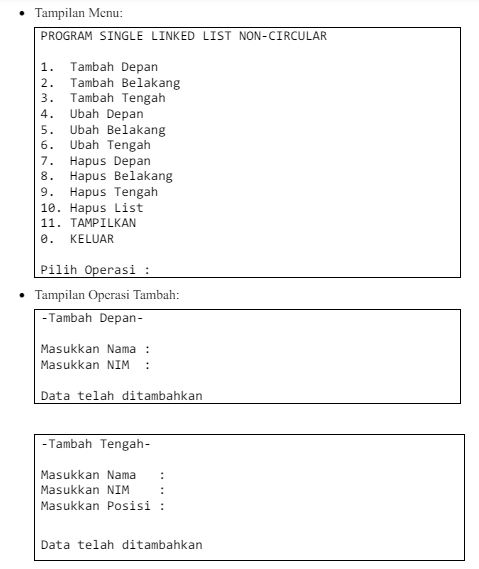

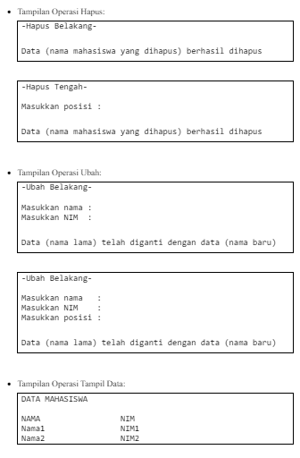

```C++
#include <iostream>
#include <iomanip>
using namespace std;
// Mendeklarasikan struct
struct Node
{
    string nama_128;
    string NIM_128;
    string namaLama_128;
    string namaBaru_128;
    Node *next;
    Node *prev;
};
Node *head;
Node *tail;
// Menginisialisasi Node
void init()
{
    head = NULL;
    tail = NULL;
}
// Pengecekan NULL untuk data kosong atau tidak
bool isEmpty()
{
    if (head == NULL)
    {
        return true;
    }
    else
    {
        return false;
    }
}
// Prosedur tambah data
// Prosedur untuk tambah data depan
void insertDepan(string nama_128, string NIM_128)
{
    Node *baru = new Node;
    baru->nama_128 = nama_128;
    baru->NIM_128 = NIM_128;
    baru->next = NULL;
    if (isEmpty() == true)
    {
        head = tail = baru;
    }
    else
    {
        baru->next = head;
        head = baru;
    }
}
// Prosedur untuk tambah data belakang
void insertBelakang(string nama_128, string NIM_128)
{
    Node *baru = new Node;
    baru->nama_128 = nama_128;
    baru->NIM_128 = NIM_128;
    baru->next = NULL;
    if (isEmpty())
    {
        head = tail = baru;
    }
    else
    {
        tail->next = baru;
        tail = baru;
    }
}

// Fungsi Hitung Jumlah
int hitung_jumlah()
{
    Node *hitung = head;
    int jumlah = 0;

    while (hitung != NULL)
    {
        jumlah++;
        hitung = hitung->next;
    }

    return jumlah;
}
// Prosedur untuh tambah data di tengah
void insertTengah(string nama_128, string NIM_128, int posisi)
{
    Node *baru = new Node;
    baru->nama_128 = nama_128;
    baru->NIM_128 = NIM_128;
    baru->next = NULL;
    if (isEmpty() == true)
    {
        head = tail = baru;
    }
    else
    {
        Node *bantu = head;
        int nomor = 1;
        while (nomor < posisi)
        {
            bantu = bantu->next;
            nomor++;
        }
        baru->next = bantu->next;
        bantu->next = baru;
    }
}
// Prosedur ubah data
// Prosedur untuk ubah data depan
void ubahDepan(string nama_128,  string namaBaru_128 ,string NIM_128)
{
     if (!isEmpty())
    {
        if (head->nama_128 == nama_128)
        {
            head->nama_128 = namaBaru_128;
            head->NIM_128 = NIM_128;
            cout << "Data (" << nama_128 << ") telah diganti dengan data (" << namaBaru_128 << ")" << endl;
        }
        else
        {
            cout << "Data dengan nama " << nama_128 << " tidak ditemukan!" << endl;
        }
    }
    else
    {
        cout << "List masih null!" << endl;
    }
}
// Prosedur untuk ubah data belakang
void ubahBelakang(string nama_128, string namaBaru_128,string NIM_128)
{
    Node *temp = head;

    while (temp != NULL)
    {
        if (temp->nama_128 == nama_128)
        {
            temp->nama_128 = namaBaru_128;
            temp->NIM_128 = NIM_128;
            cout << "Data (" << nama_128 << ") telah diganti dengan data (" << namaBaru_128 << ")" << endl;
            return;
        }
        temp = temp->next;
    }

    cout << "Data tidak ditemukan" << endl;
}
// Prosedur untuk ubah data di tengah
void ubahTengah(int posisi_128, string nama_128, string NIM_128, string namaBaru_128)
{
    if (!isEmpty())
    {
        if (posisi_128 < 1 || posisi_128 > hitung_jumlah())
        {
            cout << "Posisi di luar jangkauan" << endl;
        }
        else
        {
            Node *bantu = head;
            Node *sebelum = NULL; 

            int nomor = 1;

            // Iterasi hingga mencapai posisi yang diinginkan
            while (nomor < posisi_128 && bantu != NULL)
            {
                sebelum = bantu;
                bantu = bantu->next;
                nomor++;
            }

            // Cek apakah posisi yang diinginkan ditemukan
            if (bantu != NULL)
            {
                // Ubah data pada node yang ditemukan
                if (bantu->nama_128 == nama_128)
                {
                    bantu->nama_128 = namaBaru_128;
                    bantu->NIM_128 = NIM_128;
                    cout << "Data (" << nama_128 << ") telah diganti dengan data (" << namaBaru_128 << ")" << endl;

                    // Hubungkan node sebelumnya dengan node yang baru
                    if (sebelum != NULL)
                    {
                        Node *baru = new Node;
                        baru->nama_128 = namaBaru_128;
                        baru->NIM_128 = NIM_128;
                        baru->next = bantu->next;
                        sebelum->next = baru;
                    }
                }
                else
                {
                    cout << "Data dengan nama " << nama_128 << " tidak ditemukan pada posisi yang dimaksud!" << endl;
                }
            }
            else
            {
                cout << "Posisi di luar jangkauan" << endl;
            }
        }
    }
    else
    {
        cout << "List masih null!" << endl;
    }
}

// Fungsi hapus data
// Fungsi untuk hapus data di depan dan mengembalikan nama yang akan dihapus
string deleteDepan()
{
    // Menyimpan nama yang dihapus
    string nama_hapus = "";

    if (!isEmpty())
    {
        Node *hapus = head;

        if (head->next != NULL)
        {
            head = head->next;
            nama_hapus = hapus->nama_128;
            delete hapus;
        }
        else
        {
            nama_hapus = head->nama_128;
            head = tail = NULL;
        }
    }
    else
    {
        cout << "List null!" << endl;
    }
    return nama_hapus; 
}
// Fungsi untuk hapus data di belakang dan mengembalikan nama yang akan dihapus
string deleteBelakang()
{
    // Menyimpan nama yang dihapus
    string namaHapus = ""; 

    if (!isEmpty())
    {
        Node *hapus = tail;
        Node *bantu = head;

        if (head != tail)
        {
            while (bantu->next != tail)
            {
                bantu = bantu->next;
            }

            tail = bantu;
            tail->next = NULL;
            namaHapus = hapus->nama_128; 
            delete hapus;
        }
        else
        {
            namaHapus = head->nama_128; 
            head = tail = NULL;
        }
    }
    else
    {
        cout << "List null!" << endl;
    }

    return namaHapus;
}
// Fungsi untuk hapus data di tengah dan untuk mengembalikan nama yang akan dihapus
string deleteTengah(int posisi_128)
{
    // Menyimpan nama yang dihapus
    string namaHapus = ""; 

    if (posisi_128 < 1 || posisi_128 > hitung_jumlah())
    {
        cout << "Posisi di luar jangkauan" << endl;
    }
    else if (posisi_128 == 1)
    {
        cout << "Posisi bukan posisi tengah" << endl;
    }
    else
    {
        Node *hapus;
        Node *bantu;
        Node *bantuan;
        int nomor = 1;
        bantu = head;

        while (nomor <= posisi_128)
        {
            if (nomor == posisi_128 - 1)
            {
                bantuan = bantu;
            }

            if (nomor == posisi_128)
            {
                hapus = bantu;
                namaHapus = hapus->nama_128; 
            }

            bantu = bantu->next;
            nomor++;
        }

        bantuan->next = bantu;
        delete hapus;
    }
    // Kembalikan nama yang dihapus
    return namaHapus; 
}
// Prosedur untuk menghapus semua data
void hapusSemua()
{
    Node *bantu = head;
    Node *hapus;

    while (bantu != NULL)
    {
        hapus = bantu;
        bantu = bantu->next;
        delete hapus;
    }

    head = tail = NULL;
    cout << "List berhasil terhapus!" << endl;
}
// Prosedur untuk tampilkan semua data
void tampil()
{
    Node *bantu = head;
    if (!isEmpty()) 
    {
        cout << "|------------------------------|" << endl;
        cout << "|        DATA MAHASISWA        |" << endl;
        cout << "|------------------------------|" << endl;
        cout << "|       Nama      |    NIM     |" << endl;
        cout << "|------------------------------|" << endl;
        while (bantu != NULL)
        {
            cout << "| " << setw(15) << left << bantu->nama_128 << " | " << setw(10) << left << bantu->NIM_128 << " |" << endl;
            bantu = bantu->next;
        }
        cout << "|------------------------------|" << endl;
    }
    else
    {
        cout << "List masih kosong!" << endl;
    }
}

// Prosedur untuk menghapus nama
void hapusData(string nama_128)
{
    if (isEmpty())
    {
        cout << "List masih kosong!" << endl;
        return;
    }
    Node *bantu = head;
    Node *sebelum = NULL;

    while (bantu != NULL && bantu->nama_128 != nama_128)
    {
        sebelum = bantu;
        bantu = bantu->next;
    }

    if (bantu == NULL)
    {
        cout << "Data tidak ditemukan!" << endl;
        return;
    }

    if (sebelum == NULL)
    {
        deleteDepan();
    }
    else
    {
        sebelum->next = bantu->next;
        delete bantu;
        cout << "Data dengan nama " << nama_128 << " berhasil dihapus!" << endl;
    }
}
int main()
{
    string nama_128, NIM_128, namaBaru_128;
    int pilihan_128, posisi_128;

    do
    {
        // Menampilkan pilihan menu
        cout << "|=========================================|" << endl;
        cout << "| PROGRAM SINGLE LINKED LIST NON-CIRCULAR |" << endl;
        cout << "|=========================================|" << endl;
        cout << "|1. Tambah Depan                          |" << endl;
        cout << "|2. Tambah Belakang                       |" << endl;
        cout << "|3. Tambah Tengah                         |" << endl;
        cout << "|4. Ubah Depan                            |" << endl;
        cout << "|5. Ubah Belakang                         |" << endl;
        cout << "|6. Ubah Tengah                           |" << endl;
        cout << "|7. Hapus Depan                           |" << endl;
        cout << "|8. Hapus Belakang                        |" << endl;
        cout << "|9. Hapus Tengah                          |" << endl;
        cout << "|10. Hapus List                           |" << endl;
        cout << "|11. Tampilkan                            |" << endl;
        cout << "|0. Keluar                                |" << endl;
        cout << "|=========================================|" << endl;
        cout << "Pilihan Operasi: ";
        cin >> pilihan_128;

        switch (pilihan_128)
        {
        case 0:
            break;
        // Untuk menambah data depan
        case 1:
            cout << "-Tambah Depan-" << endl;
            cout << "Masukkan Nama : ";
            cin >> nama_128;
            cout << "Masukkan NIM : ";
            cin >> NIM_128;
            insertDepan(nama_128, NIM_128);
            cout << "Data telah ditambahkan" << endl;
            break;
        // Untuk menambah data belakang    
        case 2:
            cout << "-Tambah Belakang-" << endl;
            cout << "Masukkan Nama : ";
            cin >> nama_128;
            cout << "Masukkan NIM : ";
            cin >> NIM_128;
            insertBelakang(nama_128, NIM_128);
            cout << "Data telah ditambahkan" << endl;
            break;
        // Untuk menambah data tengah    
        case 3:
            cout << "-Tambah Tengah-" << endl;
            cout << "Masukkan Nama : ";
            cin >> nama_128;
            cout << "Masukkan NIM : ";
            cin >> NIM_128;
            cout << "Masukkan Posisi : ";
            cin >> posisi_128;
            insertTengah(nama_128, NIM_128, posisi_128);
            cout << "Data telah ditambahkan" << endl;
            break;
        // Untuk mengubah data depan    
        case 4:
            cout << "-Ubah Depan-" << endl;
            cout << "Masukkan Nama yang diubah : ";
            cin >> nama_128;
            cout << "Masukkan Nama Baru : ";
            cin >> namaBaru_128;
            cout << "Masukkan NIM Baru : ";
            cin >> NIM_128;
            ubahDepan(nama_128, namaBaru_128, NIM_128);
            cout << "Data dengan nama " << nama_128 << " telah diubah menjadi " << namaBaru_128 << endl;
            break;
        // Untuk mengubah data belakang    
        case 5:
            cout << "-Ubah Belakang-" << endl;
            cout << "Masukkan nama yang diubah : ";
            cin >> nama_128;
            cout << "Masukkan Nama Baru : ";
            cin >> namaBaru_128;
            cout << "Masukkan NIM Baru : ";
            cin >> NIM_128;
            ubahBelakang(nama_128, namaBaru_128, NIM_128);
            cout << "Data dengan nama " << nama_128 << " telah diubah menjadi " << namaBaru_128 << endl;
            break;
        // Untuk mengubah data tengah
        case 6: 
            cout << "-Ubah Tengah-" << endl;
            cout << "Masukkan nama yang diubah : ";
            cin >> nama_128;
            cout << "Masukkan Nama Baru : ";
            cin >> namaBaru_128;
            cout << "Masukkan NIM Baru : ";
            cin >> NIM_128;
            cout << "Masukkan Posisi : ";
            cin >> posisi_128;
            ubahTengah(posisi_128, nama_128, NIM_128, namaBaru_128);
            cout << "Data dengan nama " << nama_128 << " telah diubah menjadi " << namaBaru_128 << endl;
            break;
        // Untuk menghapus data depan
        case 7:
            cout << "-Hapus Depan-" << endl;  
            cout << "Data dengan nama " << deleteDepan() << " berhasil dihapus" << endl;
            break;
        // Untuk menghapus data belakang
        case 8:
            cout << "-Hapus Belakang-" << endl;
            cout << "Data dengan nama " << deleteBelakang() << " berhasil dihapus" << endl;
            break;
        // Untuk menghapus data tengah
        case 9:
            cout << "-Hapus Tengah-" << endl;
            cout << "Masukkan Posisi : ";
            cin >> posisi_128;
            cout << "Data dengan nama " << deleteTengah(posisi_128) << " berhasil dihapus" << endl;
            break;
        // Untuk menghapus semua data
        case 10:
            cout << "-Hapus List-" << endl;
            hapusSemua();
            cout << "Data berhasil dihapus" << endl;
            break;
        // Untuk menampilkan ke menu utama
        case 11:
            tampil();
            break;
        default:
            cout << "Program Selesai" << endl;
            break;
        }

    } while (pilihan_128 != 0);

    return 0;
}
```
#### Output:

<h2>Tampilan Menu</h2>

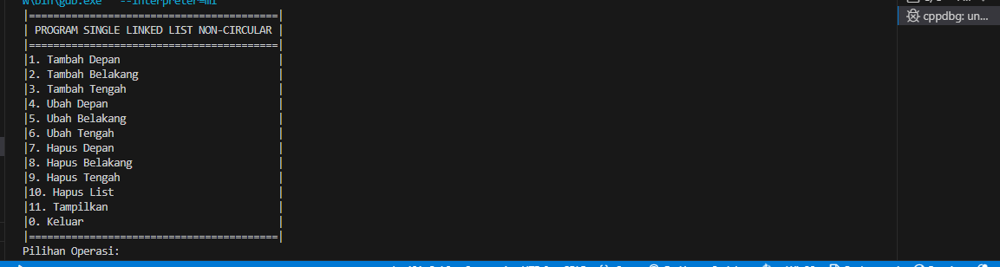

<h2>Tampilan Tambah Depan</h2>

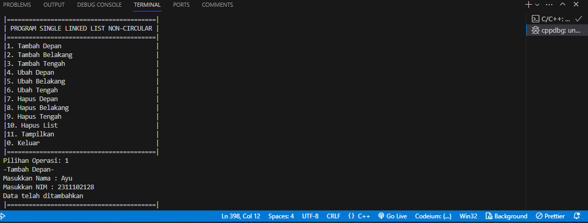

<h2>Tampilan Tambah Belakang</h2>

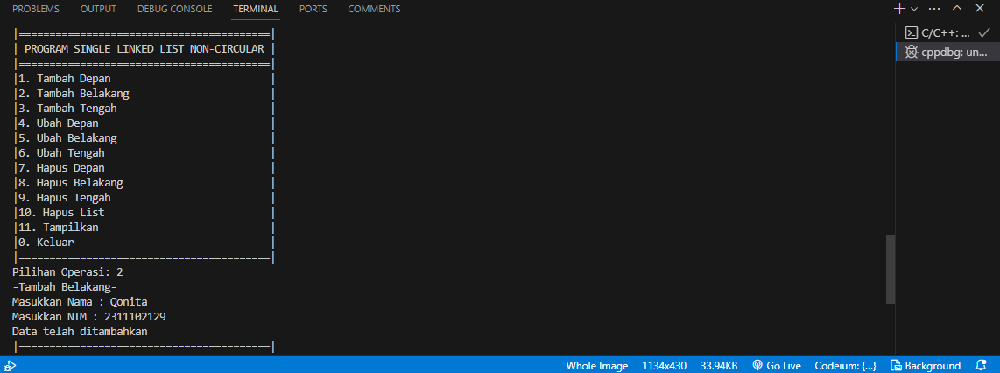

<h2>Tampilan Tambah Tengah</h2>

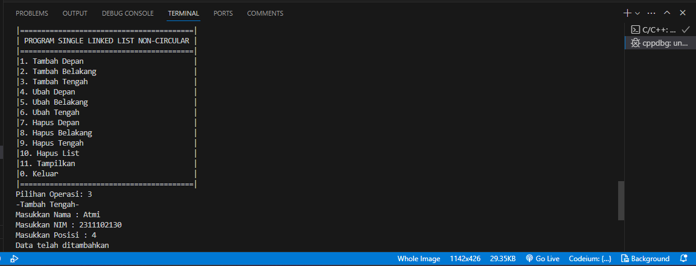

<h2>Tampilan Ubah Depan</h2>

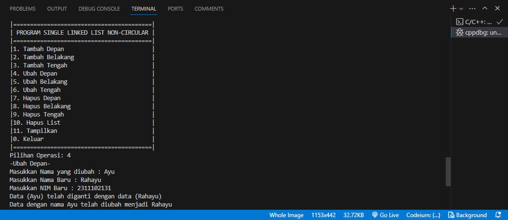

<h2>Tampilan Ubah Belakang</h2>

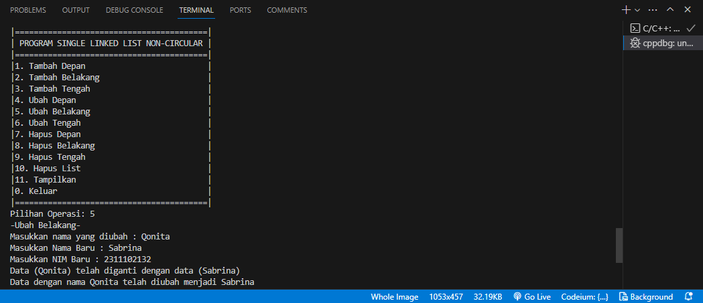

<h2>Tampilan Ubah Tengah</h2>

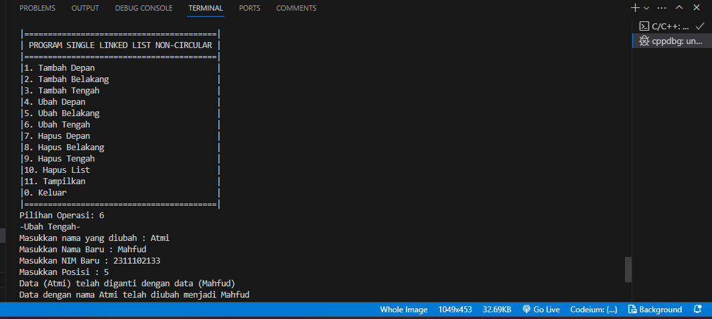

<h2>Tampilan Hapus Depan</h2>

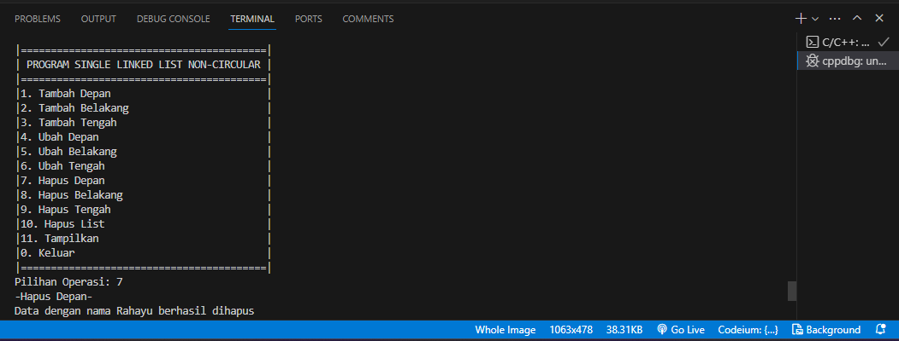

<h2>Tampilan Hapus Belakang</h2>

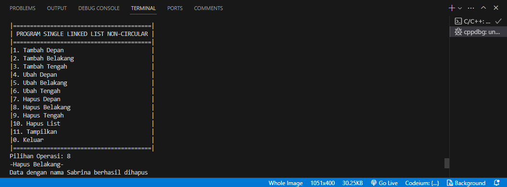

<h2>Tampilan Hapus Tengah</h2>

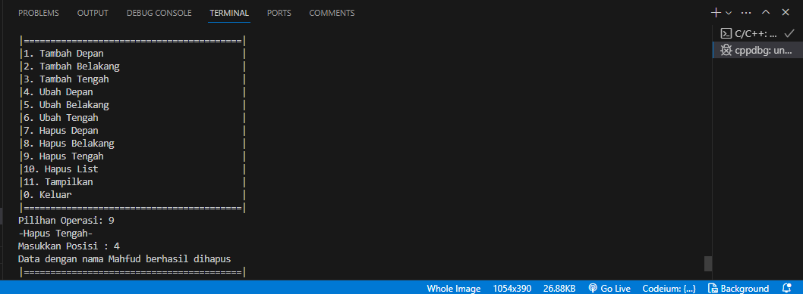

<h2>Tampilan Hapus List</h2>

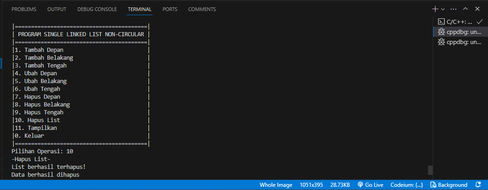

<h2>Tampilan Tampil Data</h2>

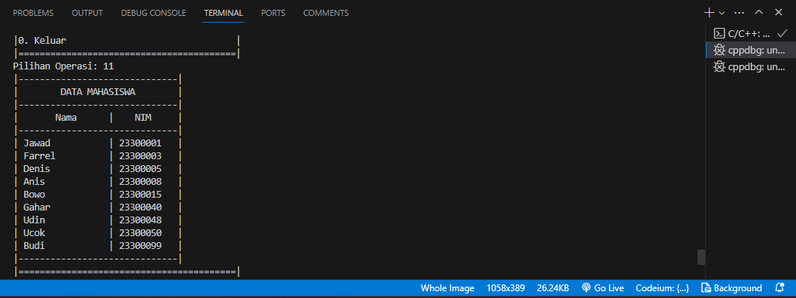

=> Penjelasan program
- Kode diatas merupakan program single linked list circular yang terdapat menu tambah depan, tambah belakang, tambah tengah,ubah depan, ubah belakang, ubah tengah, hapus depan, hapus belakang, hapus tengah, hapus list, tampilkan, dan keluar.Untuk menyimpan data mahasiswa perubah nama dan NIM. Dengan, Pada program ini, kita bisa melakukan penambahan data dengan cara tambah depan,tambah belakang,tambah tengah, mengubah data dengan cara ubah depan,ubah belakang,ubah tengah dan menghapus data dengan cara hapus depan,hapus tengah,hapus belakang, menghapus semua data dan menapilkan data dengan cara memanggil fungsi yang telah di buat dan di ikuti oleh parameter fungsi terebut.

#### Full code Screenshot:
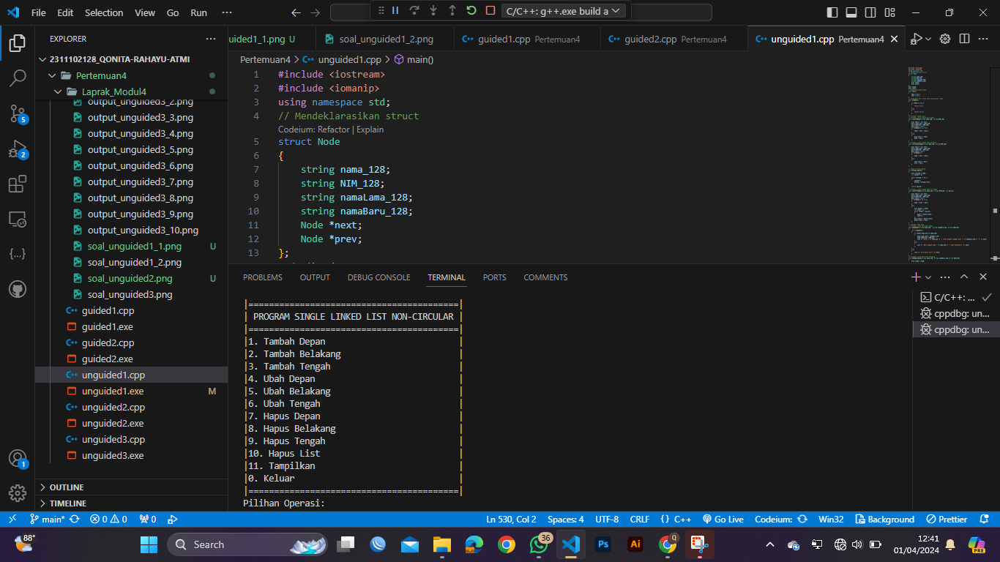

### 2. [Setelah membuat menu tersebut, masukkan data sesuai urutan berikut, lalu tampilkan data yang telah dimasukkan. (Gunakan insert depan, belakang atautengah)]

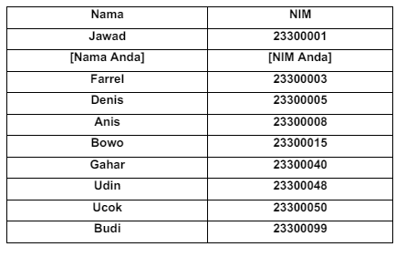

```C++
#include <iostream>
#include <iomanip>
using namespace std;
// Mendeklarasikan struct
struct Node
{
    string nama_128;
    string NIM_128;
    string namaLama_128;
    string namaBaru_128;
    Node *next;
    Node *prev;
};
Node *head;
Node *tail;
// Menginisialisasi Node
void init()
{
    head = NULL;
    tail = NULL;
}
// Pengecekan NULL untuk data kosong atau tidak
bool isEmpty()
{
    if (head == NULL)
    {
        return true;
    }
    else
    {
        return false;
    }
}
// Prosedur tambah data
// Prosedur untuk tambah data depan
void insertDepan(string nama_128, string NIM_128)
{
    Node *baru = new Node;
    baru->nama_128 = nama_128;
    baru->NIM_128 = NIM_128;
    baru->next = NULL;
    if (isEmpty() == true)
    {
        head = tail = baru;
    }
    else
    {
        baru->next = head;
        head = baru;
    }
}
// Prosedur untuk tambah data belakang
void insertBelakang(string nama_128, string NIM_128)
{
    Node *baru = new Node;
    baru->nama_128 = nama_128;
    baru->NIM_128 = NIM_128;
    baru->next = NULL;
    if (isEmpty())
    {
        head = tail = baru;
    }
    else
    {
        tail->next = baru;
        tail = baru;
    }
}

// Fungsi Hitung Jumlah
int hitung_jumlah()
{
    Node *hitung = head;
    int jumlah = 0;

    while (hitung != NULL)
    {
        jumlah++;
        hitung = hitung->next;
    }

    return jumlah;
}
// Prosedur untuh tambah data di tengah
void insertTengah(string nama_128, string NIM_128, int posisi)
{
    Node *baru = new Node;
    baru->nama_128 = nama_128;
    baru->NIM_128 = NIM_128;
    baru->next = NULL;
    if (isEmpty() == true)
    {
        head = tail = baru;
    }
    else
    {
        Node *bantu = head;
        int nomor = 1;
        while (nomor < posisi)
        {
            bantu = bantu->next;
            nomor++;
        }
        baru->next = bantu->next;
        bantu->next = baru;
    }
}
// Prosedur ubah data
// Prosedur untuk ubah data depan
void ubahDepan(string nama_128,  string namaBaru_128 ,string NIM_128)
{
     if (!isEmpty())
    {
        if (head->nama_128 == nama_128)
        {
            head->nama_128 = namaBaru_128;
            head->NIM_128 = NIM_128;
            cout << "Data (" << nama_128 << ") telah diganti dengan data (" << namaBaru_128 << ")" << endl;
        }
        else
        {
            cout << "Data dengan nama " << nama_128 << " tidak ditemukan!" << endl;
        }
    }
    else
    {
        cout << "List masih null!" << endl;
    }
}
// Prosedur untuk ubah data belakang
void ubahBelakang(string nama_128, string namaBaru_128,string NIM_128)
{
    Node *temp = head;

    while (temp != NULL)
    {
        if (temp->nama_128 == nama_128)
        {
            temp->nama_128 = namaBaru_128;
            temp->NIM_128 = NIM_128;
            cout << "Data (" << nama_128 << ") telah diganti dengan data (" << namaBaru_128 << ")" << endl;
            return;
        }
        temp = temp->next;
    }

    cout << "Data tidak ditemukan" << endl;
}
// Prosedur untuk ubah data di tengah
void ubahTengah(int posisi_128, string nama_128, string NIM_128, string namaBaru_128)
{
    if (!isEmpty())
    {
        if (posisi_128 < 1 || posisi_128 > hitung_jumlah())
        {
            cout << "Posisi di luar jangkauan" << endl;
        }
        else
        {
            Node *bantu = head;
            Node *sebelum = NULL; 

            int nomor = 1;

            // Iterasi hingga mencapai posisi yang diinginkan
            while (nomor < posisi_128 && bantu != NULL)
            {
                sebelum = bantu;
                bantu = bantu->next;
                nomor++;
            }

            // Cek apakah posisi yang diinginkan ditemukan
            if (bantu != NULL)
            {
                // Ubah data pada node yang ditemukan
                if (bantu->nama_128 == nama_128)
                {
                    bantu->nama_128 = namaBaru_128;
                    bantu->NIM_128 = NIM_128;
                    cout << "Data (" << nama_128 << ") telah diganti dengan data (" << namaBaru_128 << ")" << endl;

                    // Hubungkan node sebelumnya dengan node yang baru
                    if (sebelum != NULL)
                    {
                        Node *baru = new Node;
                        baru->nama_128 = namaBaru_128;
                        baru->NIM_128 = NIM_128;
                        baru->next = bantu->next;
                        sebelum->next = baru;
                    }
                }
                else
                {
                    cout << "Data dengan nama " << nama_128 << " tidak ditemukan pada posisi yang dimaksud!" << endl;
                }
            }
            else
            {
                cout << "Posisi di luar jangkauan" << endl;
            }
        }
    }
    else
    {
        cout << "List masih null!" << endl;
    }
}

// Fungsi hapus data
// Fungsi untuk hapus data di depan dan mengembalikan nama yang akan dihapus
string deleteDepan()
{
    // Menyimpan nama yang dihapus
    string nama_hapus = "";

    if (!isEmpty())
    {
        Node *hapus = head;

        if (head->next != NULL)
        {
            head = head->next;
            nama_hapus = hapus->nama_128;
            delete hapus;
        }
        else
        {
            nama_hapus = head->nama_128;
            head = tail = NULL;
        }
    }
    else
    {
        cout << "List null!" << endl;
    }
    return nama_hapus; 
}
// Fungsi untuk hapus data di belakang dan mengembalikan nama yang akan dihapus
string deleteBelakang()
{
    // Menyimpan nama yang dihapus
    string namaHapus = ""; 

    if (!isEmpty())
    {
        Node *hapus = tail;
        Node *bantu = head;

        if (head != tail)
        {
            while (bantu->next != tail)
            {
                bantu = bantu->next;
            }

            tail = bantu;
            tail->next = NULL;
            namaHapus = hapus->nama_128; 
            delete hapus;
        }
        else
        {
            namaHapus = head->nama_128; 
            head = tail = NULL;
        }
    }
    else
    {
        cout << "List null!" << endl;
    }

    return namaHapus;
}
// Fungsi untuk hapus data di tengah dan untuk mengembalikan nama yang akan dihapus
string deleteTengah(int posisi_128)
{
    // Menyimpan nama yang dihapus
    string namaHapus = ""; 

    if (posisi_128 < 1 || posisi_128 > hitung_jumlah())
    {
        cout << "Posisi di luar jangkauan" << endl;
    }
    else if (posisi_128 == 1)
    {
        cout << "Posisi bukan posisi tengah" << endl;
    }
    else
    {
        Node *hapus;
        Node *bantu;
        Node *bantuan;
        int nomor = 1;
        bantu = head;

        while (nomor <= posisi_128)
        {
            if (nomor == posisi_128 - 1)
            {
                bantuan = bantu;
            }

            if (nomor == posisi_128)
            {
                hapus = bantu;
                namaHapus = hapus->nama_128; 
            }

            bantu = bantu->next;
            nomor++;
        }

        bantuan->next = bantu;
        delete hapus;
    }
    // Kembalikan nama yang dihapus
    return namaHapus; 
}
// Prosedur untuk menghapus semua data
void hapusSemua()
{
    Node *bantu = head;
    Node *hapus;

    while (bantu != NULL)
    {
        hapus = bantu;
        bantu = bantu->next;
        delete hapus;
    }

    head = tail = NULL;
    cout << "List berhasil terhapus!" << endl;
}
// Prosedur untuk tampilkan semua data
void tampil()
{
    Node *bantu = head;
    if (!isEmpty()) 
    {
        cout << "|------------------------------|" << endl;
        cout << "|        DATA MAHASISWA        |" << endl;
        cout << "|------------------------------|" << endl;
        cout << "|       Nama      |    NIM     |" << endl;
        cout << "|------------------------------|" << endl;
        while (bantu != NULL)
        {
            cout << "| " << setw(15) << left << bantu->nama_128 << " | " << setw(10) << left << bantu->NIM_128 << " |" << endl;
            bantu = bantu->next;
        }
        cout << "|------------------------------|" << endl;
    }
    else
    {
        cout << "List masih kosong!" << endl;
    }
}

// Prosedur untuk menghapus nama
void hapusData(string nama_128)
{
    if (isEmpty())
    {
        cout << "List masih kosong!" << endl;
        return;
    }
    Node *bantu = head;
    Node *sebelum = NULL;

    while (bantu != NULL && bantu->nama_128 != nama_128)
    {
        sebelum = bantu;
        bantu = bantu->next;
    }

    if (bantu == NULL)
    {
        cout << "Data tidak ditemukan!" << endl;
        return;
    }

    if (sebelum == NULL)
    {
        deleteDepan();
    }
    else
    {
        sebelum->next = bantu->next;
        delete bantu;
        cout << "Data dengan nama " << nama_128 << " berhasil dihapus!" << endl;
    }
}
int main()
{
    string nama_128, NIM_128, namaBaru_128;
    int pilihan_128, posisi_128;

    do
    {
        // Menampilkan pilihan menu
        cout << "|=========================================|" << endl;
        cout << "| PROGRAM SINGLE LINKED LIST NON-CIRCULAR |" << endl;
        cout << "|=========================================|" << endl;
        cout << "|1. Tambah Depan                          |" << endl;
        cout << "|2. Tambah Belakang                       |" << endl;
        cout << "|3. Tambah Tengah                         |" << endl;
        cout << "|4. Ubah Depan                            |" << endl;
        cout << "|5. Ubah Belakang                         |" << endl;
        cout << "|6. Ubah Tengah                           |" << endl;
        cout << "|7. Hapus Depan                           |" << endl;
        cout << "|8. Hapus Belakang                        |" << endl;
        cout << "|9. Hapus Tengah                          |" << endl;
        cout << "|10. Hapus List                           |" << endl;
        cout << "|11. Tampilkan                            |" << endl;
        cout << "|0. Keluar                                |" << endl;
        cout << "|=========================================|" << endl;
        cout << "Pilihan Operasi: ";
        cin >> pilihan_128;

        switch (pilihan_128)
        {
        case 0:
            break;
        // Untuk menambah data depan
        case 1:
            cout << "-Tambah Depan-" << endl;
            cout << "Masukkan Nama : ";
            cin >> nama_128;
            cout << "Masukkan NIM : ";
            cin >> NIM_128;
            insertDepan(nama_128, NIM_128);
            cout << "Data telah ditambahkan" << endl;
            break;
        // Untuk menambah data belakang    
        case 2:
            cout << "-Tambah Belakang-" << endl;
            cout << "Masukkan Nama : ";
            cin >> nama_128;
            cout << "Masukkan NIM : ";
            cin >> NIM_128;
            insertBelakang(nama_128, NIM_128);
            cout << "Data telah ditambahkan" << endl;
            break;
        // Untuk menambah data tengah    
        case 3:
            cout << "-Tambah Tengah-" << endl;
            cout << "Masukkan Nama : ";
            cin >> nama_128;
            cout << "Masukkan NIM : ";
            cin >> NIM_128;
            cout << "Masukkan Posisi : ";
            cin >> posisi_128;
            insertTengah(nama_128, NIM_128, posisi_128);
            cout << "Data telah ditambahkan" << endl;
            break;
        // Untuk mengubah data depan    
        case 4:
            cout << "-Ubah Depan-" << endl;
            cout << "Masukkan Nama yang diubah : ";
            cin >> nama_128;
            cout << "Masukkan Nama Baru : ";
            cin >> namaBaru_128;
            cout << "Masukkan NIM Baru : ";
            cin >> NIM_128;
            ubahDepan(nama_128, namaBaru_128, NIM_128);
            cout << "Data dengan nama " << nama_128 << " telah diubah menjadi " << namaBaru_128 << endl;
            break;
        // Untuk mengubah data belakang    
        case 5:
            cout << "-Ubah Belakang-" << endl;
            cout << "Masukkan nama yang diubah : ";
            cin >> nama_128;
            cout << "Masukkan Nama Baru : ";
            cin >> namaBaru_128;
            cout << "Masukkan NIM Baru : ";
            cin >> NIM_128;
            ubahBelakang(nama_128, namaBaru_128, NIM_128);
            cout << "Data dengan nama " << nama_128 << " telah diubah menjadi " << namaBaru_128 << endl;
            break;
        // Untuk mengubah data tengah
        case 6: 
            cout << "-Ubah Tengah-" << endl;
            cout << "Masukkan nama yang diubah : ";
            cin >> nama_128;
            cout << "Masukkan Nama Baru : ";
            cin >> namaBaru_128;
            cout << "Masukkan NIM Baru : ";
            cin >> NIM_128;
            cout << "Masukkan Posisi : ";
            cin >> posisi_128;
            ubahTengah(posisi_128, nama_128, NIM_128, namaBaru_128);
            cout << "Data dengan nama " << nama_128 << " telah diubah menjadi " << namaBaru_128 << endl;
            break;
        // Untuk menghapus data depan
        case 7:
            cout << "-Hapus Depan-" << endl;  
            cout << "Data dengan nama " << deleteDepan() << " berhasil dihapus" << endl;
            break;
        // Untuk menghapus data belakang
        case 8:
            cout << "-Hapus Belakang-" << endl;
            cout << "Data dengan nama " << deleteBelakang() << " berhasil dihapus" << endl;
            break;
        // Untuk menghapus data tengah
        case 9:
            cout << "-Hapus Tengah-" << endl;
            cout << "Masukkan Posisi : ";
            cin >> posisi_128;
            cout << "Data dengan nama " << deleteTengah(posisi_128) << " berhasil dihapus" << endl;
            break;
        // Untuk menghapus semua data
        case 10:
            cout << "-Hapus List-" << endl;
            hapusSemua();
            cout << "Data berhasil dihapus" << endl;
            break;
        // Untuk menampilkan ke menu utama
        case 11:
            tampil();
            break;
        default:
            cout << "Program Selesai" << endl;
            break;
        }

    } while (pilihan_128 != 0);

    return 0;
}
```
#### Output:

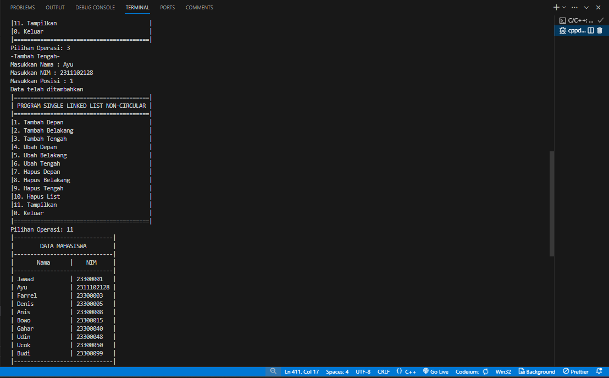

=> Penjelasan program
- Kode diatas merupakan program single linked list circular yang terdapat menu tambah depan, tambah belakang, tambah tengah,ubah depan, ubah belakang, ubah tengah, hapus depan, hapus belakang, Hapus tengah, hapus list, tampilkan, dan keluar.Untuk menyimpan data mahasiswa perubah nama dan NIM. Kita bisa menggunakan insert depan, belakang, dan tengah untuk menambahkan data 
mahasiswa dan NIM mahasiswa. Dan kita bisa menambahkan nama dan NIM kita menggunakan insert tengah.

#### Full code Screenshot:
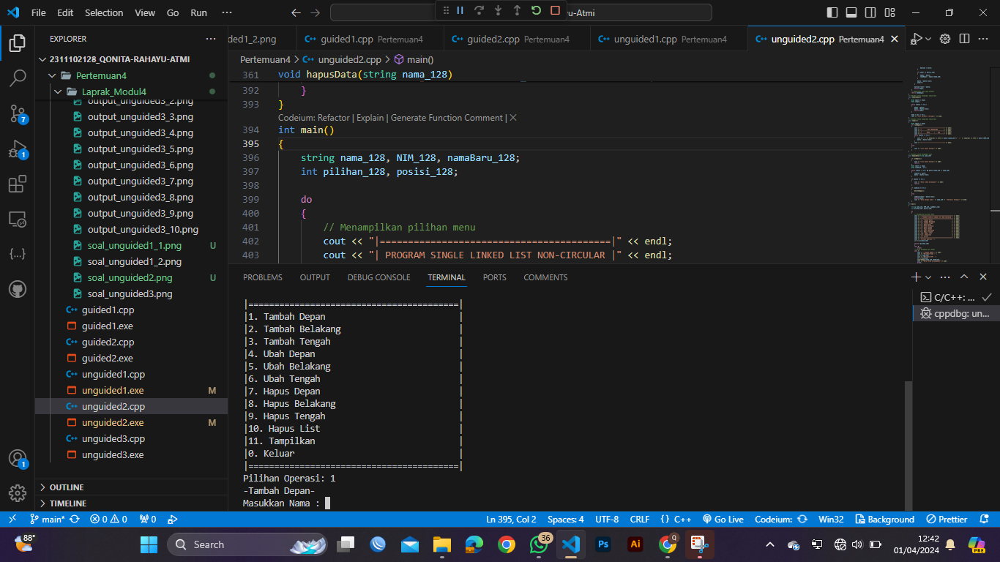

### 3. [Lakukan perintah berikut:]

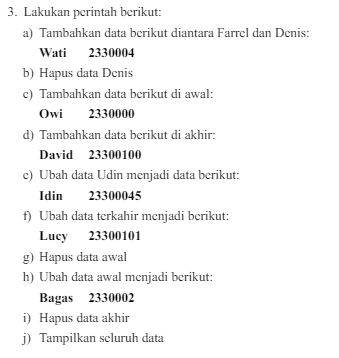

```C++
#include <iostream>
#include <iomanip>
using namespace std;
// Mendeklarasikan struct
struct Node
{
    string nama_128;
    string NIM_128;
    string namaLama_128;
    string namaBaru_128;
    Node *next;
    Node *prev;
};
Node *head;
Node *tail;
// Menginisialisasi Node
void init()
{
    head = NULL;
    tail = NULL;
}
// Pengecekan NULL untuk data kosong atau tidak
bool isEmpty()
{
    if (head == NULL)
    {
        return true;
    }
    else
    {
        return false;
    }
}
// Prosedur tambah data
// Prosedur untuk tambah data depan
void insertDepan(string nama_128, string NIM_128)
{
    Node *baru = new Node;
    baru->nama_128 = nama_128;
    baru->NIM_128 = NIM_128;
    baru->next = NULL;
    if (isEmpty() == true)
    {
        head = tail = baru;
    }
    else
    {
        baru->next = head;
        head = baru;
    }
}
// Prosedur untuk tambah data belakang
void insertBelakang(string nama_128, string NIM_128)
{
    Node *baru = new Node;
    baru->nama_128 = nama_128;
    baru->NIM_128 = NIM_128;
    baru->next = NULL;
    if (isEmpty())
    {
        head = tail = baru;
    }
    else
    {
        tail->next = baru;
        tail = baru;
    }
}

// Fungsi Hitung Jumlah
int hitung_jumlah()
{
    Node *hitung = head;
    int jumlah = 0;

    while (hitung != NULL)
    {
        jumlah++;
        hitung = hitung->next;
    }

    return jumlah;
}
// Prosedur untuh tambah data di tengah
void insertTengah(string nama_128, string NIM_128, int posisi)
{
    Node *baru = new Node;
    baru->nama_128 = nama_128;
    baru->NIM_128 = NIM_128;
    baru->next = NULL;
    if (isEmpty() == true)
    {
        head = tail = baru;
    }
    else
    {
        Node *bantu = head;
        int nomor = 1;
        while (nomor < posisi)
        {
            bantu = bantu->next;
            nomor++;
        }
        baru->next = bantu->next;
        bantu->next = baru;
    }
}
// Prosedur ubah data
// Prosedur untuk ubah data depan
void ubahDepan(string nama_128,  string namaBaru_128 ,string NIM_128)
{
     if (!isEmpty())
    {
        if (head->nama_128 == nama_128)
        {
            head->nama_128 = namaBaru_128;
            head->NIM_128 = NIM_128;
            cout << "Data (" << nama_128 << ") telah diganti dengan data (" << namaBaru_128 << ")" << endl;
        }
        else
        {
            cout << "Data dengan nama " << nama_128 << " tidak ditemukan!" << endl;
        }
    }
    else
    {
        cout << "List masih null!" << endl;
    }
}
// Prosedur untuk ubah data belakang
void ubahBelakang(string nama_128, string namaBaru_128,string NIM_128)
{
    Node *temp = head;

    while (temp != NULL)
    {
        if (temp->nama_128 == nama_128)
        {
            temp->nama_128 = namaBaru_128;
            temp->NIM_128 = NIM_128;
            cout << "Data (" << nama_128 << ") telah diganti dengan data (" << namaBaru_128 << ")" << endl;
            return;
        }
        temp = temp->next;
    }

    cout << "Data tidak ditemukan" << endl;
}
// Prosedur untuk ubah data di tengah
void ubahTengah(int posisi_128, string nama_128, string NIM_128, string namaBaru_128)
{
    if (!isEmpty())
    {
        if (posisi_128 < 1 || posisi_128 > hitung_jumlah())
        {
            cout << "Posisi di luar jangkauan" << endl;
        }
        else
        {
            Node *bantu = head;
            Node *sebelum = NULL; 

            int nomor = 1;

            // Iterasi hingga mencapai posisi yang diinginkan
            while (nomor < posisi_128 && bantu != NULL)
            {
                sebelum = bantu;
                bantu = bantu->next;
                nomor++;
            }

            // Cek apakah posisi yang diinginkan ditemukan
            if (bantu != NULL)
            {
                // Ubah data pada node yang ditemukan
                if (bantu->nama_128 == nama_128)
                {
                    bantu->nama_128 = namaBaru_128;
                    bantu->NIM_128 = NIM_128;
                    cout << "Data (" << nama_128 << ") telah diganti dengan data (" << namaBaru_128 << ")" << endl;

                    // Hubungkan node sebelumnya dengan node yang baru
                    if (sebelum != NULL)
                    {
                        Node *baru = new Node;
                        baru->nama_128 = namaBaru_128;
                        baru->NIM_128 = NIM_128;
                        baru->next = bantu->next;
                        sebelum->next = baru;
                    }
                }
                else
                {
                    cout << "Data dengan nama " << nama_128 << " tidak ditemukan pada posisi yang dimaksud!" << endl;
                }
            }
            else
            {
                cout << "Posisi di luar jangkauan" << endl;
            }
        }
    }
    else
    {
        cout << "List masih null!" << endl;
    }
}

// Fungsi hapus data
// Fungsi untuk hapus data di depan dan mengembalikan nama yang akan dihapus
string deleteDepan()
{
    // Menyimpan nama yang dihapus
    string nama_hapus = "";

    if (!isEmpty())
    {
        Node *hapus = head;

        if (head->next != NULL)
        {
            head = head->next;
            nama_hapus = hapus->nama_128;
            delete hapus;
        }
        else
        {
            nama_hapus = head->nama_128;
            head = tail = NULL;
        }
    }
    else
    {
        cout << "List null!" << endl;
    }
    return nama_hapus; 
}
// Fungsi untuk hapus data di belakang dan mengembalikan nama yang akan dihapus
string deleteBelakang()
{
    // Menyimpan nama yang dihapus
    string namaHapus = ""; 

    if (!isEmpty())
    {
        Node *hapus = tail;
        Node *bantu = head;

        if (head != tail)
        {
            while (bantu->next != tail)
            {
                bantu = bantu->next;
            }

            tail = bantu;
            tail->next = NULL;
            namaHapus = hapus->nama_128; 
            delete hapus;
        }
        else
        {
            namaHapus = head->nama_128; 
            head = tail = NULL;
        }
    }
    else
    {
        cout << "List null!" << endl;
    }

    return namaHapus;
}
// Fungsi untuk hapus data di tengah dan untuk mengembalikan nama yang akan dihapus
string deleteTengah(int posisi_128)
{
    // Menyimpan nama yang dihapus
    string namaHapus = ""; 

    if (posisi_128 < 1 || posisi_128 > hitung_jumlah())
    {
        cout << "Posisi di luar jangkauan" << endl;
    }
    else if (posisi_128 == 1)
    {
        cout << "Posisi bukan posisi tengah" << endl;
    }
    else
    {
        Node *hapus;
        Node *bantu;
        Node *bantuan;
        int nomor = 1;
        bantu = head;

        while (nomor <= posisi_128)
        {
            if (nomor == posisi_128 - 1)
            {
                bantuan = bantu;
            }

            if (nomor == posisi_128)
            {
                hapus = bantu;
                namaHapus = hapus->nama_128; 
            }

            bantu = bantu->next;
            nomor++;
        }

        bantuan->next = bantu;
        delete hapus;
    }
    // Kembalikan nama yang dihapus
    return namaHapus; 
}
// Prosedur untuk menghapus semua data
void hapusSemua()
{
    Node *bantu = head;
    Node *hapus;

    while (bantu != NULL)
    {
        hapus = bantu;
        bantu = bantu->next;
        delete hapus;
    }

    head = tail = NULL;
    cout << "List berhasil terhapus!" << endl;
}
// Prosedur untuk tampilkan semua data
void tampil()
{
    Node *bantu = head;
    if (!isEmpty()) 
    {
        cout << "|------------------------------|" << endl;
        cout << "|        DATA MAHASISWA        |" << endl;
        cout << "|------------------------------|" << endl;
        cout << "|       Nama      |    NIM     |" << endl;
        cout << "|------------------------------|" << endl;
        while (bantu != NULL)
        {
            cout << "| " << setw(15) << left << bantu->nama_128 << " | " << setw(10) << left << bantu->NIM_128 << " |" << endl;
            bantu = bantu->next;
        }
        cout << "|------------------------------|" << endl;
    }
    else
    {
        cout << "List masih kosong!" << endl;
    }
}

// Prosedur untuk menghapus nama
void hapusData(string nama_128)
{
    if (isEmpty())
    {
        cout << "List masih kosong!" << endl;
        return;
    }
    Node *bantu = head;
    Node *sebelum = NULL;

    while (bantu != NULL && bantu->nama_128 != nama_128)
    {
        sebelum = bantu;
        bantu = bantu->next;
    }

    if (bantu == NULL)
    {
        cout << "Data tidak ditemukan!" << endl;
        return;
    }

    if (sebelum == NULL)
    {
        deleteDepan();
    }
    else
    {
        sebelum->next = bantu->next;
        delete bantu;
        cout << "Data dengan nama " << nama_128 << " berhasil dihapus!" << endl;
    }
}
int main()
{
    string nama_128, NIM_128, namaBaru_128;
    int pilihan_128, posisi_128;

    do
    {
        // Menampilkan pilihan menu
        cout << "|=========================================|" << endl;
        cout << "| PROGRAM SINGLE LINKED LIST NON-CIRCULAR |" << endl;
        cout << "|=========================================|" << endl;
        cout << "|1. Tambah Depan                          |" << endl;
        cout << "|2. Tambah Belakang                       |" << endl;
        cout << "|3. Tambah Tengah                         |" << endl;
        cout << "|4. Ubah Depan                            |" << endl;
        cout << "|5. Ubah Belakang                         |" << endl;
        cout << "|6. Ubah Tengah                           |" << endl;
        cout << "|7. Hapus Depan                           |" << endl;
        cout << "|8. Hapus Belakang                        |" << endl;
        cout << "|9. Hapus Tengah                          |" << endl;
        cout << "|10. Hapus List                           |" << endl;
        cout << "|11. Tampilkan                            |" << endl;
        cout << "|0. Keluar                                |" << endl;
        cout << "|=========================================|" << endl;
        cout << "Pilihan Operasi: ";
        cin >> pilihan_128;

        switch (pilihan_128)
        {
        case 0:
            break;
        // Untuk menambah data depan
        case 1:
            cout << "-Tambah Depan-" << endl;
            cout << "Masukkan Nama : ";
            cin >> nama_128;
            cout << "Masukkan NIM : ";
            cin >> NIM_128;
            insertDepan(nama_128, NIM_128);
            cout << "Data telah ditambahkan" << endl;
            break;
        // Untuk menambah data belakang    
        case 2:
            cout << "-Tambah Belakang-" << endl;
            cout << "Masukkan Nama : ";
            cin >> nama_128;
            cout << "Masukkan NIM : ";
            cin >> NIM_128;
            insertBelakang(nama_128, NIM_128);
            cout << "Data telah ditambahkan" << endl;
            break;
        // Untuk menambah data tengah    
        case 3:
            cout << "-Tambah Tengah-" << endl;
            cout << "Masukkan Nama : ";
            cin >> nama_128;
            cout << "Masukkan NIM : ";
            cin >> NIM_128;
            cout << "Masukkan Posisi : ";
            cin >> posisi_128;
            insertTengah(nama_128, NIM_128, posisi_128);
            cout << "Data telah ditambahkan" << endl;
            break;
        // Untuk mengubah data depan    
        case 4:
            cout << "-Ubah Depan-" << endl;
            cout << "Masukkan Nama yang diubah : ";
            cin >> nama_128;
            cout << "Masukkan Nama Baru : ";
            cin >> namaBaru_128;
            cout << "Masukkan NIM Baru : ";
            cin >> NIM_128;
            ubahDepan(nama_128, namaBaru_128, NIM_128);
            cout << "Data dengan nama " << nama_128 << " telah diubah menjadi " << namaBaru_128 << endl;
            break;
        // Untuk mengubah data belakang    
        case 5:
            cout << "-Ubah Belakang-" << endl;
            cout << "Masukkan nama yang diubah : ";
            cin >> nama_128;
            cout << "Masukkan Nama Baru : ";
            cin >> namaBaru_128;
            cout << "Masukkan NIM Baru : ";
            cin >> NIM_128;
            ubahBelakang(nama_128, namaBaru_128, NIM_128);
            cout << "Data dengan nama " << nama_128 << " telah diubah menjadi " << namaBaru_128 << endl;
            break;
        // Untuk mengubah data tengah
        case 6: 
            cout << "-Ubah Tengah-" << endl;
            cout << "Masukkan nama yang diubah : ";
            cin >> nama_128;
            cout << "Masukkan Nama Baru : ";
            cin >> namaBaru_128;
            cout << "Masukkan NIM Baru : ";
            cin >> NIM_128;
            cout << "Masukkan Posisi : ";
            cin >> posisi_128;
            ubahTengah(posisi_128, nama_128, NIM_128, namaBaru_128);
            cout << "Data dengan nama " << nama_128 << " telah diubah menjadi " << namaBaru_128 << endl;
            break;
        // Untuk menghapus data depan
        case 7:
            cout << "-Hapus Depan-" << endl;  
            cout << "Data dengan nama " << deleteDepan() << " berhasil dihapus" << endl;
            break;
        // Untuk menghapus data belakang
        case 8:
            cout << "-Hapus Belakang-" << endl;
            cout << "Data dengan nama " << deleteBelakang() << " berhasil dihapus" << endl;
            break;
        // Untuk menghapus data tengah
        case 9:
            cout << "-Hapus Tengah-" << endl;
            cout << "Masukkan Posisi : ";
            cin >> posisi_128;
            cout << "Data dengan nama " << deleteTengah(posisi_128) << " berhasil dihapus" << endl;
            break;
        // Untuk menghapus semua data
        case 10:
            cout << "-Hapus List-" << endl;
            hapusSemua();
            cout << "Data berhasil dihapus" << endl;
            break;
        // Untuk menampilkan ke menu utama
        case 11:
            tampil();
            break;
        default:
            cout << "Program Selesai" << endl;
            break;
        }

    } while (pilihan_128 != 0);

    return 0;
}
```
#### Output:

<h2>Tambahkan data berikut diantara Farrel dan Denis:
Wati 2330004</h2>

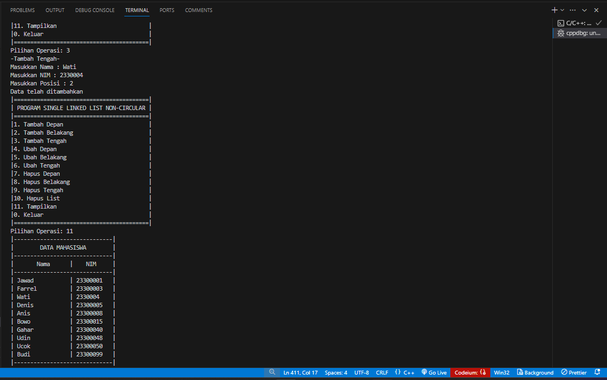

<h2>Hapus data Denis</h2>

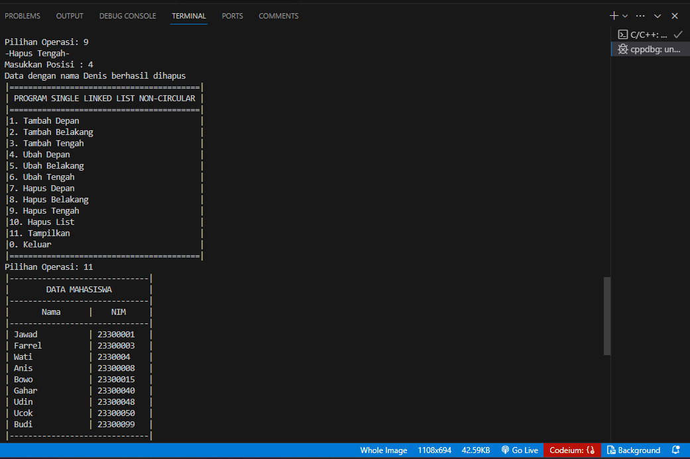

<h2>Tambahkan data berikut di awal:
Owi 2330000</h2>

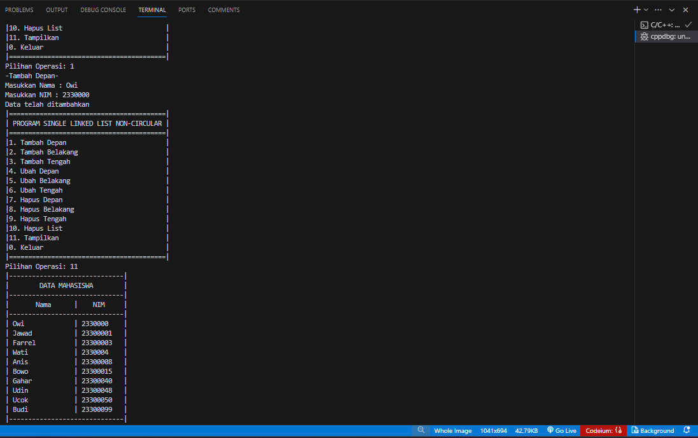

<h2>Tambahkan data berikut di akhir:
David 23300100</h2>

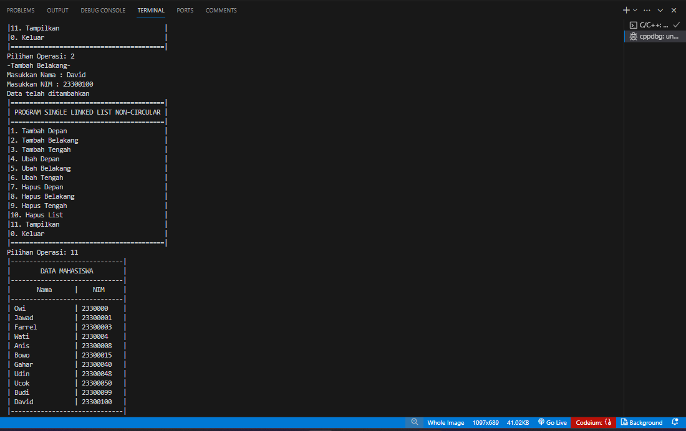

<h2>Ubah data Udin menjadi data berikut:
Idin 23300045</h2>


<h2>Ubah data terkahir menjadi berikut:
Lucy 23300101</h2>

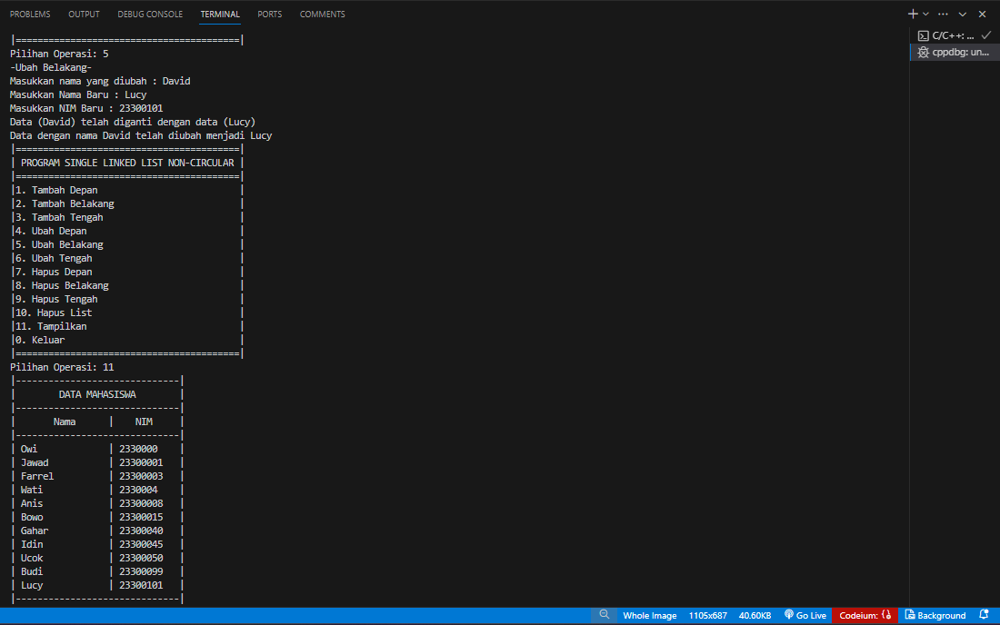

<h2>Hapus data awal</h2>

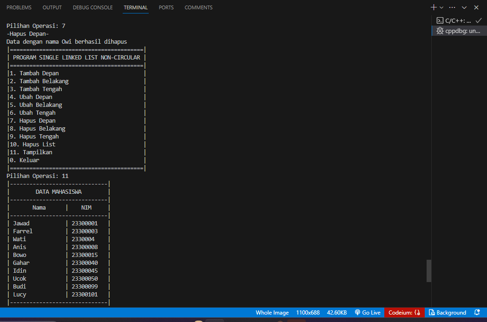

<h2>Ubah data awal menjadi berikut:
Bagas 2330002</h2>

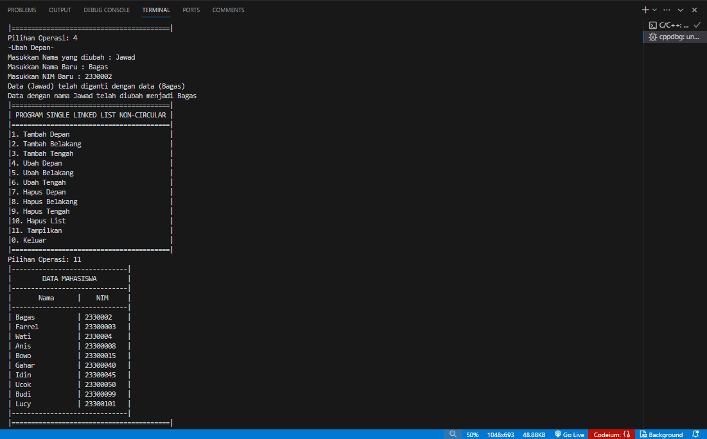

<h2>Hapus data akhir</h2>

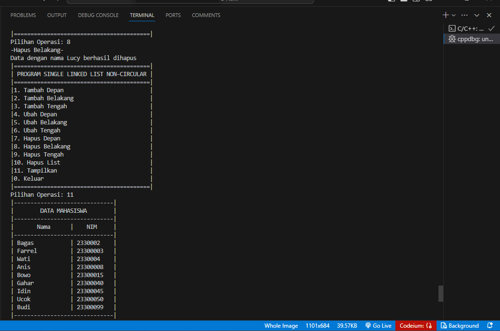

<h2>Tampilkan seluruh data</h2>

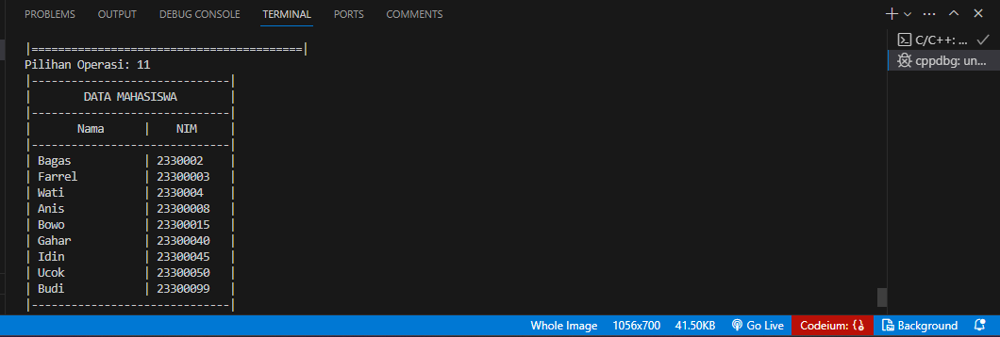


=> Penjelasan program
- Kode diatas merupakan program single linked list circular yang terdapat menu tambah depan, tambah belakang, tambah tengah,ubah depan, ubah belakang, ubah tengah, hapus depan, hapus belakang, Hapus tengah, hapus list, tampilkan, dan keluar. Pada program ini, kita bisa melakukan penambahan data dengan cara tambah depan,tambah belakang,tambah tengah, mengubah data dengan cara ubah depan,ubah belakang,ubah tengah dan menghapus data dengan cara hapus depan,hapus tengah,hapus belakang, menghapus semua data dan menapilkan data dengan cara memanggil fungsi yang telah di buat dan di ikuti oleh parameter fungsi terebut.Pada unguided 3 dengan perintah kita bisa menambahkan data wati menggunkan fungsi ubahTengah, menghapus data denis dengan menggunakan fungsi deleteTengah, menambahkan data owi menggunakan fungsi insertDepan, menambahkan data david di akhir menggunakan fungsi insertBelakang, menambahkan data idin dengan menggunakanfungsi ubahTengah, mengubah data lucy dengan menggunakan fungsi ubahBelakang, untuk menghapus data awal menggunakan deleteDepan, mengubah data bagas menggunakan fungsi ubahDepan, menghapus data diakhir dengan menggunakan fungsi deleteBelakang, serta menampilkan seluruh data dengan fungsi tampil.

#### Full code Screenshot:
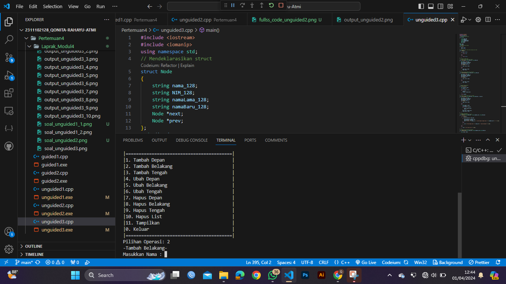

## Kesimpulan

Dari materi Linked list tesebut saya dapat menyimpulkan linked list merupakan jenis-jenis data berisi kelompok-kelompok data yang disusun secara linear. Dan semua data disimpan dalam satu node yang tersimpan antara satu node dengan node yang lainnya. Dan linked list memiliki dua macam jenis yaitu linked list non-circular dan linked list circular. Linked List Non Circular adalah node terakhir yang menunjuk ke NULL, yang  digunakan sebagai kondisi penghentian ketika membaca isi linked list.Linked List Circular  adalah  linked  list  unidirectional yang dapat melintasinya  dalam satu arah. Tetapi jenis linked list ini memiliki simpul terakhir yang menunjuk ke simpul kepala. Jadi saat  melintas, harus  berhati-hati  dan  berhenti  saat kembali simpul kepala.

## Referensi
[1] Moh Erkamim, Lim Abdurrohim , Buku Ajar Algoritma dan Struktur Data. Jambi. SONPEDIA : 2024.