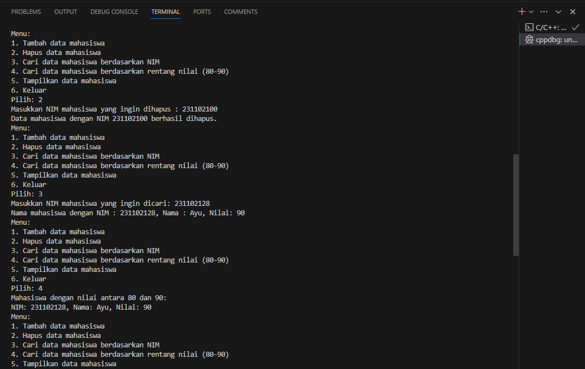
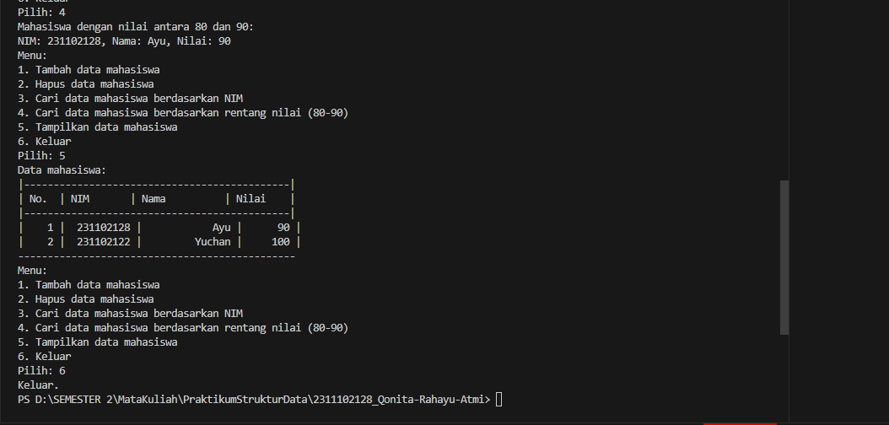

# <h1 align="center">Laporan Praktikum Modul Hash Tabel </h1>
<h1 align="center">Qonita Rahayu Atmi-2311102128</h1>

## Dasar Teori
A. Pengertian Hash Tabel
- Hash tabel adalah sebuah fungsi yang mengembalikan array yang digunakan . Hash tabel merupakan struktur data yang terdiri dari tabel dan fungsi, yang tujuannya adalah memetakan nilai kunci  unik  setiap record  (baris) ke nomor (hash) posisi record  dalam  tabel. Tabel hash juga merupakan cara untuk menyimpan  data di memori  dalam baris dan kolom sehingga membentuk tabel yang dapat  diakses dengan cepat. Setiap sel yang mengisi baris  dan kolom  tabel hash tempat data diarsipkan disebut slot.

B. Fungsi Hash Tabel
- Fungsi hash tabel adalah  fungsi yang dapat digunakan  untuk memetakan data dengan ukuran sembarang ke data dengan  ukuran tertentu . Bentuk fungsi hash yang umum digunakan  adalah tabel hash, yaitu struktur data yang sering digunakan untuk mengoptimalkan pengambilan data. Tabel hash biasanya digunakan  untuk menemukan catatan yang sama dalam database atau tabel dengan sangat cepat. Fungsi hash menyimpan nilai  atau kunci asli di alamat yang sama dengan nilai hash. Saat mencari nilai dalam tabel hash,  terlebih dahulu menghitung nilai hash atau nilai asli untuk kunci  dan kemudian membandingkan kunci atau nilai  asli dengan isi  memori yang dialamatkan oleh nomor hash . Dengan cara ini, Anda dapat  dengan cepat menemukan nilai tanpa harus menelusuri seluruh isi tabel satu per satu.

C. Operasi Hash Tabel
1. Insertion
- Insertion adalah digunakan untuk melakukan operasi memasukkan data baru ke dalam tabel hash. Data baru yang ditempatkan pada indeks yang dihasilkan oleh fungsi hash.
2. Deletion
- Deletion adalah digunakan untuk menghapus data dari tabel hash berdasarkan kunci atau indeks . Data yang dihapus akan dihapus dari indeks yang dihasilkan oleh fungsi hash.
3. Serching
- Serching adalah digunakan untuk mencari data dalam tabel hash berdasarkan kunci atau indeks. Pencarian dilakukan  menggunakan fungsi hash untuk mengindeks item yang akan dicari.
4. Update
- Update adalah digunakan untuk melakukann operasi untuk mengubah nilai suatu data yang sudah ada di tabel hash. Nilai suatu data dapat diubah berdasarkan kunci atau indeksnya.
5. Traversal
- Traversal adalah digunakan untuk melakukan iterasi melalui tabel hash , untuk memproses semua data yang terdapat dalam tabel .

## Guided 

### 1. [ HashTabel dengan Array Dinamis Tabel ]

```C++
#include <iostream>
using namespace std;
const int MAX_SIZE = 10;
// Fungsi hash sederhana
int hash_func(int key)
{
    return key % MAX_SIZE;
}
// Struktur data untuk setiap node
struct Node
{
    int key;
    int value;
    Node *next;
    Node(int key, int value) : key(key), value(value), next(nullptr) {}
};
// Class hash table
class HashTable
{
private:
    Node **table;

public:
    HashTable()
    {
        table = new Node *[MAX_SIZE]();
    }
    ~HashTable()
    {
        for (int i = 0; i < MAX_SIZE; i++)
        {
            Node *current = table[i];
            while (current != nullptr)
            {
                Node *temp = current;
                current = current->next;
                delete temp;
            }
        }
        delete[] table;
    }
    // Insertion
    void insert(int key, int value)
    {
        int index = hash_func(key);
        Node *current = table[index];
        while (current != nullptr)
        {
            if (current->key == key)
            {
                current->value = value;
                return;
            }
            current = current->next;
        }
        Node *node = new Node(key, value);
        node->next = table[index];
        table[index] = node;
    }
    // Searching
    int get(int key)
    {
        int index = hash_func(key);
        Node *current = table[index];
        while (current != nullptr)
        {
            if (current->key == key)
            {
                return current->value;
            }
            current = current->next;
        }
        return -1;
    }
    // Deletion
    void remove(int key)
    {
        int index = hash_func(key);
        Node *current = table[index];
        Node *prev = nullptr;
        while (current != nullptr)
        {
            if (current->key == key)
            {
                if (prev == nullptr)
                {
                    table[index] = current->next;
                }
                else
                {
                    prev->next = current->next;
                }
                delete current;
                return;
            }
            prev = current;
            current = current->next;
        }
    }
    // Traversal
    void traverse()
    {
        for (int i = 0; i < MAX_SIZE; i++)
        {
            Node *current = table[i];
            while (current != nullptr)
            {
                cout << current->key << ": " << current->value
                     << endl;
                current = current->next;
            }
        }
    }
};
int main()
{
    HashTable ht;
    // Insertion
    ht.insert(1, 10);
    ht.insert(2, 20);
    ht.insert(3, 30);
    // Searching
    cout << "Get key 1: " << ht.get(1) << endl;
    cout << "Get key 4: " << ht.get(4) << endl;
    // Deletion
    ht.remove(4);
    // Traversal
    ht.traverse();
    return 0;
}
```
=> Penjelasan program
- Kode diatas adalah Kode untuk menjalankan hash table untuk menyimpan data berupa pasangan key-value. 
Kode tersebut menggunakan struktur Node yang menyimpan key, value, dan pointer ke node selanjutnya. 
HashTable class dibuat untuk mengelola operasi seperti insert untuk menambahkan data, get untuk mencari 
value berdasarkan key, remove untuk menghapus data berdasarkan key, dan traverse untuk mencetak seluruh isi 
hash table. Fungsi hash_func digunakan untuk memetakan key ke index pada tabel hash. Pada int main() diatas terdapat untuk menambahkan data menggunkan ht.insert untuk menambahkan 3 data dengan value 10, 20, dan 30 ,kemudian mencari key 1 dan 4 menggunakan ht.get, lalu menghapus data 4 menggunakan ht.remove, dan traverse untuk mencetak isi data tersebut.


### 2. [Implementasi HashMap untuk Penyimpan Nama dan Nomor Telepon  ]

```C++
#include <iostream>
#include <string>
#include <vector>
using namespace std;

// Deklarasi untuk menampung data
const int TABLE_SIZE = 11;

// Variabel
string name;
string phone_number;

// Deklarasi class HashNode
class HashNode
{
public:
    string name;
    string phone_number;
    HashNode(string name, string phone_number)
    {
        this->name = name;
        this->phone_number = phone_number;
    }
};
// Deklarasi class HashMap
class HashMap
{
private:
    vector<HashNode *> table[TABLE_SIZE];

public:
    // Fungsi untuk menghasilkan indeks dari key
    int hashFunc(string key)
    {
        int hash_val = 0;
        for (char c : key)
        {
            hash_val += c;
        }
        return hash_val % TABLE_SIZE;
    }
    // Prosedur untuk menambahkan data
    void insert(string name, string phone_number)
    {
        int hash_val = hashFunc(name);
        for (auto node : table[hash_val])
        {
            if (node->name == name)
            {
                node->phone_number = phone_number;
                return;
            }
        }
        table[hash_val].push_back(new HashNode(name,phone_number));
    }
    // Prosedur untuk menghapus data berdasarkan nama
    void remove(string name)
    {
        int hash_val = hashFunc(name);
        for (auto it = table[hash_val].begin(); it !=table[hash_val].end();it++)
        {
            if ((*it)->name == name)
            {
                table[hash_val].erase(it);
                return;
            }
        }
    }
    // Fungsi untuk mencari data berdasarkan nama
    string searchByName(string name)
    {
        int hash_val = hashFunc(name);
        for (auto node : table[hash_val])
        {
            if (node->name == name)
            {
                return node->phone_number;
            }
        }
        return "";
    }
    // Prosedur untuk menampilkan data
    void print()
    {
        for (int i = 0; i < TABLE_SIZE; i++)
        {
            cout << i << ": ";
            for (auto pair : table[i])
            {
                if (pair != nullptr)
                {
                    cout << "[" << pair->name << ", " << pair->phone_number << "]";
                }
            }
            cout << endl;
        }
    }
};
int main()
{
    HashMap employee_map;

    // Untuk menambahkan data
    employee_map.insert("Mistah", "1234");
    employee_map.insert("Pastah", "5678");
    employee_map.insert("Ghana", "91011");

    // Untuk mencari dan mencetak phone number
    cout << "Nomer Hp Mistah : "
    << employee_map.searchByName("Mistah") << endl;
    cout << "Phone Hp Pastah : "
    << employee_map.searchByName("Pastah") << endl;

    // Untuk menghapus data dan mencetak 
    employee_map.remove("Mistah");
    cout << "Nomer Hp Mistah setelah dihapus : "
    << employee_map.searchByName("Mistah") << endl << endl;

    // Untuk mencetak seluruh data tabel hash
    cout << "Hash Table : " << endl;
    employee_map.print();
    return 0;
}
```
=> Penjelasan program
- Kode diatas adalah Kode sederhana untuk hash table untuk menyimpan data karyawan berupa nama dan nomor telepon. Kode ini mendefinisikan kelas HashNode untuk menyimpan informasi tersebut dan kelas HashMap untuk mengelola operasi seperti insert untuk menambahkan data, searchByName untuk mencari nomor telepon berdasarkan nama, remove untukmenghapus data, dan print untuk mencetak isi hash table. Fungsi hashFunc digunakan untuk memetakan nama menjadi index pada tabel hash. Terdapat fungsi insert yang memeriksa keberadaan nama sebelum memasukkan data baru, dan fungsi remove yang menghapus data berdasarkan nama. Dan, fungsi print menampilkan isi keseluruhan hash table. Pada int main() HashMap dideklarasikan dengan employee_map, program diatas menambahkan 3 data nama dan nomer telepon yaitu Mistah dan 1234, Pastah dan 5678, Ghana dan 91011 menggunakan employee_map.insert, lalu mencari data Mistah dan pastah menggunakan employee_map.searchByName, kemudian mengghapus data Mistah menggunakan employee_map.searchByName, selanjutnya mencari data Mistah. Lalu program menampilkan data menggunkan employee_map.print.

## Unguided

### 1. [Implementasikan hash table untuk menyimpan data mahasiswa. Setiap mahasiswa memiliki NIM dan nilai. Implementasikan fungsi untuk menambahkan data baru,menghapus data, mencari data berdasarkan NIM, dan mencari data berdasarkan nilai. Dengan ketentuan : </br> a. Setiap mahasiswa memiliki NIM dan nilai.</br> b. Program memiliki tampilan pilihan menu berisi poin C.</br> c. Implementasikan fungsi untuk menambahkan data baru, menghapus data, mencari data berdasarkan NIM, dan mencari data berdasarkan rentang nilai (80 – 90).]

```C++
#include <iostream>
#include <string>
#include <vector>
#include <iomanip>
using namespace std;

// Untuk mendeklarasi konstanta TABLE_SIZE
const int TABLE_SIZE = 10;

// Untuk mendeklarasi struct hash_node
struct hash_node
{
    string NIM_128;
    string nama_128;
    int nilai_128;
};

// Untuk mendeklarasi array tabel hash
hash_node *table[TABLE_SIZE];

// Fungsi hash untuk menghasilkan indeks dari NIM
int hashfunc(string key)
{
    int index = 0;
    for (char i : key)
    {
        index += i;
    }
    return index % TABLE_SIZE;
}

// Fungsi untuk menambahkan data mahasiswa ke dalam tabel hash
void insert_128(string NIM_128, string nama_128, int nilai_128)
{
    int index = hashfunc(NIM_128);
    for (int i = 0; i < TABLE_SIZE; i++)
    {
        if (table[index] == nullptr)
        {
            table[index] = new hash_node{NIM_128, nama_128, nilai_128};
            cout << "Data mahasiswa berhasil ditambahkan." << endl;
            return;
        }
        index = (index + 1) % TABLE_SIZE;
    }
    cout << "Tabel hash penuh. Data mahasiswa tidak dapat ditambahkan." << endl;
}

// Fungsi untuk menghapus data mahasiswa dari tabel hash berdasarkan NIM
void delete_128(string NIM_128)
{
    int index = hashfunc(NIM_128);
    for (int i = 0; i < TABLE_SIZE; i++)
    {
        if (table[index] != nullptr && table[index]->NIM_128 == NIM_128)
        {
            delete table[index];
            table[index] = nullptr;
            cout << "Data mahasiswa dengan NIM " << NIM_128 << " berhasil dihapus." << endl;
            return;
        }
        index = (index + 1) % TABLE_SIZE;
    }
    cout << "Data mahasiswa dengan NIM " << NIM_128 << " tidak ditemukan." << endl;
}

// Fungsi untuk mencari data mahasiswa berdasarkan NIM
hash_node *search_128(string NIM_128)
{
    int index = hashfunc(NIM_128);
    for (int i = 0; i < TABLE_SIZE; i++)
    {
        if (table[index] != nullptr && table[index]->NIM_128 == NIM_128)
        {
            return table[index];
        }
        index = (index + 1) % TABLE_SIZE;
    }
    return nullptr;
}

// Fungsi untuk mencari data mahasiswa berdasarkan rentang nilai
vector<hash_node *> search_nilai_128(int minScore, int maxScore)
{
    vector<hash_node *> result;
    for (int i = 0; i < TABLE_SIZE; i++)
    {
        if (table[i] != nullptr && table[i]->nilai_128 >= minScore && table[i]->nilai_128 <= maxScore)
        {
            result.push_back(table[i]);
        }
    }
    return result;
}

// Fungsi untuk mencetak data mahasiswa dalam bentuk tabel
void print_128()
{
    cout << "|---------------------------------------------|" << endl;
    cout << "| No.  | NIM       | Nama          | Nilai    |" << endl;
    cout << "|---------------------------------------------|" << endl;
    int no = 1;
    for (int i = 0; i < TABLE_SIZE; i++)
    {
        if (table[i] != nullptr)
        {
      cout << "| " << setw(4) << no++ << " | " << setw(10) << table[i]->NIM_128 << " | " << setw(14) << table[i]->nama_128 << " | " << setw(7) << table[i]->nilai_128 << " |" << endl;
        }
    }
    cout << "-----------------------------------------------" << endl;
}

// Fungsi utama
int main()
{
    // Mendeklarasikan variabel
    int pilihan_128;
    string NIM_128;
    string nama_128;
    int nilai_128;

    do
    {
        // Untuk menampilkan menu pilihan
        cout << "Menu:" << endl;
        cout << "1. Tambah data mahasiswa" << endl;
        cout << "2. Hapus data mahasiswa" << endl;
        cout << "3. Cari data mahasiswa berdasarkan NIM" << endl;
        cout << "4. Cari data mahasiswa berdasarkan rentang nilai (80-90)" << endl;
        cout << "5. Tampilkan data mahasiswa" << endl;
        cout << "6. Keluar" << endl;
        cout << "Pilih: ";
        cin >> pilihan_128;

        switch (pilihan_128)
        {
        // Untuk menambah data mahasiswa
        case 1:
            cout << "Masukkan nama mahasiswa : ";
            cin.ignore();
            getline(cin, nama_128);
            cout << "Masukkan NIM mahasiswa : ";
            cin >> NIM_128;
            cout << "Masukkan nilai mahasiswa : ";
            cin >> nilai_128;
            insert_128(NIM_128, nama_128, nilai_128);
            break;
        // Untuk menghapus data mahasiswa
        case 2:
            cout << "Masukkan NIM mahasiswa yang ingin dihapus : ";
            cin >> NIM_128;
            delete_128(NIM_128);
            break;
        // Untuk mencari data mahasiswa berdasarkan NIM
        case 3:
            cout << "Masukkan NIM mahasiswa yang ingin dicari: ";
            cin >> NIM_128;
            {
                hash_node *mahasiswa = search_128(NIM_128);
                if (mahasiswa != nullptr)
                {
                    cout << "Nama mahasiswa dengan NIM : " << NIM_128 << ", Nama : " << mahasiswa->nama_128 << ", Nilai: " << mahasiswa->nilai_128 << endl;
                }
                else
                {
                    cout << "Mahasiswa dengan NIM : " << NIM_128 << " tidak ditemukan" << endl;
                }
            }
            break;
        // Untuk mencari data mahasiswa berdasarkan rentang nilai 80-90
        case 4:
            cout << "Mahasiswa dengan nilai antara 80 dan 90:" << endl;
            {
                vector<hash_node *> mahasiswaInRange = search_nilai_128(80, 90);
                if (mahasiswaInRange.empty())
                {
                    cout << "Tidak ada mahasiswa dalam rentang nilai tersebut" << endl;
                }
                else
                {
                    for (auto mahasiswa : mahasiswaInRange)
                    {
                        cout << "NIM: " << mahasiswa->NIM_128 << ", Nama: " << mahasiswa->nama_128 << ", Nilai: " << mahasiswa->nilai_128 << endl;
                    }
                }
            }
            break;
        // Untuk mampilkan data mahasiswa
        case 5:
            cout << "Data mahasiswa:" << endl;
            print_128();
            break;
        case 6:
            cout << "Keluar." << endl;
            break;
        default:
            cout << "Pilihan tidak valid. Silakan coba lagi." << endl;
        }
    } while (pilihan_128 != 6);

    return 0;
}
```
#### Output:







=> Penjelasan program
- Kode di atas adalah kode sederhana untuk menjalankan hash table untuk menyimpan data mahasiswa. Setiap 
mahasiswa memiliki NIM, nama, dan nilai. Kode ini menyediakan fungsi untuk menambahkan data baru, menghapus 
data, mencari data berdasarkan NIM, mencari data berdasarkan rentang nilai yaitu 80 sampai 90, dan 
menampilkan seluruh datanya. Pada saat menambahkan data kita perlu memasukkan nama mahasiswa, NIM mahasiswa, dan nilai mahasiswa. Lalu, saat menghapus data mahasiswa kita hanya memerlukan NIM mahasiswa agar dapat dihapus. Saat, mencari data mahasiswa berdasarkan NIM kita hanya perlu menginputkan NIM mahasiswa. Pada, saat mencari data mahasiswa berdasarkan rentang nilai 80-90 kita tinggal memanggilnya apakah terdapat nilai pada rentang 80-90. Dan terakhir, kita menampilkan seluruh data mahasiswa.

#### Full code Screenshot:


## Kesimpulan

Dari materi Hash Tabel tesebut saya dapat menyimpulkan Hash tabel adalah sebuah fungsi yang mengembalikan array yang digunakan . Hash tabel merupakan struktur data yang terdiri dari tabel dan fungsi, yang tujuannya adalah memetakan nilai kunci  unik  setiap record  (baris) ke nomor (hash) posisi record  dalam  tabel. Setiap sel yang mengisi baris  dan kolom  tabel hash tempat data diarsipkan disebut slot. Dan memiliki fungsi hash tabel untuk memetakan data dengan ukuran sembarang ke data dengan  ukuran tertentu. Lalu memiliki operasi insertion digunakan untuk melakukan operasi memasukkan data baru ke dalam tabel hash, deletion digunakan untuk menghapus data dari tabel hash berdasarkan kunci atau indeks, serching digunakan untuk mencari data dalam tabel hash berdasarkan kunci atau indeks, update digunakan untuk melakukann operasi untuk mengubah nilai suatu data yang sudah ada di tabel hash, dan traversal digunakan untuk melakukan iterasi melalui tabel hash , untuk memproses semua data yang terdapat dalam tabel.

## Referensi
[1] Izhar Rahim, Nizirwan Anwar, Agung Mulyo Widodo, Komparasi Fungsi Hash Md5 Dan Sha256 Dalam Keamanan Gambar Dan Teks. Jakarta : Universitas Esa Unggul, 2023.

[2] Rizki Alif Salman Alfarisy, Perbandingan Kinerja Berbagai Algoritma FungsiHash pada Algoritma Rabin-Karp. Bandung : 2019.