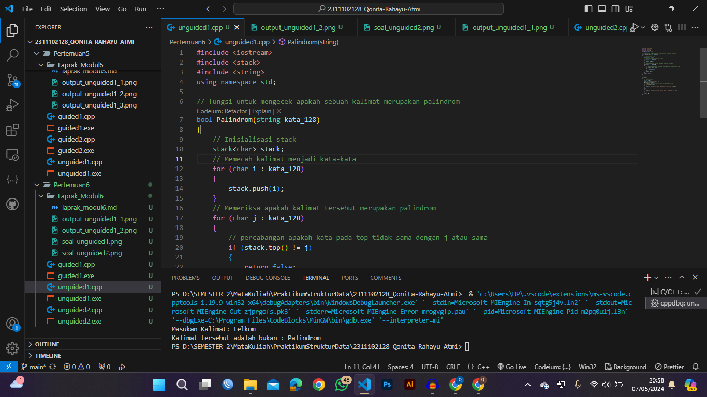

# <h1 align="center">Laporan Praktikum Modul Stack </h1>
<h1 align="center">Qonita Rahayu Atmi-2311102128</h1>

## Dasar Teori
A. Pengertian Stack
- Stack merupakan sebuah kumpulan elemen atau tumpukan yang hanya dapat ditambah dan atau dihapus dari satu ujung yang sama, seolah-olah bertumpuk yang dapat   diartikan   sebagai suatu kumpulan data yang seolah-olah ada data yang diletakkan di atas data yang lain. Stack memiliki sifat LIFO (Last In First Out) berarti elemen-elemen terakhir yang masuk akan pertama kali keluar yang direpresentasikan. Jadi, LIFO (last in first out) adalah sesuatu yang terakhir masuk dalam stack akan menjadi sesuatu pertama yang dikeluarkan dari stack.

B. Operasi Stack
Operasi dasar yang dapat dilakukan terhadap sebuah Stack, berikut adalah beberapa operasi umum pada stack:
1. Push (Masukan)
- Operasi Push adalah untuk memasukkan sebuah nilai atau data ke dalam stack. Sebelum sebuah nilai atau data dimasukkan ke dalam stack, prosedur ini terlebih dahulu akan menaikkan posisi TOP satu level ke atas.Operasi Push memasukkan elemen ke dalam suatu Stack, jika Stack belum mencapai Max. Operasi Push akan memasukkan sebuah elemen ke salah satu stack. Operasi ini berfungsi memasukkan sebuah elemen ke salah satu stack dan untuk menambahkan item pada tumpukan paling atas. 
2. Pop (Keluarkan)
- Operasi Pop adalah untuk menghapus atau mengambil sebuah elemen yang paling puncak atau mengambil yang teratas dari Stack. Pada saat operasi Pop dilakukan maka petunjuk Top akan berkurang satu. Operasi Pop dilakukan jika Stack tidak kosong. 
3. Top (Atas)
- Operasi Top adalah menunjukkan posisi puncak pada sebauh Stack tanpa menghapus tumpukannya.
4. IsEmpty (Kosong)
- Operasi IsEmpty untuk melakukan pengecekan terhadap sebuah stack, apakah stack tersebut kosong atau tidak. Jika stack tersebut kosong yang artinya TOP berada pada posisi 0, maka fungsi akan mengembalikan nilai 1 (true), tetapi jika stack tersebut tidak kosong atau isi yang artinya TOP tidak berada pada posisi 0, maka fungsi akan mengembalikan nilai 0 (false).
5. IsFull (Penuh)
- Operasi IsFull untuk melakukan pengecekan pada sebuah stack, apakah stack tersebut penuh atau tidak. Jika stack tersebut penuh yang artinya TOP berada pada posisi MAX, maka fungsi akan mengembalikan nilai 1 (true), tetapi jika stack tersebut tidak penuh yang artinya TOP tidak berada pada posisi MAX, maka fungsi akan mengembalikan nilai 0 (false). 
6. Size (Ukuran)
- Size adalah untuk mengembalikan jumlah sebuah elemen yang terdapat dalam stack atau tumpukan tersebut.
7. Peek (Lihat)
- Operasi Peek adalah melihat sebuah elemen yang teratas dari stack tanpa menghapus stacknya.
8. Clear (Hapus Semua)
- Operasi Clear adalah operasi yang akan digunakan untuk mengosongkan sebuah Stack dan suatu Stack dikatakan kosong jika Top=0.
9. Search (Cari)
- Search adalah untuk mencari suatu keberadaan elemen tertentu dalam tumpukan.
10. Retrieve
-  Retrieve adalah untuk melihat suatu nilai yang berada pada posisi tumpukan teratas.

## Guided 

### 1. [ Operasi pada Stack ]

```C++
#include <iostream>
using namespace std;

// Untuk menampung buku max 5
string arrayBuku[5];
int maksimal = 5, top = 0;

// Untuk mengecek apakah stack full atau tidak dan mengembalikan nilai top maksimal
bool isFull()
{
  return (top == maksimal);
}

// Untuk mengecek apakah stack kosong atau tidak
bool isEmpty()
{
  return (top == 0);
}

// Prosedur untuk menambahkan data baru ke dalam stack
void pushArrayBuku(string data)
{
  if (isFull())
  {
    // Stack penuh, tampilkan pesan
    cout << "Data telah penuh" << endl;
  }
  else
  {
    // Stack masih ada ruang, tambahkan data
    arrayBuku[top] = data;
    top++;
  }
}

// Prosedur untuk mengeluarkan data di stack
void popArrayBuku()
{
  if (isEmpty())
  {
    // Stack kosong, tampilkan pesan
    cout << "Tidak ada data yang bisa dihapus" << endl;
  }
  else
  {
    // Stack tidak kosong, hapus data terakhir
    arrayBuku[top - 1] = "";
    top--;
  }
}

// Prosedur untuk menampilkan data pada posisi tertentu dalam stack
void peekArrayBuku(int posisi)
{
  if (isEmpty())
  {
    // Stack kosong, tampilkan pesan
    cout << "Tidak ada data yang bisa dilihat" << endl;
  }
  else
  {
    // Stack tidak kosong, tampilkan data pada posisi tertentu
    int index = top;
    for (int i = 1; i < posisi; i++)
    {
      index--;
    }
    cout << "Posisi ke " << posisi << " adalah " << arrayBuku[index] << endl;
  }
}

// Fungsi untuk mengembalikan jumlah data dalam stack
int countStack()
{
  return top;
}

// Prosedur untuk mengubah data pada posisi tertentu dalam stack
void changeArrayBuku(int posisi, string data)
{
  if (posisi > top)
  {
    // Posisi melebihi data yang ada, tampilkan pesan
    cout << "Posisi melebihi data yang ada" << endl;
  }
  else
  {
    // Posisi valid, ubah data pada posisi tertentu
    int index = top;
    for (int i = 1; i < posisi; i++)
    {
      index--;
    }
    arrayBuku[index] = data;
  }
}

// Prosedur untuk menghapus semua data dalam stack dan mengembalikan stack ke keadaan kosong
void destroyArrayBuku()
{
  for (int i = 0; i < top; i++)
  {
    arrayBuku[i] = "";
  }
  top = 0;
}

// Prosedur untuk mencetak semua data dalam stack dari atas ke bawah
void cetakArrayBuku()
{
  if (isEmpty())
  {
    // Stack kosong, tampilkan pesan
    cout << "Tidak ada data yang dicetak" << endl;
  }
  else
  {
    for (int i = top - 1; i >= 0; i--)
    {
      cout << arrayBuku[i] << endl;
    }
  }
}

int main()
{
  // untuk menambahkan data baru ke dalam stack
  pushArrayBuku("Kalkulus");
  pushArrayBuku("Struktur Data");
  pushArrayBuku("Matematika Diskrit");
  pushArrayBuku("Dasar Multimedia");
  pushArrayBuku("Inggris");

  // Untuk menampilkan semua data dalam stack
  cetakArrayBuku();
  cout << "\n";

  // Untuk mengecek apakah stack penuh atau tidak
  cout << "Apakah data stack penuh? " << isFull() << endl;
  // Untuk mengecek apakah stack kosong atau tidak
  cout << "Apakah data stack kosong? " << isEmpty() << endl;

  // Untuk menampilkan data pada posisi tertentu dalam stack
  peekArrayBuku(2);
  popArrayBuku();

  // Untuk mengecek banyaknya data
  cout << "Banyaknya data = " << countStack() << endl;

  // Untuk mengubah data pada posisi tertentu dalam stack
  changeArrayBuku(2, "Bahasa Jerman");
  cetakArrayBuku();

  cout << "\n";

  // Untuk menghapus semua data dalam stack dan mengembalikan stack ke keadaan kosong
  destroyArrayBuku();
  cout << "jumlah data setelah dihaopus:" << top << endl;
  cetakArrayBuku();

  return 0;
}

```
=> Penjelasan program
- Pada code di atas merupakan code sebuah stack, yang dimana pada code stack tersebut terdapat berbagai fungsi yang  dibutuhkan. Fungsi yang ada pada stack tersbut adalah isFull, isEmpty, pushArrayBuku popArrayBuku, peekArrayBuku, countStack, changeArrayBuku, destroyArrayBuku, cetakArrayBuku yang dimana masing masing fungsi tersebut memiliki fungsi yang berbeda dan sebuah stack. Fungsi isFull yang digunakan untuk mengecek apakah stack sudah penuh atau belum, fungsi isEmpty yang digunakan untuk mengecek apakah stack kosong atau tidak, fungsi pushArrayBuku yang digunakan untuk menambahkan data baru ke dalam stack dan mengecek terlebih dahulu apakah stack sudah penuh atau belum jika belum maka akan menambahkan, fungsi popArrayBuku yang digunakan untuk mengeluarkan data dari stack sebelum itu akan di cek terlebih dahulu apakah data pada stack kosong atau tidak jika tidak maka fungsi akan berjalan untuk mengeluarkan data dari stack, fungsi peekArrayBuku yang digunakan untuk mengecek data pada posisi tertentu dalam stack sebelum menampilkan akan di cek dengan perulangan di mana akan mengecek apakah stack ksoong atau tidak jika tidak maka akan menampilkan posisi yang di inginkan pada stack, fungsi countStack yang digunakan untuk menghitung banyaknya data dalam stack dan mengecek apakah data pada stack ada atu tidak dan baru menghitungnya, fungsi changeArrayBuku yang digunakan untuk mengubah data pada posisi tertentu dalam stack sebleum mengubah akan mengeccek apakah data tersebut melebihi nilai top jika tidak maka akan mengubah data, fungsi destroyArrayBuku yang digunakan untuk mengosongkan semua data dalam stack dan mengecek terlebih dahulu apakah data pada stack kosong atau tidak jika iya maka akan di hapus semua, dan fungsi cetakArrayBuku yang digunakan untuk mencetak semua data dalam stack fungsi tersebut digunakan untuk melakukan operasi pada stack jika ingin menggunakan fungsi tersbut kita bisa melakukanya dengan cara memanggil fungsi tersebut dan di ikuti oleh parameter fungsi tersebut dan jika pada fungsi tersebut terdapat parameternya.

## Unguided

### 1. [Buatlah program untuk menentukan apakah kalimat tersebut yang diinputkan dalam program stack adalah palindrom/tidak. Palindrom kalimat yang dibaca dari depan dan belakang sama. Jelaskan bagaimana cara kerja programnya.]


```C++
#include <iostream>
#include <stack>
#include <string>
using namespace std;

// fungsi untuk mengecek apakah sebuah kalimat merupakan palindrom 
bool Palindrom(string kata_128)
{
    // Inisialisasi stack
    stack<char> stack;
    // Memecah kalimat menjadi kata-kata
    for (char i : kata_128)
    {
        stack.push(i);
    }
    // Memeriksa apakah kalimat tersebut merupakan palindrom
    for (char j : kata_128)
    {
        // percabangan apakah kata pada top tidak sama dengan j atau sama
        if (stack.top() != j)
        {
            return false;
        }
        stack.pop();
    }
    return true;
}

int main()
{
    // input kalimat
    string input;
    cout << "Masukan Kalimat: ";
    getline(cin, input);
    // mengecek apakah kalimat tersebut merupakan palindrom
    if (Palindrom(input))
    {
        cout << "Kalimat tersebut adalah : Palindrom" << endl;
    }
    else
    {
        cout << "Kalimat tersebut adalah bukan : Palindrom" << endl;
    }

    return 0;
}

```
#### Output:

<h2>Kalimat tersebut adalah Palindrom</h2>


<h2>Kalimat tersebut adalah bukan Palindrom</h2>


=> Penjelasan program
- Pada code di atas merupakan code sederhana untuk mengecek apakah sebuah kata tersebut adalah sebuah palindrom atau buka,pada awal melakukan inisialisasi kan stack dan membuat perulangan for untuk memecah kata-kata dan percabangan untuk mengecek apakah sebuah kata tersebut merupakan palindrom atau bukan. selanjutnya mengecek apakah kata pada stack top sama dengan kata awal atau tidak, dan jika iya maka akan mengeluarkan kata itu ke variable kata, dan jika tidak maka akan memberikan output false.

#### Full code Screenshot:


### 2. [Buatlah program untuk melakukan pembalikan terhadap kalimat menggunakan stack dengan minimal 3 kata. Jelaskan output program dan source codenyabeserta operasi/fungsi yang dibuat?]


```C++
#include <iostream>
#include <stack>
using namespace std;

string Pembalik_kata(string kalimat_128) {
    //inisialisasi stack
    stack<string> st;
    string kata = "";
    // memecah kata-kata
    for (size_t i = 0; i < kalimat_128.length(); i++) {
        // mengecek kalimat apakah ada spasi maka push ke stack
        if (kalimat_128[i] == ' ') {
            st.push(kata);
            kata = "";
        } else {
            kata += kalimat_128[i];
        }
    }
    // mengirimkan kata terakhir
    st.push(kata);
    // membuat kalimat terbalik
    string kalimatTerbalik_128 = "";
    // mengecek apakah stack tidak kosong
    while (!st.empty()) {
        string kataTerbalik_128 = "";
        // mengambil kata dari stack urutan paling ats
        string kata_awal = st.top();
        // membalik urutan kata 
        for (int i = kata_awal.length() - 1; i >= 0; i--) {
            kataTerbalik_128 += kata_awal[i];
        }
        // menambahkan kata ke variable kalimatTerbalik_128
        kalimatTerbalik_128 += kataTerbalik_128 + " ";
        st.pop();
    }
    // mengembalikan kalimat terbalik
    return kalimatTerbalik_128;
}
int main() {
    // input kalimat
    string kalimat_128;
    cout << "Masukkan Kalimat: ";
    getline(cin, kalimat_128);
    // mengeluarkan kalimat setelah diturunkan
    string kalimatTerbalik_128 = Pembalik_kata(kalimat_128);
    cout << "Hasil Kalimat Setelah Diturunkan: " << kalimatTerbalik_128 << endl;

    return 0;
}
```
#### Output:


=> Penjelasan program
- Pada code diatas merupakan code sedrhana unutk membalikan kata yang dimana awalnya kita menginisialisasikan stack dan membuat perulangan yang digunakan untuk memecah kata-kata dan percabangan untuk mengecek apakah terdapat sebuah spasi atau tidak jika ada maka push ke stack dan jika tidak maka tambahkan ke variable kata. Selanjutnya mengirimkan kata terakhir ke variable kata. Selanjutnya membuat variabel kalimatTerbalik_128, 
membuat perulangan while untuk mengecek apakah stack kosong atau tidak jika tidak kosong mengambil kata dari stack dan membalik urutan kata. Selanjutnya perulangan for untuk membalik urutan kata yang ada pada top stack.
Kemudian menambahkan kata ke variable kalimatTerbalik_128 dan mengeluarkan stack, dan mengembalikan kalimat terbalik.

#### Full code Screenshot:


## Kesimpulan

Dari materi Stack tesebut saya dapat menyimpulkan Stack adalah Stack adalah kumpulan elemen yang hanya dapat ditambah dan atau dihapus dari satu ujung (gerbang) yang sama, seolah-olah bertumpuk. Stack mempunyai sifat LIFO (Last In First Out) yang berarti elemen terakhir masuk akan pertama keluar yang direpresentasikan. Stack memiliki operasi dasar yaitu Pop (Keluarkan) adalah untuk memasukkan sebuah nilai atau data ke dalam stack, Pop (Keluarkan) adalah untuk menghapus atau mengambil sebuah elemen yang paling puncak atau mengambil yang teratas dari Stack, Top (Atas) adalah menunjukkan posisi puncak pada sebauh Stack tanpa menghapus tumpukannya, IsEmpty (Kosong)  untuk melakukan pengecekan terhadap sebuah stack kosong atau tidak, IsFull (Penuh) untuk melakukan pengecekan pada sebuah stack penuh atau tidak, Size (Ukuran) adalah untuk mengembalikan jumlah sebuah elemen yang terdapat dalam stack atau tumpukan, Peek (Lihat) adalah melihat sebuah elemen yang teratas dari stack tanpa menghapus stacknya, Clear (Hapus Semua) adalah operasi yang akan digunakan untuk mengosongkan sebuah Stack, Search (Cari) adalah untuk mencari suatu keberadaan elemen tertentu dalam tumpukan, dan Retrieve adalah untuk melihat suatu nilai yang berada pada posisi tumpukan teratas.

## Referensi
[1] Muhammad Benny Chaniago, Cecep Kurnia Sastradipraja, Buku Ajar Algoritma dan Struktur Data. Bandung : 2022.

[2] Moh Erkamim, Iim Abdurrohim, BUKU AJAR ALGORITMA DAN STRUKTUR DATA. Jambi : 2024.

[3] Rita Komalasari, Joan Angelina Widians, PENGANTAR ILMU KOMPUTER : TEORI KOMPREHENSIF PERKEMBANGAN ILMU KOMPUTER TERKINI. Jambi : 2023.

[4] Ade Mulyana, Cara Mudah Mempelajari Algoritma dan Struktur Data. Yogyakarta : 2021.

[5] Wanra Tarigan, ALGORITMA PEMROGRAMAN DAN STRUKTUR DATA. Jawa Tengah : 2022. 