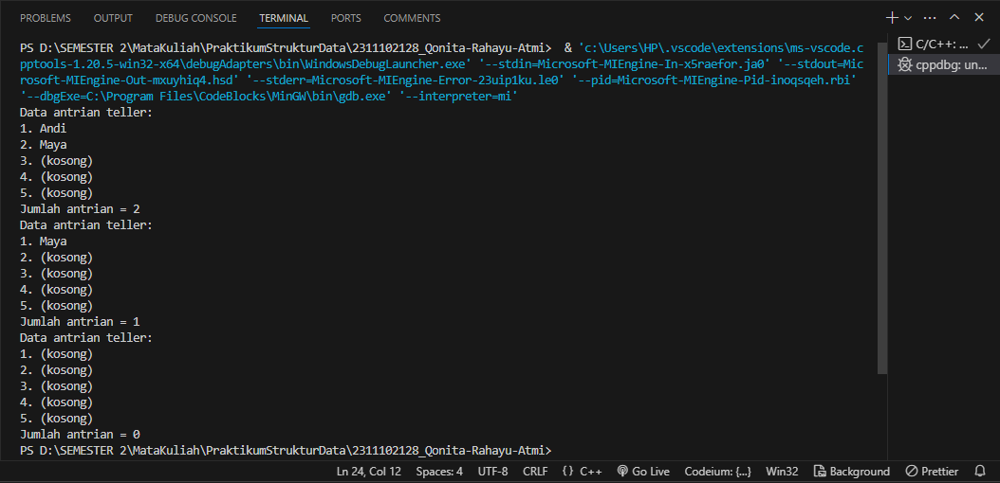
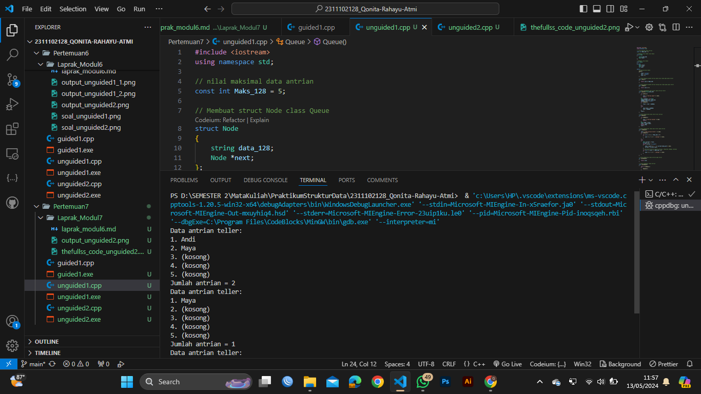
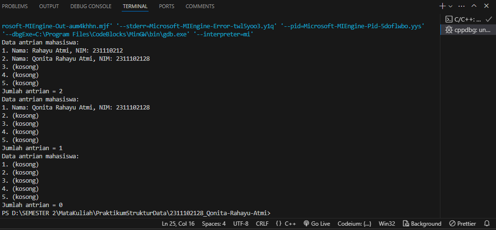
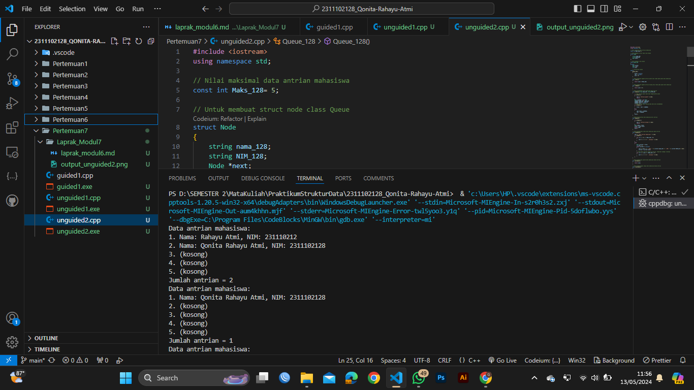

# <h1 align="center">Laporan Praktikum Modul Queue </h1>
<h1 align="center">Qonita Rahayu Atmi-2311102128</h1>

## Dasar Teori
A. Pengertian Queue
- Queue  atau  Antrian  adalah sebuah kumpulan  elemen  atau salah satu konsep dari struktur data dengan penyisipan  dan  penghapusan  elemen  yang  dilakukan  dari sisi atau gerbang  yang  berbeda.  Sebuh penyisipannya yang dilakukan  dari  gerbang belakang  dan  penghapusan  dilakukan  dari  gerbang  depan,  sehingga Queue mempunyai sifat  FIFO  (First  In  First Out), yaitu elemen yang pertama masuk akan keluar pertama. Hal ini dikarenakan pesanan antrian prioritas keluar dari antrian berdasarkan prioritas setiap elemen dalam antrian yang harus diproses terlebih dahulu. Dalam antrian, elemen hanya dapat ditambahkan dari belakang antrian, dan elemen hanya dapat dihapus dari awal antrian. Oleh karena itu, ada dua  elemen dalam antrian atau queue, yaitu bagian belakang (last atau rear) digunakan sebagai penunjuk belakang, dan bagian depan (first atau front) digunakan sebagai penunjuk elemen  depan. Seperti stack dan list, antrian atau queue juga dianggap sebagai struktur data dan dapat  direpresentasikan secara statis menggunakan array atau secara  dinamis menggunakan pointer. Demikian pula elemen  dapat digunakan untuk mengisi antrian dengan data sesuai kebutuhan.

B. Operasi Queue
1. enqueue()
- Operasi enqueue adalah operasi yang digunakan untuk menambahkan atau menyimpan item atau elemen ke dalam antrian atau queue.
2. dequeue() 
- Operasi  dequeue adalah operasi yang digunakan untuk  menghapus atau mengambil item atau elemen dari antrian. Elemen yang diambil adalah elemen depan dan jumlah  elemen antrian dikurangi satu.
3. peek() 
- Operasi peek adalah operasi untuk mendapat elemen di bagian depan antrian tanpa menghapusnya.
4. isEmpty() 
- Operasi isEmpty digunakan untuk mengecek queue apakah suatu antrian kosong  atau  tidak. Pada saat menghapus elemen antrian atau queue, harus memastikan bahwa antrian tidak menjadi kosong. Jika return pointer = 0 maka antrian dikatakan kosong.
5. isFull() 
- Operasi isFull digunakan untuk memeriksa apakah antrian sudah penuh, karena saat penyisipan elemen antrian atau Queue, perlu memastikan bahwa antrian tidak penuh. Jika backpoint=MaxQ, antrian dianggap penuh. Operasi ini dibuat dalam suatu fungsi, sehingga mengembalikan nilai true jika antrian penuh. Namun, jika antrian tidak penuh,  fungsi ini mengembalikan false. 
6. size() 
- Size adalah operasi untuk mendapatkan banyaknya elemen dalam queue.

## Guided 

### 1. [ Operasi pada Queue Teller ]

```C++
#include <iostream>

using namespace std;

const int maksimalQueue = 5; // Maksimal antrian
int front = 0;               // Penanda antrian
int back = 0;                // Penanda
string queueTeller[5];       // Fungsi pengecekan
bool isFull()
{ // Pengecekan antrian penuh atau tidak
    if (back == maksimalQueue)
    {
        return true; // =1
    }
    else
    {
        return false;
    }
}
bool isEmpty()
{ // Antriannya kosong atau tidak
    if (back == 0)
    {
        return true;
    }
    else
    {
        return false;
    }
}
void enqueueAntrian(string data)
{ // Fungsi menambahkan antrian
    if (isFull())
    {
        cout << "Antrian penuh" << endl;
    }
    else
    {
        if (isEmpty())
        { // Kondisi ketika queue kosong
            queueTeller[0] = data;
            front++;
            back++;
        }
        else
        { // Antrianya ada isi
            queueTeller[back] = data;
            back++;
        }
    }
}
void dequeueAntrian()
{ // Fungsi mengurangi antrian
    if (isEmpty())
    {
        cout << "Antrian kosong" << endl;
    }
    else
    {
        for (int i = 0; i < back; i++)
        {
            queueTeller[i] = queueTeller[i + 1];
        }
        back--;
    }
}
int countQueue()
{ // Fungsi menghitung banyak antrian
    return back;
}
void clearQueue()
{ // Fungsi menghapus semua antrian
    if (isEmpty())
    {
        cout << "Antrian kosong" << endl;
    }
    else
    {
        for (int i = 0; i < back; i++)
        {
            queueTeller[i] = "";
        }
        back = 0;
        front = 0;
    }
}
void viewQueue()
{ // Fungsi melihat antrian
    cout << "Data antrian teller:" << endl;
    for (int i = 0; i < maksimalQueue; i++)
    {
        if (queueTeller[i] != "")
        {
            cout << i + 1 << ". " << queueTeller[i] << endl;
        }
        else
        {
            cout << i + 1 << ". (kosong)" << endl;
        }
    }
}
int main()
{
    // Untuk menambahkan data pada antrian
    enqueueAntrian("Andi");
    enqueueAntrian("Maya");
    // Untuk melihat semua data pada antrian
    viewQueue();
    // Untuk menghitung semua data teller pada antrian
    cout << "Jumlah antrian = " << countQueue() << endl;
    // Untuk mengeluarkan data pada antrian
    dequeueAntrian();
    // Untuk melihat semua data pada antrian
    viewQueue();
    // Untuk menghitung semua data teller pada antrian
    cout << "Jumlah antrian = " << countQueue() << endl;
    // Untuk menghapus semua data pada antrian
    clearQueue();
    // Untuk melihat semua data pada antrian
    viewQueue();
    // Untuk menghitung semua data teller pada antrian
    cout << "Jumlah antrian = " << countQueue() << endl;
    return 0;
}
```
=> Penjelasan program
- Pada code diatas adalah code sederhana Queue Teller menggunakan sebuah array berukuran 5 untuk urutan antrian yang terdapat beberapa fungsi yaitu isFull untuk mengecek apakah antrian penuh atau tidak, isEmpty untuk mengecek apakah antrian kosong atau tidak, enqueueAntrian untuk menambahkan data antrian, dequeueAntrian untuk mengurangi data antrian, countQueue untuk menghitung banyaknya antrian, clearQueue untuk menghapus semua data antrian, dan viewQueue untuk menampilkan data antrian. Pada code diatas terdapat program queue teller menggunakan sistem FIFO yang dimana antrian pertama masuk maka akan pertama keluar. Untuk menggunakan program diatas kita perlu melakukan pemamnggilan fungsi yang telah dibuat dan diikuti parameter fungsi tersebut. Pada code diatas untuk int main() queue teller pertama kita menggunakan fungsi enqueueAntrian untuk menambahkan data Andi dan Maya, untuk menampilkan data teller tersebut menggunakan viewQueue, Untuk menghitung semua data teller pada antrian menggunakan fungsi countQueue, untuk mengeluarkan data antrian pada teller menggunakan dequeueAntrian, untuk melihat semua data pada antrian menggunakan fungsi viewQueue, untuk menghitung semua data teller pada antrian menggunakan fungsi countQueue, untuk menghapus semua data pada antrian teller menggunakan fungsi clearQueue, untuk melihat semua data pada antrian menggunakan fungsi viewQueue, dan untuk menghitung semua data teller pada antrian menggunakan fungsi countQueue.

## Unguided

### 1. [Ubahlah penerapan konsep queue pada bagian guided dari array menjadi linked list.]

```C++
#include <iostream>
using namespace std;

// nilai maksimal data antrian
const int Maks_128 = 5; 

// Membuat struct Node class Queue
struct Node
{
    string data_128;
    Node *next;
};

// Membuat class Queue
class Queue
{
private:
    Node *front;
    Node *rear;
    int size;

public:
    // Iniisialisasi Queue
    Queue()
    {
        front = nullptr;
        rear = nullptr;
        size = 0;
    }

    // Untuk mengecek apakah antrian penuh atau tidak pada queue teller
    bool isFull()
    {
        return size == Maks_128;
    }

    // Untuk mengecek apakah antrian kosong atau tidak pada queue teller
    bool isEmpty()
    {
        return size == 0;
    }

    // Untuk menambahkan data teller pada antrian teller
    void enqueue(string data_128)
    {
        if (isFull())
        {
            cout << "Antrian penuh" << endl;
            return;
        }
        Node *newNode = new Node;
        newNode->data_128 = data_128;
        newNode->next = nullptr;
        if (isEmpty())
        {
            front = rear = newNode;
        }
        else
        {
            rear->next = newNode;
            rear = newNode;
        }
        size++;
    }

    // Untuk mengeluarkan data teller dari antrian
    void dequeue()
    {
        if (isEmpty())
        {
            cout << "Antrian kosong" << endl;
            return;
        }
        Node *temp = front;
        front = front->next;
        delete temp;
        size--;
    }

    // Untuk menampilkan semua data teller pada antrian
    void viewQueue()
    {
        cout << "Data antrian teller:" << endl;
        if (isEmpty())
        {
            for (int i = 0; i < Maks_128; i++)
            {
                cout << i + 1 << ". (kosong)" << endl;
            }
        }
        else
        {
            Node *current = front;
            int pos = 1;
            while (current != nullptr)
            {
                cout << pos++ << ". " << current->data_128 << endl;
                current = current->next;
            }
            // Jika masih tersisa ruang di antrian, tampilkan sebagai (kosong)
            for (int i = size; i < Maks_128; i++)
            {
                cout << i + 1 << ". (kosong)" << endl;
            }
        }
    }

    // Untuk menghitung semua antrian pada teller
    int countQueue()
    {
        return size;
    }

    // Untuk menghapus semua antrian
    void clearQueue()
    {
        while (!isEmpty())
        {
            dequeue();
        }
    }
};

int main()
{
    // Untuk inisialisasikan antrian
    Queue tellerQueue;
    // Untuk menambahkan data pada antrian
    tellerQueue.enqueue("Andi");
    tellerQueue.enqueue("Maya");
    // Untuk melihat semua data pada antrian
    tellerQueue.viewQueue();
    // Untuk menghitung semua data teller pada antrian
    cout << "Jumlah antrian = " << tellerQueue.countQueue() << endl;
    // Untuk mengeluarkan data pada antrian
    tellerQueue.dequeue();
    // Untuk melihat semua data pada antrian
    tellerQueue.viewQueue();
    // Untuk menghitung semua data teller pada antrian
    cout << "Jumlah antrian = " << tellerQueue.countQueue() << endl;
    // Untuk menghapus semua data pada antrian
    tellerQueue.clearQueue();
    // Untuk melihat semua data pada antrian
    tellerQueue.viewQueue();
    // Untuk menghitung semua data teller pada antrian
    cout << "Jumlah antrian = " << tellerQueue.countQueue() << endl;
    return 0;
}
```
#### Output:



=> Penjelasan program
- Pada code diatas adalah code sederhana Queue Teller menggunakan linked list untuk sebagai urutan antrian  yang terdapat beberapa fungsi yaitu membuat class queue linked list untuk antrian, isFull untuk mengecek apakah antrian penuh atau tidak, isEmpty untuk mengecek apakah antrian kosong atau tidak, enqueue untuk menambahkan data antrian, dequeue untuk mengurangi data antrian, countQueue untuk menghitung banyaknya antrian, clearQueue untuk menghapus semua data antrian, dan viewQueue untuk menampilkan data antrian. Pada code diatas terdapat program queue teller menggunakan sistem FIFO yang dimana antrian pertama masuk maka akan pertama keluar. Untuk menggunakan program diatas kita perlu melakukan pemamnggilan fungsi yang telah dibuat dan diikuti parameter fungsi tersebut. Pada code diatas untuk int main() queue teller pertama kita menggunakan fungsi enqueue untuk menambahkan data Andi dan Maya, untuk menampilkan data teller tersebut menggunakan viewQueue, Untuk menghitung semua data teller pada antrian menggunakan fungsi countQueue, untuk mengeluarkan data antrian pada teller menggunakan ddequeue, untuk melihat semua data pada antrian menggunakan fungsi viewQueue, untuk menghitung semua data teller pada antrian menggunakan fungsi countQueue, untuk menghapus semua data pada antrian teller menggunakan fungsi clearQueue, untuk melihat semua data pada antrian menggunakan fungsi viewQueue, dan untuk menghitung semua data teller pada antrian menggunakan fungsi countQueue.

#### Full code Screenshot:


### 2. [Dari nomor 1 buatlah konsep antri dengan atribut Nama mahasiswa dan NIM Mahasiswa]

```C++
#include <iostream>
using namespace std;

// Nilai maksimal data antrian mahasiswa
const int Maks_128= 5;

// Untuk membuat struct node class Queue
struct Node
{
    string nama_128;
    string NIM_128;
    Node *next;
};

// Untuk membuat class Queue
class Queue_128
{
private:
    Node *front;
    Node *rear;
    int size;

    // Insialisasi Queue
public:
    Queue_128()
    {
        front = nullptr;
        rear = nullptr;
        size = 0;
    }

    // Untuk mengecek apakah antrian penuh atau tidak pada queue data mahasiswa
    bool isFull()
    {
        return size == Maks_128;
    }

    // Untuk mengecek apakah antrian kosong atau tidak pada queue data mahasiswa
    bool isEmpty()
    {
        return size == 0;
    }

    // Untuk menambahkan data mahasiswa pada antrian
    void enQueue(string nama_128, string NIM_128)
    {
        // Jika antrian penuh maka akan mengeluarkan pesan
        if (isFull())
        {
            cout << "Antrian penuh" << endl;
            return;
        }
        Node *newNode = new Node;
        newNode->nama_128 = nama_128;
        newNode->NIM_128 = NIM_128;
        newNode->next = nullptr;
        // Jika antrian masih kosong maka data baru ditambahkan
        if (isEmpty())
        {
            front = rear = newNode;
        }
        else
        {
            rear->next = newNode;
            rear = newNode;
        }
        size++;
    }

    // Untuk mengeluarkan data mahasiswa dari antrian
    void deQueue()
    {
        if (isEmpty())
        {
            cout << "Antrian kosong" << endl;
            return;
        }
        Node *temp = front;
        front = front->next;
        delete temp;
        size--;
    }

    // Untuk menampilkan semua data mahasiswa pada antrian
    void viewQueue()
    {
        cout << "Data antrian mahasiswa:" << endl;
        if (isEmpty())
        {
            for (int i = 0; i < Maks_128; i++)
            {
                cout << i + 1 << ". (kosong)" << endl;
            }
        }
        else
        {
            Node *current = front;
            int pos = 1;
            while (current != nullptr)
            {
                cout << pos++ << ". Nama: " << current->nama_128 << ", NIM: " << current->NIM_128 << endl;
                current = current->next;
            }
            // Jika masih tersisa ruang di antrian, tampilkan sebagai (kosong)
            for (int i = size; i < Maks_128; i++)
            {
                cout << i + 1 << ". (kosong)" << endl;
            }
        }
    }

    // Untuk menghitung jumlah data mahasiswa dalam antrian
    int countQueue()
    {
        return size;
    }

    // Untuk mengosongkan semua data mahasiswa dalam antrian
    void clearQueue()
    {
        while (!isEmpty())
        {
            deQueue();
        }
    }
};

int main()
{
    // Untuk menambahkan data mahasiswa pada antrian
    Queue_128 mahasiswaQueue_128;
    mahasiswaQueue_128.enQueue("Rahayu Atmi", "231110212");
    mahasiswaQueue_128.enQueue("Qonita Rahayu Atmi", "2311102128");
    // Untuk melihat semua data mahasiswa pada antrian
    mahasiswaQueue_128.viewQueue();
    // Untuk menghitung data mahasiswa dari antrian
    cout << "Jumlah antrian = " << mahasiswaQueue_128.countQueue() << endl;
    // Untuk mengeluarkan data mahasiswa dari antrian
    mahasiswaQueue_128.deQueue();
    // Untuk melihat semua data mahasiswa pada antrian
    mahasiswaQueue_128.viewQueue();
    // Untuk menghitung data mahasiswa dari antrian
    cout << "Jumlah antrian = " << mahasiswaQueue_128.countQueue() << endl;
    // Untuk menghapus semua data mahasiswa pada antrian
    mahasiswaQueue_128.clearQueue();
    // Untuk melihat semua data mahasiswa pada antrian
    mahasiswaQueue_128.viewQueue();
    // Untuk menghitung data mahasiswa dari antrian
    cout << "Jumlah antrian = " << mahasiswaQueue_128.countQueue() << endl;
    return 0;
}
```
#### Output:



=> Penjelasan program
- Pada code diatas adalah code sederhana Queue Nama Mahasiswa dan NIM Mahasiswa dengan menggunakan linked list untuk sebagai urutan antrian  yang terdapat beberapa fungsi yaitu membuat class queue linked list untuk antrian, isFull untuk mengecek apakah antrian penuh atau tidak, isEmpty untuk mengecek apakah antrian kosong atau tidak, enqueue untuk menambahkan data antrian, dequeue untuk mengurangi data antrian, countQueue untuk menghitung banyaknya antrian, clearQueue untuk menghapus semua data antrian, dan viewQueue untuk menampilkan data antrian. Pada code diatas terdapat program queue mahasiswa menggunakan sistem FIFO yang dimana antrian pertama masuk maka akan pertama keluar. Untuk menggunakan program diatas kita perlu melakukan pemamnggilan fungsi yang telah dibuat dan diikuti parameter fungsi tersebut. Pada code diatas untuk int main() queue teller pertama kita menggunakan fungsi enqueue untuk menambahkan data "Rahayu Atmi", "231110212" dan "Qonita Rahayu Atmi", "2311102128", untuk menampilkan data Nama Mahasiswa dan NIM Mahasiswa tersebut menggunakan viewQueue, untuk menghitung semua data Nama Mahasiswa dan NIM Mahasiswa pada antrian menggunakan fungsi countQueue, untuk mengeluarkan data antrian pada Nama Mahasiswa dan NIM Mahasiswa menggunakan ddequeue, untuk melihat semua data pada antrian Nama Mahasiswa dan NIM Mahasiswa menggunakan fungsi viewQueue, untuk menghitung semua data Nama Mahasiswa dan NIM Mahasiswa pada antrian menggunakan fungsi countQueue, untuk menghapus semua data pada antrian Nama Mahasiswa dan NIM Mahasiswa menggunakan fungsi clearQueue, untuk melihat semua data pada antrian Nama Mahasiswa dan NIM Mahasiswa menggunakan fungsi viewQueue, dan untuk menghitung semua data Nama Mahasiswa dan NIM Mahasiswa pada antrian menggunakan fungsi countQueue.

#### Full code Screenshot:



## Kesimpulan

Dari materi Stack tesebut saya dapat menyimpulkan Queue  atau  Antrian  adalah sebuah kumpulan  elemen  atau salah satu konsep dari struktur data dengan penyisipan  dan  penghapusan  elemen  yang  dilakukan  dari sisi atau gerbang  yang  berbeda. Queue mempunyai sifat  FIFO  (First  In  First Out), yaitu elemen yang pertama masuk akan keluar pertama. Queue atau antrian terdapat operasi yaitu enqueue adalah operasi yang digunakan untuk menambahkan atau menyimpan item atau elemen ke dalam antrian atau queue, dequeue adalah operasi yang digunakan untuk  menghapus atau mengambil item atau elemen dari antrian, peek adalah operasi untuk mendapat elemen di bagian depan antrian tanpa menghapusnya, isEmpty digunakan untuk mengecek queue apakah suatu antrian kosong  atau  tidak, isFull digunakan untuk memeriksa apakah antrian sudah penuh atau tidak, dan Size adalah operasi untuk mendapatkan banyaknya elemen dalam queue.

## Referensi
[1] Moh Erkamim, Iim Abdurrohim, BUKU AJAR ALGORITMA DAN STRUKTUR DATA. Jambi : 2024.

[2] Ade Mulyana, Cara Mudah Mempelajari Algoritma dan Struktur Data. Yogyakarta : 2021.

[3] Hindarto, Ade Eviyanti, BUKU AJARALGORITMA & PEMROGRAMAN MENGGUNAKAN MATLAB. Jawa Timur : 2020. 