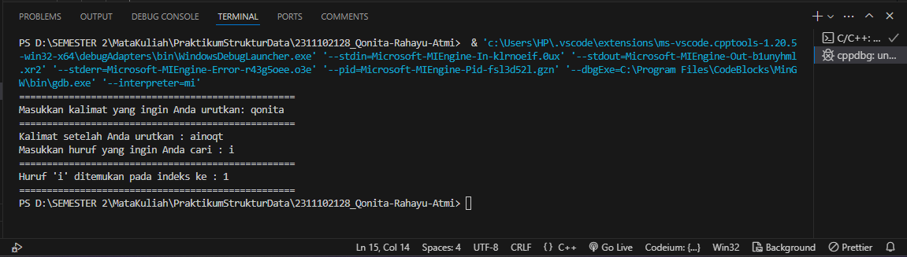
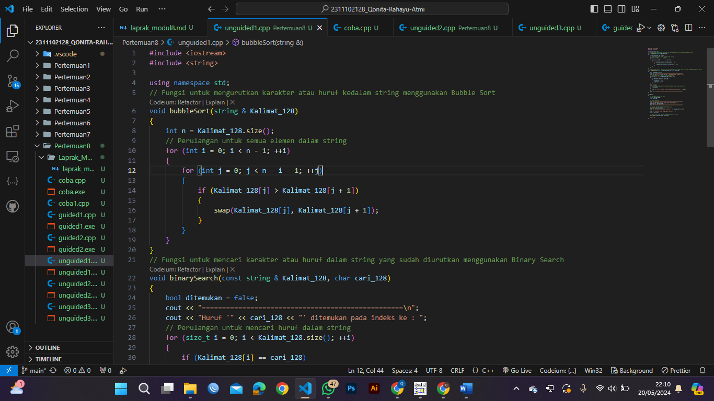
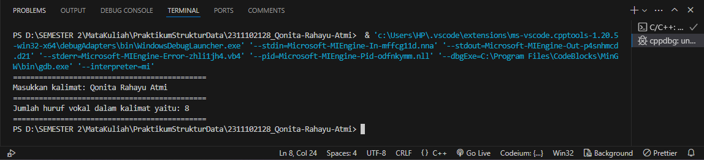
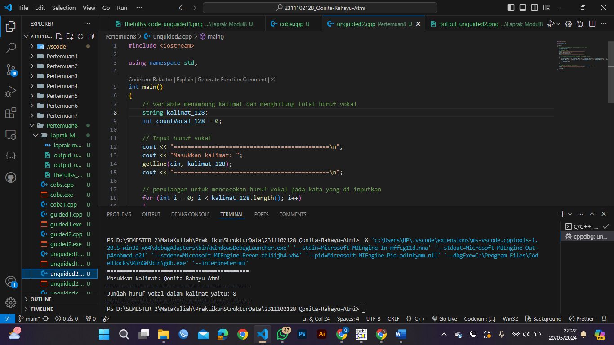
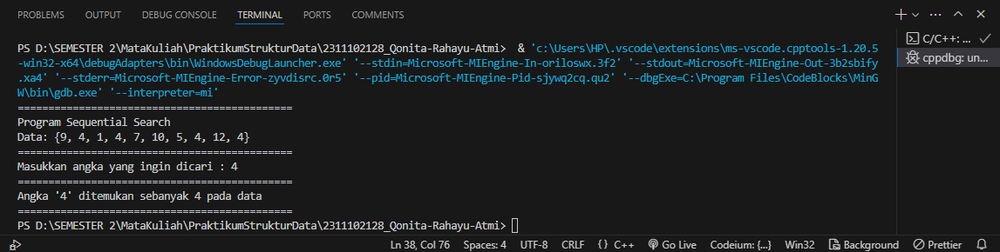
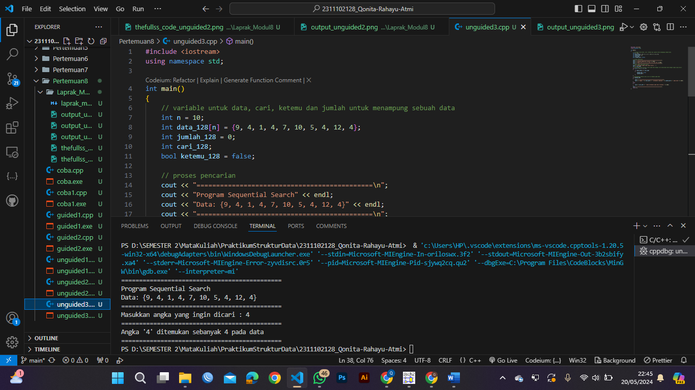

# <h1 align="center">Laporan Praktikum Modul Algoritma Searching </h1>
<h1 align="center">Qonita Rahayu Atmi-2311102128</h1>

## Dasar Teori

<h1 align="center">ALGORITMA SEARCHING</h1>

Searching adalah sebuah teknik mengambil data dari kumpulan data berdasarkan kunci (key) atau referensi data. Algoritma searching adalah sebuah algoritma yang menerima sebuah argumen kunci atau key dan dengan memiliki langkah-langkah yang tertentu yang akan mencari suatu data dengan kunci tersebut. Setelah proses pencarian dilaksanakan, akan dapat diperoleh salah satu dari dua kemungkinan, yaitu data yang dicari ditemukan atau tidak ditemukan. Jika ada, maka data dapat dihapus atau diubah. Dan Searching terbagi menjadi 2 macam, yaitu:

A. SEQUENTIAL SEARCH
- Sequential search adalah sebuah teknik atau metode pencarian paling sederhana dan merupakan teknik pencarian dari sebauh data array, dalam data dalam array dibaca satu per satu, dan data akan diurutkan dari index yang paling terkecil ke index yang paling terbesar, ataupun sebaliknya. Kemudian data yang akan dicari nantinya akan ditelusuri dalam semua elemen-elemen array dari awal sampai akhir, dan data yang dicari tersebut tidak perlu diurutkan terlebih dahulu apabila sampai akhir pengulangan tidak ditemukan data yang sama, artinya data yang yang dicari tidak ada.

- Konsep Sequential Search:
1. Membandingkan setiap elemen array satu per satu secara beruntun.
2. Pencarian sequential dimulai dengan elemen pertama, sampai  elemen yang dicari ditemukan atau sampai elemen terakhir dari array.  
3. Pada pencarian apabila data ditemukan, maka program akan berhenti. Apabila data tidak ditemukan, maka program akan berhenti.

- Algoritma Sequential search adalah sebagai berikut:
1. i ← 0
2. ditemukan← false
3. Selama (tidak ditemukan) dan (i <= N)kerjakan baris 4
4. Jika (Data[i] = x) maka ditemukan← true, jika tidak i ← i + 1
5. Jika (ditemukan) maka i adalah indeks dari data yang dicari,jika data tidak ditemukan berarti data tidak
ada.

B. BINARY SEARCH
- Binary search adalah proses pencarian dengan membagi dua bagian data kemudian membandingkan isi data bagian pertama atau bagian kedua dengan data yang akan dicari. Pada metode ini membutuhkan nilai indeks terkecil dan terbesar untuk dijumlahkan kemudian dibagi dua. Binary search hanya dapat dilakukan pada data yang sudah urut. Binary ini lebih efisien dibandingkan dengan metode pencarian sequential search atau pencarian beruntun. Pencarian Biner sebagai algoritma pencarian yang digunakan dalam array yang diurutkan dengan berulang kali membagi interval pencarian menjadi dua. Ide pencarian biner adalah menggunakan informasi bahwa array diurutkan dan mengurangi kompleksitas waktu ke O (log N).

- Cara kerja binary search adalah sebagai berikut:
1. Diambil posisi awal 1 dan posisi akhir = N, kemudian dicari posisi data tengah dengan rumus (posisi awal + posisi akhir) / 2.
2. Data yang dicari dibandingkan dengan data tengah. Jika lebih kecil, proses dilakukan kembali tetapi posisi akhir dianggap sama dengan posisi tengah – 1. Jika lebih besar, porses dilakukan kembali tetapi posisi awal dianggap sama dengan posisi tengah + 1.
3. Demikian seterusnya sampai data tengah sama dengan yang dicari.

## Guided 

### 1. [Buatlah sebuah project dengan menggunakan sequential search sederhana untuk melakukan pencarian data.]

```C++
#include <iostream>

using namespace std;

int main()
{
    // variable untuk menampung data, cari dan ketemu
    int n = 10;
    int data[n] = {9, 4, 1, 7, 5, 12, 4, 13, 4, 10};
    int cari = 10;
    bool ketemu = false;
    int i;
    // perulangan untuk mencari nilai dengan mencocokan data dengan nilai cari
    for (i = 0; i < n; i++)
    {
        if (data[i] == cari)
        {
            ketemu = true;
            break;
        }
    }
    // menampilkan data
    cout << " Program Sequential Search" << endl;
    cout << " data : {9,4,1,7,5,12,4,13,4,10}" << endl;
    // percabangan ketika angka di temukan pada indeks keberapa
    if (ketemu)
    {
        cout << "\nAngka " << cari << " ditemukan pada indeks ke-" << i << endl;
    }
    else
    {
        cout << "\nAngka " << cari << " tidak ditemukan" << endl;
    }
    return 0;
}

```
=> Penjelasan program
- Pada code diatas adalah program sederhana sequential search untuk melakukan pencarian data merupakan code program untuk mencari sebuah nilai n yang sudah di tetapkan nilainya. Pada code tersebut terdapat sebuah variable yang digunakan untuk menampung data nilai angka yaitu ada data, cari, dan ketemu. Selanjutnya kita akan di tampilkan sebuah perulangan untuk mencocokan sebuah data dengan nilai angka yang di cari, dan ketika nilai yang di cari di temukan maka akan menampilkan sebuah percabangan yang dimana ketika nilai cari di temukan maka akan menampilkan urutan indeks angka yang di cari dari data yang disimpan.

### 2. [Buatlah sebuah project untuk melakukan pencarian data dengan menggunakan Binary Search.]

```C++
#include <iostream>
#include <conio.h>
#include <iomanip>

using namespace std;

// Mendeklarasikan variabel data
int dataArray[7] = {1,8,2,5,4,9,7};
int cari;

// Prosedur untuk mengurutkan data dalam dataArray
void selection_sort()
{
    int temp, min, i, j;
    for (i = 0; i < 7; i++)
    {
        min = i;
        // Perulangan untuk mengurutkan data dari terkecil hingga terbesar
        for (j = i + 1; j < 7; j++)
        {
            if (dataArray[j] < dataArray[min])
            {
                min = j;
            }
        }
        temp = dataArray[i];
        dataArray[i] = dataArray[min];
        dataArray[min] = temp;
    }
}

// Prosedur untuk mencari data
void binarySearch()
{
    // Mendeklarasikan variabel awal, akhir, dan tengah
    int awal, akhir, tengah;
    bool b_flag = false;
    awal = 0;
    akhir = 6;

    // Perulangan untuk mencari data
    while (!b_flag && awal <= akhir)
    {
        // Menghitung indeks tengah
        tengah = (awal + akhir) / 2;
        if (dataArray[tengah] == cari)
        {
            b_flag = true;
        }
        else if (dataArray[tengah] < cari)
        {
            awal = tengah + 1;
        }
        else
        {
            akhir = tengah - 1;
        }
    }
    // Menampilkan output jika angka yang dicari ditemukan
    if (b_flag)
    {
        cout << "\nData ditemukan pada indeks ke-" << tengah << endl;
    }else{
        cout << "\nDATA TIDAK DITEMUKAN" << endl;
    }
}

int main()
{
    // Menampilkan output
    cout << "BINARY SEARCH" <<endl;
    cout << "\nData : " <<endl;

    // Perulangan untuk enampilkan data
    for(int x = 0; x < 7; x++ ){
        cout << setw(3) << dataArray[x] ;
    }

    cout << endl;

    // Untuk input data yang akan dicari
    cout << "Masukkan data yang ingin dicari : " ;
    cin >> cari;

    // Untuk mengurutkan data
    cout << "\nData diurutkan : " ;
    selection_sort();

    // Perulangan untuk menampilkan data setelah diurutkan
    for (int x = 0; x < 7; x++){
        cout << setw(3) << dataArray[x];
    }
    cout <<endl;

    // Untuk mencari data
    binarySearch();
    _getche();
    return 0;

}

```
=> Penjelasan program
- Pada code di atas merupakan sebuah program untuk binary search mencari nilai angka.
Pada code di atas terdapat sebuah variable berbentuk array untuk menampung sebuah data dan variable untuk nilai cari selanjutnya terdapat dua fungsi yaitu yang pertama selection sort yang digunakan unutuk mengurutkan sebuah data yang di dalam array dari terkecil ke yang terbesar menggunakan perulangan, selanjutnya terdapat sebuah fungsi binary search yang dimana digunakan untuk mencari sebuah nilai angka yang dimana terdapat variable awal akhir tengah bflag dengan nilai false, dan terdapat sebuah perulangan while yang didalamnya terdapat percabangan ketika data ditemukan di indeks tengah maka akan true, ketika data di temukan pada awal maka indeksnya di tambah 1 dan ketika data di temukan di akhir maka indeks di kurangi 1.
Selanjutnya terdapat percabangan yang dimana ketika nilai angka yang di cari di temukan maka akan menampilkan data pada indeks keberapa. Dan pada fungsi utama terdapat sebuah perulangan untuk menampilkan sebuah data dan selanjutnya menginputkan nilai cari dan memanggil fungsi selection sort untuk mengurutkan data yang di tampilkan dengan perulangan sebelumnya selanjutnya data di tampilkan kembali dengan perulangan dari terkecil ke terbesar dan selanjutnya gunakan fungsi binary search untuk mencari nilai cari pada data tersebut.

## Unguided

### 1. [Buatlah sebuah program untuk mencari sebuah huruf pada sebuah kalimat yang sudah di input dengan menggunakan Binary Search!]

```C++
#include <iostream>
#include <string>

using namespace std;
// Fungsi untuk mengurutkan karakter atau huruf kedalam string menggunakan Bubble Sort
void bubbleSort(string & Kalimat_128)
{
    int n = Kalimat_128.size();
    // Perulangan untuk semua elemen dalam string
    for (int i = 0; i < n - 1; ++i)
    {
        for (int j = 0; j < n - i - 1; ++j)
        {
            if (Kalimat_128[j] > Kalimat_128[j + 1])
            {
                swap(Kalimat_128[j], Kalimat_128[j + 1]);
            }
        }
    }
}
// Fungsi untuk mencari karakter atau huruf dalam string yang sudah diurutkan menggunakan Binary Search
void binarySearch(const string & Kalimat_128, char cari_128)
{
    bool ditemukan = false;
    cout << "==================================================\n";
    cout << "Huruf '" << cari_128 << "' ditemukan pada indeks ke : ";
    // Perulangan untuk mencari huruf dalam string
    for (size_t i = 0; i < Kalimat_128.size(); ++i)
    {
        if (Kalimat_128[i] == cari_128)
        {
            ditemukan = true;
            cout << i << " ";
        }
    }
    cout << endl;
    // percabangan apabila huruf tidak ditemukan dalam kata atau huruf
    if (!ditemukan)
    {
        cout << "Huruf tersebut tidak ditemukan dalam kalimat." << endl;
    }
    cout << "==================================================\n";
}

int main()
{
    // variable kalimat dan cari
    string Kalimat_128;
    char cari_128;
    
    // input kalimat
    cout << "==================================================\n";
    cout << "Masukkan kalimat yang ingin Anda urutkan: ";
    getline(cin, Kalimat_128);
    cout << "==================================================\n";

    // Urutkan kalimat menggunakan bubble sort
    bubbleSort(Kalimat_128);
    cout << "Kalimat setelah Anda urutkan : " << Kalimat_128 << endl;

    cout << "Masukkan huruf yang ingin Anda cari : ";
    cin >> cari_128;

    // Cari huruf dalam kalimat menggunakan binary search
    binarySearch(Kalimat_128, cari_128);

    return 0;
}
```
#### Output:



=> Penjelasan program
- Pada program code di atas merupakan sebuah program untuk mencari sebuah huruf dalam sebuah kalimat, pada code tersebut terdapat dua fungsi yaitu yang pertama menggunakan fungsi bubble sort untuk mengurutkan sebuah kata pada kalimat dengan cara memecah kaliamt tersebut menjadi huruf dan di gabungkan dengan urutan dari terkecil ke yang terbesar, dan yang kedua menggunakan fungsi binary search untuk mencari sebuah huruf dalam sebuah kalimat yang sudah di urutkan dari yang terkecil dengan menggunakan nilai true false yang dimana ketika pencarian berbeda maka nilainya tidak berubah yaitu false dan jika ditemukan nilainya berubah yaitu true. Pada fungsi utama yaitu main kita menginputkan sebuah kalimat dan sebuah huruf yang ingin di cari, kemudian kalimat tersebut akan di urutkan dahulu dan akan di tampilkan setelah itu akan dilakukan pencarian huruf tersebut pada kalimat yang sudah diurutkan.

#### Full code Screenshot:


### 2. [Buatlah sebuah program yang dapat menghitung banyaknya huruf vocal dalam sebuah kalimat!]

```C++
#include <iostream>

using namespace std;

int main()
{
    // variable menampung kalimat dan menghitung total huruf vokal
    string kalimat_128;
    int countVocal_128 = 0;

    // Input huruf vokal
    cout << "=============================================\n"; 
    cout << "Masukkan kalimat: ";
    getline(cin, kalimat_128);
    cout << "=============================================\n"; 

    // perulangan untuk mencocokan huruf vokal pada kata yang di inputkan
    for (int i = 0; i < kalimat_128.length(); i++)
    {
        if (kalimat_128[i] == 'a' || kalimat_128[i] == 'i' || kalimat_128[i] == 'u' || kalimat_128[i] == 'e' || kalimat_128[i] == 'o' || kalimat_128[i] == 'A' || kalimat_128[i] == 'I' || kalimat_128[i] == 'U' || kalimat_128[i] == 'E' || kalimat_128[i] == 'O')
        {
            countVocal_128++;
        }
    }

    // menampilkan jumlah total huruf vokal
    cout << "Jumlah huruf vokal dalam kalimat yaitu: " << countVocal_128 << endl;
    cout << "=============================================\n"; 

    return 0;
}
```
#### Output:



=> Penjelasan program
- Pada code di atas merupakan code untuk menghitung semua total huruf vokal pada sebuah kalimat. Pada code tersebut terdapat sebuah variable kalimat dan countvocal untuk menampung sebuah data kalimat yang nati di inputkan dan menampung jumlah huruf vokal nanti yang akan bertama nilainya, selanjutnya memasukan kalimat yang akan di cari, setelah menginputkan kalimat tersebut akan dilakukan perulangan untuk mencocokkan huruf vokal pada kalimat yang di inputkan. Jika di temukan huruf vokal maka nilai variable countvocal akan bertamah 1 dan seterusnya sampai tidak di tmeukan kembali huruf vocal jika sudah tidak ada huruf vokal lagi yang di temukan lagi makan akan di tampilkan keseluruhan jumlah huruf vokalnya.

#### Full code Screenshot:


### 3. [Diketahui data = 9, 4, 1, 4, 7, 10, 5, 4, 12, 4. Hitunglah berapa banyak angka 4 dengan menggunakan algoritma Sequential Search!]

```C++
#include <iostream>
using namespace std;

int main()
{
    // variable untuk data, cari, ketemu dan jumlah untuk menampung sebuah data
    int n = 10;
    int data_128[n] = {9, 4, 1, 4, 7, 10, 5, 4, 12, 4};
    int jumlah_128 = 0;
    int cari_128;
    bool ketemu_128 = false;

    // proses pencarian
    cout << "=============================================\n";
    cout << "Program Sequential Search" << endl;
    cout << "Data: {9, 4, 1, 4, 7, 10, 5, 4, 12, 4}" << endl;
    cout << "=============================================\n";
    // input angka yang akan dicari
    cout << "Masukkan angka yang ingin dicari : ";
    cin >> cari_128;
    // perulangan untuk mencari nilai pada data dengan cara mencocokan data dengan angka yang dicari
    for (int i = 0; i < n; i++)
    {
        if (data_128[i] == cari_128)
        {
            ketemu_128 = true;
            jumlah_128++;
        }
    }
    // percabangan ketika nilai cari di temukan pada data
    if (ketemu_128)
    {
        cout << "=============================================\n";
        cout << "Angka '" << cari_128 << "' ditemukan sebanyak " << jumlah_128 << " pada data" << endl;
    }
    else
    {
        cout << cari_128 << " tidak ditemukan pada data tersebut." << endl;
    }
    cout << "=============================================\n";
    return 0;
}
```
#### Output:



=> Penjelasan program
- Pada program di atas merupakan code program untuk mencari sebuah nilai angka lebih dari satu pada sebuah data menggunakan sequential search. Pada code tersebut terdapat sebuah variable yang digunakan untuk menampung yaitu ada data, jumlah, cari, dan ketemu. Selanjutnya kita akan di tampilkan sebuah data yang ingin kita cari dan menginputkan sebuah angka yang akan di cari, dan ketika sudah menginputkan maka akan dilakukan perulangan yang mencocokan data dengan angka cari yang di inputkan jika ditemukan maka variable jumlah akan bertambah sampai data yang di cari sudah tidak ditemukan lagi. selanjutnya terdapat sebuah percabangan yang dimana ketika angka yang di cari ditemukan pada variable ketemu maka akan menampilkan data cari ditemukan sebanyak berapa kali pada data tersebut dan jika tidka di temukan maka akan menampilkan tidak dapat menemukan data yang di cari.

#### Full code Screenshot:


## Kesimpulan

Dari materi Algoritma Searching tesebut saya dapat menyimpulkan Algoritma Searching adalah sebuah teknik mengambil data dari kumpulan data berdasarkan kunci (key) atau referensi data dan engan memiliki langkah-langkah yang tertentu yang akan mencari suatu data dengan kunci tersebut. Algoritma searching memiliki dua macam jenis yaitu yang pertama Sequential search adalah sebuah teknik atau metode pencarian paling sederhana dan merupakan teknik pencarian dari sebauh data array, dalam data dalam array dibaca satu per satu, dan data akan diurutkan dari index yang paling terkecil ke index yang paling terbesar, ataupun sebaliknya. Dan yang kedua yaitu Binary search adalah proses pencarian dengan membagi dua bagian data kemudian membandingkan isi data bagian pertama atau bagian kedua dengan data yang akan dicari. Pada metode ini membutuhkan nilai indeks terkecil dan terbesar untuk dijumlahkan kemudian dibagi dua yang hanya dapat dilakukan pada data yang sudah urut.

## Referensi
[1] Fitri Yanti, Emi Sita Eriana, ALGORITMA SORTING DAN SEARCHING . Jawa Tengah : 2024.

[2] Muhammad Taufik, Munawir, Ana Rahma, Belajar Pemrograman Lanjut Dengan C++. Bandung : 2023.

[3] Kartiko Ardi Widodo, Suryo Adi Wibowo, PENERAPAN SEQUENTIAL SEARCH UNTUK PENGELOLAAN DATA BARANG. Malang : 2021.