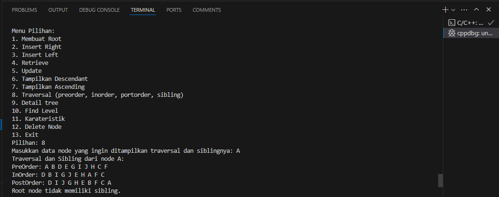

# <h1 align="center">Laporan Praktikum Modul Graph Dan Tree</h1>
<h1 align="center">Qonita Rahayu Atmi-2311102128</h1>

## Dasar Teori

<h1 align="center">GRAPH DAN TREE</h1>

1. Graph
Graph adalah suatu graph yang terdiri dari suatu himpunan tak kosong yang masing masing unsurnya disebut titik (vertex) dan suatu himpunan pasangan  tak  berurutan dari titik- titik tersebut yang disebut sisi (edge). Graph dapat digunakan untuk merepresentasikan objekobjek diskret dan hubungan antara objek-objek tersebut.Representasi visual dari graph adalah dengan menyatakan objek sebagai node, bulatan, atau titik (vertex), sedangkan hubungan antara objek dinyatakan dengan garis (edge).

- Graph memiliki beberapa jenis-jenis, berikut jenis-jenis dari graph:

- a. Graph berarah (directed graph)
Graph berarah (directed graph) adalah graph yang setiap sisinya diberikan orientasi arah . Pada graf berarah, (u,v) dan (v,u) menyatakan sisi berarah yang berbeda, dengan kata  lain (u,v)≠(v,u). Untuk sisi berarah  (u,v),  simpul  u  dinamakan simpul  asal dan  simpul  v dinamakan simpul terminal.Grafik  terarah  (atau  digraf  singkatnya)  G  terdiri  dari  satu  set simpul V  =  {v1, v2, . . .}, satu set tepi E  =  {e1, e2,  . . .}, dan pemetaan Ψ yang memetakan setiap tepi ke beberapa pasangan simpul yang dipesan (vi, vj).

- b. Graph tak berarah (undirected graph)
Graph tak berarah (undirected graph) adalah graph yang sisinya tidak mempunyai orientasi arah. Dan pada graph tak berarah urutan pasangan simpul yang dihubungkan oleh sisi tidak diperhatikan. Jadi, (u,v)=(v,u) adalah sisi yang sama. 

- c. Weight Graph
Weight Graph adalah setiap busur yang mempunyai nilai yang menyatakan hubungan antara dua buah simpul, maka busur tersebut dinyatakan memiliki bobot. Bobot sebuah busur dapat menyatakan panjang sebuah jalan dari dua buah titik, jumlah rata-rata kendaraan per hari yang melalui sebuah jalan, dan lain-lain.

- Istilah pada graph, yaitu:

- a. Vertex : Vertex adalah himpunan node atau titik pada suatu graph.

- b. Edge : Edge adalah himpunan garis yang menghubungkan setiap
node atau vertex.

- c. Adjacent : Adjacent adalah dua buah titik dikatakan berdekatan jika keduanya terhubung dengan sebuah sisi. 

- d. Weight : Weight adalah sebuah graph berbobot apabila terdapat sebuah fungsi bobot bernilai real W pada himpunan E.

- e. Path : Path merupakan jalur dengan setiap vertex berbeda.

- f. Cycle : Cycle adalah sebuah lintasan yang berawal dan berakhir pada simpul yang sama.

2. Tree atau Pohon
Tree  atau pohon adalah salah satu jenis struktur data yang terdiri dari simpul-simpul (nodes) yang saling terhubung (edges) satu sama lain secara hierarkis. Dan nodes dalam implementasinya dapat merepresentasikan data, sementara edges adalah jalan atau lintasan yang menghubungkan antara nodes. Jadi, tree dapat digunakan  untuk merepresentasikan data yang memiliki hierarkis seperti struktur perusahaan, struktur keluarga,  struktur direktori pada sistem file komputer atau permasalahan lain yang melibatkan pembagian dan percabangan.

- Istilah dalam struktur data pada tree atau pohon, yaitu:

- a. Predecessor : Predecessor adalah sebuah node yang berada di atas node tertentu.

- b. Successor : Successor adalah sebuah node yang berada di bawah node tertentu. 

- c. Ancestor : Ancestor adalah semua dari node yang terletak sebelum node tertentu pada jalur yang sama pada node. 

- d. Descendent : Descendent adalah semua dari node yang terletak setelah node tertentu pada jalur yang sama pada node.

- e. Parent: Parent merupakan node yang memiliki satu atau lebih edge di bagian bawahnya. 

- f. Child: Child merupakan node pada pohon atau tree yang hanya memiliki satu edges pada  bagian  atasnya.  Jadi, pada suatu node  tertentu  dapat  dianggap sebagai parent ataupun child berdasarkan sudut pandangnya. 

- g. Sibling : Sibling adalah node yang mempunyai father yang sama dengan suatu node.

- h. Subtree: Subtree  merupakan node-node pada pohon atau tree  yang  memiliki  child, dan node tersebut dapat dianggap sebagai root dalam  subtree. 

- i. Size : Size adalah banyaknya node dalam sebuah tree.

- j. Height : Height adalah banyaknya tingkatan atau level dalam suatu tree.

- k. Roof: Roof adalah satu-satunya node khusus dalam tree yang tidak memiliki predecssor.

- l. Leaf: Leaf  adalah  suatu node yang  paling terakhir dalam  suatu pohon atau tree, dan left tidak memiliki edge lagi pada bagian bawahnya. 

- m. Degree : Degree adalah banyaknya anak yang dimiliki suatu
node. 

- Binary Tree
Binary tree atau pohon biner adalah struktur data hirarkis yang terdiri dari nodes dan edges dimana setiap node hanya terdapat maksimal 2 child left child dan right
child. Binary tree merupakan sebuah ordered tree yang memiliki 3 sifat utama, yaitu: 
1. Setiap node hanya boleh memiliki maksimal 2 child.
2. Setiap child memiliki nama masing-masing yaitu left child dan right child.
3. Node left child selalu dikunjungi lebih awal daripadanode right child.

- Operasi pada Tree atau Pohon, yaitu:

- a. Create : Create digunakan untuk membentuk suatu binary tree baru yang masih kosong atau tidak ada isinya.

- b. Clear : Clear digunakan untuk mengosongkan suatu binary tree yang sudah ada atau sudah terisi.

- c. isEmpty : isEmpty dalah function yang digunakan untuk memeriksa apakah suatu binary tree masih kosong atau tidak.

- d. Insert : Insert digunakan untuk memasukkan sebuah node ke dalam tree.

- e. Find : Find digunakan untuk mencari suatu root, parent, left child, atau right child dari suatu node, dan tree tak boleh kosong atau harus terisi.

- f. Update : Update digunakan untuk mengubah isi dari suatu node yang ditunjuk oleh sebuah pointer current, dan tree tidak boleh kosong atau harus terisi.

- g. Retrive : : Retrive digunakan untuk mengetahui isi dari suatu node yang ditunjuk oleh pointer current, dan tree tidak boleh kosong.

- h. Delete Sub : Delete Sub digunakan untuk menghapus suatu subtree pada node beserta seluruh descendantnya yang ditunjuk current, dan tree tak boleh kosong. Kemudian, pointer current akan berpindah ke parent dari node yang dihapus.

- i. Characteristic : Characteristic digunakan untuk mengetahui karakteristik dari sebuah tree, yaitu  size, height, serta average lengthnya dan tree tidak boleh kosong. 

- j. Traverse : Traverse digunakan untu mengunjungi seluruh node-node pada tree dalam urutan tertentu, masing-masing sekali. Dan hasilnya adalah urutan dari informasi secara linier yang tersimpan dalam tree. Terdapat 3 metode traversal ini yakni Pre-Order, In-Order, dan Post-Order, yaitu:
1. Pre-Order : Untuk mencetak isi dari node yang dikunjungi,
kunjungi Left Child, kunjungi Right Child.
2. In-Order : Untuk mengunjungi Left Child, cetak isi node yang dikunjungi, kunjungi Right Child.
3. . Post Order : : Untuk mengkunjungi Left Child, kunjungi Right Child, cetak isi node yang dikunjungi.

## Guided 

### 1. [ Program Graph]

```C++
#include <iostream>
#include <iomanip>

// Program Graph
using namespace std;
// Mendeklarasikan variabel simpul yang berisi nama-nama kota
string simpul[7] = {
    "Ciamis", "Bandung", "Bekasi", "Tasikmalaya", "Cianjur", "Purwokerto", "Yogyakarta"
};
// Fungsi untuk array 2 dimensi yang dibuat 7 baris dan 7 kolom
int busur[7][7] = {
    {0, 7, 8, 0, 0, 0, 0},
    {0, 0, 5, 0, 0, 15, 0},
    {0, 6, 0, 0, 5, 0, 0},
    {0, 5, 0, 0, 2, 4, 0},
    {23, 0, 0, 10, 0, 0, 8},
    {0, 0, 0, 0, 7, 0, 3},
    {0, 0, 0, 0, 9, 4, 0}
};

// Prosedur untu menampilkan graph
void tampilGraph()
{
    // Perulangan untuk menampilkan baris
    for (int baris = 0; baris < 7; baris++)
    {
        cout << " " << setiosflags(ios::left) << setw(15) << simpul[baris] << " : ";
        // Perulangan untuk menampilkan kolom
        for (int kolom = 0; kolom < 7; kolom++)
        {
            if (busur[baris][kolom] != 0)
            {
                cout << " " << simpul[kolom] << " ( " << busur [baris][kolom] << " ) ";
            }
        }cout << endl;
    }
}
int main()
{
    // Untuk menampilkan graph
    tampilGraph();
    return 0;
}

```
=> Penjelasan program
- Pada code diatas adalah program sederhana dari graph berarah menggunakan matriks untuk menunjukkan konektivitas antar kota di Jawa Barat dan sekitarnya, dengan setiap elemen matriks menyimpan bobot (misalnya jarak atau biaya) dari satu kota ke kota lain, di mana 0 menunjukkan tidak adanya busur. Dan terdapat fungsi `tampilGraph` berfungsi untuk mengulangi matriks tersebut untuk mencetak daftar kota beserta hubungannya, menampilkan kota tujuan dan bobot setiap busur yang ada. Pada fungsi `int main()` untuk fungsi `tampilGraph` dipanggil untuk menampilkan graf, dengan hasil berupa daftar kota dan hubungan yang memiliki bobot. 

### 2. [Program Tree]

```C++
#include <iostream>
#include <iomanip>
using namespace std;

struct Pohon // merepresentasikan node
{
    char data; // variabel data pada simpul
    Pohon *left; // variabel pointer pada simpul kiri
    Pohon *right; // variabel pointer pada simpul kanan
    Pohon *parent; // variabel pointer pada simpul parent
};

Pohon *root, *baru;
// Prosedur untuk inisialisasi root NULL
void init()
{
    root = NULL;
}
// Prosedur untuk mengecek apakah tree kosong atau tidak
bool isEmpty()
{
    return root == NULL;
}
// membuat simpul baru
void buatNode(char data)
{
    if (isEmpty())
    {
        root = new Pohon();
        root->data = data;
        root->left = NULL;
        root->right = NULL;
        root->parent = NULL;
        cout << "\n Node " << data << " berhasil dibuat sebagai root." << endl;
    }
    else
    {
        cout << "\n Tree sudah ada!" << endl;
    }
}
// menambahkan simpul sebagai anak tiri
Pohon *insertLeft(char data, Pohon *node)
{
    if (isEmpty())
    {
        cout << "\n Buat tree terlebih dahulu!" << endl;
        return NULL;
    }
    else
    {
        if (node->left != NULL)
        {
            cout << "\n Node " << node->data << " sudah ada child kiri !" << endl;
            return NULL;
        }
        else
        {
            Pohon *baru = new Pohon();
            baru->data = data;
            baru->left = NULL;
            baru->right = NULL;
            baru->parent = node;
            node->left = baru;
            cout << "\n Node " << data << " berhasil ditambahkan ke child kiri " << baru->parent->data << endl;
            return baru;
        }
    }
}
// menambahkan simpul sebagai anak kanan
Pohon *insertRight(char data, Pohon *node)
{
    if (isEmpty())
    {
        cout << "\n Buat tree terlebih dahulu!" << endl;
        return NULL;
    }
    else
    {
        if (node->right != NULL)
        {
            cout << "\n Node " << node->data << " sudah ada child kanan !" << endl;
            return NULL;
        }
        else
        {
            Pohon *baru = new Pohon();
            baru->data = data;
            baru->left = NULL;
            baru->right = NULL;
            baru->parent = node;
            node->right = baru;
            cout << "\n Node " << data << " berhasil ditambahkan ke child kanan " << baru->parent->data << endl;
            return baru;
        }
    }
}

// mengganti simpul lama dengan simpul baru
void update(char data, Pohon *node)
{
    if (isEmpty())
    {
        cout << "\n Buat tree terlebih dahulu!" << endl;
    }
    else
    {
        if (!node)
        {
            cout << "\n Node yang ingin diganti tidak ada!!" << endl;
        }
        else
        {
            char temp = node->data;
            node->data = data;
            cout << "\n Node " << temp << " berhasil diubah menjadi "
                 << data << endl;
        }
    }
}

// menampilkan data simpul yang ditentukan
void retrieve(Pohon *node)
{
    if (isEmpty())
    {
        cout << "\n Buat tree terlebih dahulu!" << endl;
    }
    else
    {
        if (!node)
        {
            cout << "\n Node yang ditunjuk tidak ada!" << endl;
        }
        else
        {
            cout << "\n Data node : " << node->data << endl;
        }
    }
}

// mencari simpul yang telah ditentukan
void find(Pohon *node)
{
    if (isEmpty())
    {
        cout << "\n Buat tree terlebih dahulu!" << endl;
    }
    else
    {
        if (!node)
        {
            cout << "\n Node yang ditunjuk tidak ada!" << endl;
        }
        else
        {
            cout << "\n Data Node : " << node->data << endl;
            cout << " Root : " << root->data << endl;
            if (!node->parent)
                cout << " Parent : (tidak punya parent)" << endl;
            else
                cout << " Parent : " << node->parent->data << endl;
            if (node->parent != NULL && node->parent->left != node &&
                node->parent->right == node)
                cout << " Sibling : " << node->parent->left->data << endl;
            else if (node->parent != NULL && node->parent->right != node && node->parent->left == node)
                cout << " Sibling : " << node->parent->right->data << endl;
            else
                cout << " Sibling : (tidak punya sibling)" << endl;
            if (!node->left)
                cout << " Child Kiri : (tidak punya Child kiri)" << endl;
            else
                cout << " Child Kiri : " << node->left->data << endl;
            if (!node->right)
                cout << " Child Kanan : (tidak punya Child kanan)" << endl;
            else
                cout << " Child Kanan : " << node->right->data << endl;
        }
    }
}
// Penelusuran (Traversal)
// preOrder
void preOrder(Pohon *node = root)
{
    if (isEmpty())
    {
        cout << "\n Buat tree terlebih dahulu!" << endl;
    }
    else
    {
        if (node != NULL)
        {
            cout << " " << node->data << ", ";
            preOrder(node->left);
            preOrder(node->right);
        }
    }
}
// inOrder
void inOrder(Pohon *node = root)
{
    if (isEmpty())
    {
        cout << "\n Buat tree terlebih dahulu!" << endl;
    }
    else
    {
        if (node != NULL)
        {
            inOrder(node->left);
            cout << " " << node->data << ", ";
            inOrder(node->right);
        }
    }
}
// postOrder
void postOrder(Pohon *node = root)
{
    if (isEmpty())
    {
        cout << "\n Buat tree terlebih dahulu!" << endl;
    }
    else
    {
        if (node != NULL)
        {
            postOrder(node->left);
            postOrder(node->right);
            cout << " " << node->data << ", ";
        }
    }
}
// Hapus simpul , sibling dan anaknya
void deleteTree(Pohon *node)
{
    if (isEmpty())
    {
        cout << "\n Buat tree terlebih dahulu!" << endl;
    }
    else
    {
        if (node != NULL)
        {
            if (node != root)
            {
                node->parent->left = NULL;
                node->parent->right = NULL;
            }
            deleteTree(node->left);
            deleteTree(node->right);
            if (node == root)
            {
                delete root;
                root = NULL;
            }
            else
            {
                delete node;
            }
        }
    }
}
// Hapus anak dari simpul yang telah ditentukan
void deleteSub(Pohon *node)
{
    if (isEmpty())
    {
        cout << "\n Buat tree terlebih dahulu!" << endl;
    }
    else
    {
        deleteTree(node->left);
        deleteTree(node->right);
        cout << "\n Node subtree " << node->data << " berhasil dihapus." << endl;
    }
}
// Hapus seluruh simpul
void clear()
{
    if (isEmpty())
    {
        cout << "\n Buat tree terlebih dahulu!!" << endl;
    }
    else
    {
        deleteTree(root);
        cout << "\n Pohon berhasil dihapus." << endl;
    }
}
// Untuk mengecek Size Tree
int size(Pohon *node = root)
{
    if (isEmpty())
    {
        cout << "\n Buat tree terlebih dahulu!!" << endl;
        return 0;
    }
    else
    {
        if (!node)
        {
            return 0;
        }
        else
        {
            return 1 + size(node->left) + size(node->right);
        }
    }
}
// Untuk mengecek Height Level Tree
int height(Pohon *node = root)
{
    if (isEmpty())
    {
        cout << "\n Buat tree terlebih dahulu!" << endl;
        return 0;
    }
    else
    {
        if (!node)
        {
            return 0;
        }
        else
        {
            int heightKiri = height(node->left);
            int heightKanan = height(node->right);
            if (heightKiri >= heightKanan)
            {
                return heightKiri + 1;
            }
            else
            {
                return heightKanan + 1;
            }
        }
    }
}
// Karakteristik Tree
void characteristic()
{
    cout << "\n Size Tree : " << size() << endl;
    cout << " Height Tree : " << height() << endl;
    cout << " Average Node of Tree : " << size() / height() << endl;
}
int main()
{
    // Untuk membuat node
    buatNode('A');
    Pohon *nodeB, *nodeC, *nodeD, *nodeE, *nodeF, *nodeG, *nodeH, *nodeI, *nodeJ;

    // Untuk insert node kanan atau kiri
    nodeB = insertLeft('B', root);
    nodeC = insertRight('C', root);
    nodeD = insertLeft('D', nodeB);
    nodeE = insertRight('E', nodeB);
    nodeF = insertLeft('F', nodeC);
    nodeG = insertLeft('G', nodeE);
    nodeH = insertRight('H', nodeE);
    nodeI = insertLeft('I', nodeG);
    nodeJ = insertRight('J', nodeG);

    // Untuk mengupdate node C
    update('Z', nodeC);
    update('C', nodeC);
    // Untuk menampilkan isi node C
    retrieve(nodeC);
    // Untuk mencari node C
    find(nodeC);
    // Untuk menampilkan detail node C
    characteristic();
    // Untuk menampilkan PreOrder, InOrder, PostOrder
    cout << "\n PreOrder :" << endl;
    preOrder(root);
    cout << "\n" << endl;

    cout << " InOrder :" << endl;
    inOrder(root);
    cout << "\n" << endl;

    cout << " PostOrder :" << endl;
    postOrder(root);
    cout << "\n" << endl;

    return 0;
}
```
=> Penjelasan program
- Pada code tersebut adalah program sederhana dari tree atau pohon. Dan memiliki beberapa fungsi yaitu isEmpty() berfungsi untuk mengecek apakah pohon tersebut kosong atau tidak, buatNode(char data) berfungsi untuk membuat node baru dengan menggunakan data char atau karakter yang diberikan kemudian menetapkan sebagai root apabila pohon kosong, *insertLeft(char data, Pohon *node) berfungsi untuk menambahkan node kiri dengan syarat node tersebut belum terdapat child pada sisinya, *insertRight(char data, Pohon *node) berfungsi untuk menambahkan node kanan dengan syarat node tersebut belum terdapat anak pada sisinya, update(char data, Pohon *node) berfungsi untuk mengupdate atau memperbarui data node yang diberikan, retrieve(Pohon *node) berfungsi untuk menampilkan data node yang diberikan, find(Pohon *node) berfungsi untuk menampilkan informasi dari detail node yang akan diberikan seperti data node, root, parent, sibling, child kiri, dan child kanan, preOrder(Pohon *node = root) berfungsi menampilkan data node secara preorder (akar, kiri, kanan), inOrder(Pohon *node = root) berfungsi untuk  menampilkan data node secara inorder (kiri, akar, kanan), postOrder(Pohon *node = root) berfungsi untuk  menampilkan data node secara postorder (kiri, kanan, akar), deleteTree(Pohon *node) berfungsi untuk menghapus seluruh node pada pohon, deleteSub(Pohon *node) berfungsi untuk menghapus subtree dari node yang diberikan, clear() berfungsi untuk menghapus semua node pada pohon, height(Pohon *node = root) berfungsi untuk mengecek Height Level Tree, size(Pohon *node = root) berfungsi untuk mengecek ukuran pohon, characteristic() berfungsi untuk menampilkan karakteristik pohon seperti jumlah node (size), tinggi (height), dan rata-rata node per level.  Pada fungsi `int main()`, pohon dibuat dengan simpul 'A' sebagai root, kemudian ditambahkan simpul-simpul lain ('B', 'C', 'D', 'E', 'F', 'G', 'H', 'I', 'J') sebagai anak kiri atau kanan dari simpul yang ada. Selanjutnya, data simpul 'C' diubah sementara menjadi 'Z' lalu kembali ke 'C', data simpul 'C' ditampilkan, informasi detail simpul 'C' dicari, dan karakteristik pohon ditampilkan. Penelusuran pre-order, in-order, dan post-order dilakukan untuk menampilkan urutan simpul dalam pohon. 

## Unguided

### 1. [Buatlah program graph dengan menggunakan inputan user untuk menghitung jarak dari sebuah kota ke kota lainnya.]

<h2>Output Program</h2>


```C++
#include <iostream>
#include <iomanip>
#include <vector>
#include <string>

using namespace std;

// Fungsi untuk menampilkan graf dalam bentuk matriks bobot
void tampilGraph(vector<string>& simpul_2311102128, vector<vector<int>>& busur_2311102128, int n) 
{
    // Untuk cetak header kolom (nama-nama simpul)
    cout << setw(15) << " ";
    for (int i = 0; i < n; i++) 
    {
        cout << setw(15) << simpul_2311102128[i];
    }
    cout << endl;

    // Untuk cetak setiap baris dalam matriks
    for (int baris = 0; baris < n; baris++)
    {
        // Untuk cetak nama simpul untuk baris saat ini
        cout << setw(15) << simpul_2311102128[baris];
        for (int kolom = 0; kolom < n; kolom++) 
        {
            // Untuk cetak bobot dari simpul baris ke simpul kolom
            cout << setw(15) << busur_2311102128[baris][kolom];
        }
        cout << endl;
    }
}

int main() 
{
    // Variabel 
    int n_2311102128;
    
    // Untuk memasukkan jumlah simpul
    cout << "Silakan masukan jumlah simpul: ";
    cin >> n_2311102128;

    // Untuk menyimpan nama-nama simpul vektor
    vector<string> simpul_2311102128(n_2311102128);
    cout << "Silakan masukan nama simpul\n";
    for (int i = 0; i < n_2311102128; i++) 
    {
        // Untuk memasukkan nama untuk setiap simpul
        cout << "Simpul " << i + 1 <<  " : ";
        cin >> simpul_2311102128[i];
    }

    // Untuk menyimpan bobot antar simpul matriks
    vector<vector<int>> busur_2311102128(n_2311102128, vector<int>(n_2311102128, 0));
    cout << "Silakan masukkan bobot antar simpul\n";
    for (int i = 0; i < n_2311102128; i++) 
    {
        for (int j = 0; j < n_2311102128; j++) 
        {
            // Untuk memasukkan bobot untuk setiap pasangan simpul
            cout << simpul_2311102128[i] << "--> " << simpul_2311102128[j] << " = ";
            cin >> busur_2311102128[i][j];
        }
    }

    // Fungsi tampilGraph untuk menampilkan matriks bobot
    tampilGraph(simpul_2311102128, busur_2311102128, n_2311102128);
    return 0;
}

```
#### Output:


=> Penjelasan program
- Pada program code di atas merupakan sebuah sederhana yang merepresentasikan graf dalam bentuk matriks bobot dan menampilkannya dengan format tabel. Fungsi `tampilGraph` berfungsi untuk mencetak matriks bobot dengan mencetak header kolom (nama-nama simpul) dan setiap baris yang menunjukkan bobot antar simpul. Pada fungsi utama `main`, pengguna diminta untuk memasukkan jumlah simpul, diikuti dengan nama masing-masing simpul yang disimpan dalam vektor `simpul_2311102128`. Selanjutnya, untuk memasukkan bobot antar setiap pasangan simpul, yang disimpan dalam matriks `busur_2311102128`. Setelah semua data diinput, fungsi `tampilGraph` dipanggil untuk menampilkan matriks bobot tersebut . 

#### Full code Screenshot:


### 2. [Modifikasi guided tree diatas dengan program menu menggunakan input data tree dari user dan berikan fungsi tambahan untuk menampilkan node child dan descendant dari node yang diinput kan!]

```C++
#include <iostream>
#include <queue>
using namespace std;

// strung untuk menampung data
struct Pohon
{
    char data_2311102128;
    Pohon *left_2311102128;
    Pohon *right_2311102128;
    Pohon *parent_2311102128;
};

Pohon *root_2311102128;

// fungsi untuk mengecek bahwa root itu kosong atau tidak
bool isEmpty()
{
    return root_2311102128 == NULL;
}
// inisialisai kan root
void init()
{
    root_2311102128 = nullptr;
}
// untuk membuat node
void buatNode(char data)
{
    if (root_2311102128 == nullptr)
    {
        root_2311102128 = new Pohon();
        root_2311102128->data_2311102128 = data;
        root_2311102128->left_2311102128 = nullptr;
        root_2311102128->right_2311102128 = nullptr;
        cout << "Node " << data << " berhasil dibuat sebagai root." << endl;
    }
    else
    {
        cout << "Root sudah ada!" << endl;
    }
}
// insert data child ke sebelah kiri
Pohon *insertLeft(char data, Pohon *parent)
{
    if (parent == nullptr)
    {
        cout << "Node parent tidak ditemukan!" << endl;
        return nullptr;
    }

    if (parent->left_2311102128 == nullptr)
    {
        Pohon *newNode = new Pohon();
        newNode->data_2311102128 = data;
        newNode->left_2311102128 = nullptr;
        newNode->right_2311102128 = nullptr;
        parent->left_2311102128 = newNode;
        cout << "Node " << data << " berhasil ditambahkan ke child kiri " << parent->data_2311102128 << endl;
        return newNode;
    }
    else
    {
        cout << "Node kiri dari " << parent->data_2311102128 << " sudah terisi!" << endl;
        return nullptr;
    }
}
// insert data child ke sebelah kanan
Pohon *insertRight(char data, Pohon *parent)
{
    if (parent == nullptr)
    {
        cout << "Node parent tidak ditemukan!" << endl;
        return nullptr;
    }

    if (parent->right_2311102128 == nullptr)
    {
        Pohon *newNode = new Pohon();
        newNode->data_2311102128 = data;
        newNode->left_2311102128 = nullptr;
        newNode->right_2311102128 = nullptr;
        parent->right_2311102128 = newNode;
        cout << "Node " << data << " berhasil ditambahkan ke child kanan " << parent->data_2311102128 << endl;
        return newNode;
    }
    else
    {
        cout << "Node kanan dari " << parent->data_2311102128 << " sudah terisi!" << endl;
        return nullptr;
    }
}
// untuk mengupdate data node
void update(char data, Pohon *node)
{
    if (node == nullptr)
    {
        cout << "Node tidak ditemukan!" << endl;
        return;
    }

    if (node->data_2311102128 == data)
    {
        cout << "Masukkan data baru: ";
        char newData;
        cin >> newData;
        node->data_2311102128 = newData;
        cout << "Node " << data << " berhasil diubah menjadi " << newData << endl;
        return;
    }

    if (node->left_2311102128 != nullptr)
    {
        update(data, node->left_2311102128);
    }
    if (node->right_2311102128 != nullptr)
    {
        update(data, node->right_2311102128);
    }
}
// untuk mengetahui isi dari node yang diinputkan
void retrieve(Pohon *node)
{
    if (node != nullptr)
    {
        cout << "Data node: " << node->data_2311102128 << endl;
    }
    else
    {
        cout << "Node tidak ditemukan!" << endl;
    }
}
// untuk mencari node
Pohon *find(char data)
{
    queue<Pohon *> q;
    if (root_2311102128 != nullptr)
        q.push(root_2311102128);

    while (!q.empty())
    {
        Pohon *temp = q.front();
        q.pop();

        if (temp->data_2311102128 == data)
        {
            return temp;
        }

        if (temp->left_2311102128 != nullptr)
        {
            q.push(temp->left_2311102128);
        }
        if (temp->right_2311102128 != nullptr)
        {
            q.push(temp->right_2311102128);
        }
    }
    return nullptr;
}
// untuk menampilkan child
void tampilkanChild(Pohon *node)
{
    if (node == nullptr)
    {
        cout << "Node tidak ditemukan!" << endl;
        return;
    }

    if (node->left_2311102128 != nullptr)
    {
        cout << "Child kiri: " << node->left_2311102128->data_2311102128 << endl;
    }
    else
    {
        cout << "Child kiri: (tidak punya child kiri)" << endl;
    }

    if (node->right_2311102128 != nullptr)
    {
        cout << "Child kanan: " << node->right_2311102128->data_2311102128 << endl;
    }
    else
    {
        cout << "Child kanan: (tidak punya child kanan)" << endl;
    }
}
// untuk menampilkan dari yang terbesar
void tampilkanDescendant(Pohon *node)
{
    if (node == nullptr)
    {
        cout << "Node tidak ditemukan!" << endl;
        return;
    }

    if (node->left_2311102128 != nullptr)
    {
        cout << node->left_2311102128->data_2311102128 << " ";
        tampilkanDescendant(node->left_2311102128);
    }
    if (node->right_2311102128 != nullptr)
    {
        cout << node->right_2311102128->data_2311102128 << " ";
        tampilkanDescendant(node->right_2311102128);
    }
}
// untuk menampilkan dari yang terkecil
void tampilkanAscending(Pohon *node)
{
    if (node == nullptr)
    {
        return;
    }

    tampilkanAscending(node->left_2311102128);
    cout << node->data_2311102128 << " ";
    tampilkanAscending(node->right_2311102128);
}
// untuk menampilkan dari node, kiri dan kanan
void PreOrder(Pohon *node)
{
    if (node == nullptr)
    {
        return;
    }

    cout << node->data_2311102128 << " ";
    PreOrder(node->left_2311102128);
    PreOrder(node->right_2311102128);
}
// untuk menampilkan data node dari kiri, node dan kanan
void InOrder(Pohon *node)
{
    if (node == nullptr)
    {
        return;
    }

    InOrder(node->left_2311102128);
    cout << node->data_2311102128 << " ";
    InOrder(node->right_2311102128);
}
// untuk menampilkan node dari kiri, node child kanan dan node
void PostOrder(Pohon *node)
{
    if (node == nullptr)
    {
        return;
    }

    PostOrder(node->left_2311102128);
    PostOrder(node->right_2311102128);
    cout << node->data_2311102128 << " ";
}
// untuk menampilkan saudara dari root atau yang sejajar dengan node nya
void sibling(Pohon *node)
{
    if (root_2311102128 == nullptr || root_2311102128 == node)
    {
        cout << "Root node tidak memiliki sibling." << endl;
        return;
    }

    Pohon *parent = nullptr;
    Pohon *current = root_2311102128;

    queue<Pohon *> q;
    q.push(current);

    while (!q.empty())
    {
        current = q.front();
        q.pop();

        if (current->left_2311102128 == node || current->right_2311102128 == node)
        {
            parent = current;
            break;
        }

        if (current->left_2311102128 != nullptr)
        {
            q.push(current->left_2311102128);
        }
        if (current->right_2311102128 != nullptr)
        {
            q.push(current->right_2311102128);
        }
    }

    if (parent == nullptr)
    {
        cout << "Node tidak ditemukan." << endl;
        return;
    }

    if (parent->left_2311102128 != nullptr && parent->left_2311102128 != node)
    {
        cout << "Sibling: " << parent->left_2311102128->data_2311102128 << endl;
    }
    else if (parent->right_2311102128 != nullptr && parent->right_2311102128 != node)
    {
        cout << "Sibling: " << parent->right_2311102128->data_2311102128 << endl;
    }
    else
    {
        cout << "Node tidak memiliki sibling." << endl;
    }
}
// untuk menampilkan preorder, in order, post order dan sibling secara bersama
void traversalAndSibling(Pohon *node)
{
    cout << "PreOrder: ";
    if (node == nullptr)
    {
        cout << "Tree kosong" << endl;
    }
    else
    {
        PreOrder(node);
    }
    cout << endl;

    cout << "InOrder: ";
    if (node == nullptr)
    {
        cout << "Tree kosong" << endl;
    }
    else
    {
        InOrder(node);
    }
    cout << endl;

    cout << "PostOrder: ";
    if (node == nullptr)
    {
        cout << "Tree kosong" << endl;
    }
    else
    {
        PostOrder(node);
    }
    cout << endl;

    sibling(node);
}
// untuk menghapus semua subtree dari node yang diinputkan
void deleteSubtree(Pohon *&node)
{
    if (node == nullptr)
    {
        return;
    }
    // Hapus seluruh subtree dari anak kiri dan anak kanan secara rekursif
    deleteSubtree(node->left_2311102128);
    deleteSubtree(node->right_2311102128);
    // Setiap node dihapus dari memori
    delete node;
    node = nullptr;
}
// untuk menghapus sebuah node yang di inputkan
void deleteNode(char data, Pohon *&node)
{
    if (node == nullptr)
    {
        return;
    }

    if (node->data_2311102128 == data)
    {
        if (node->left_2311102128 == nullptr && node->right_2311102128 == nullptr)
        {
            delete node;
            node = nullptr;
            cout << "Node " << data << " berhasil dihapus." << endl;
        }
        else
        {
            // Jika node memiliki anak, panggil fungsi deleteSubtree untuk menghapus subtree
            deleteSubtree(node);
            node = nullptr;
            cout << "Node " << data << " beserta subtree berhasil dihapus." << endl;
        }
        return;
    }

    deleteNode(data, node->left_2311102128);
    deleteNode(data, node->right_2311102128);
}

// untuk mencari sebuah node yang di inputkan
void find(Pohon *node)
{
    if (isEmpty())
    {
        cout << "\n Buat tree terlebih dahulu!" << endl;
    }
    else
    {
        if (!node)
        {
            cout << "\n Node yang ditunjuk tidak ada!" << endl;
        }
        else
        {
            cout << "\n Data Node : " << node->data_2311102128 << endl;

            // Mencari parent
            Pohon *parent = nullptr;
            Pohon *current = root_2311102128;
            queue<Pohon *> q;
            q.push(current);

            while (!q.empty())
            {
                current = q.front();
                q.pop();

                if (current->left_2311102128 == node || current->right_2311102128 == node)
                {
                    parent = current;
                    break;
                }

                if (current->left_2311102128 != nullptr)
                {
                    q.push(current->left_2311102128);
                }
                if (current->right_2311102128 != nullptr)
                {
                    q.push(current->right_2311102128);
                }
            }
            // Menampilkan parent
            if (root_2311102128 != nullptr)
            {
                cout << " Root : " << root_2311102128->data_2311102128 << endl;
            }
            else
            {
                cout << " Root : (tidak punya root)" << endl;
            }

            // Menampilkan parent
            if (parent != nullptr)
            {
                cout << " Parent : " << parent->data_2311102128 << endl;
            }
            else
            {
                cout << " Parent : (tidak punya parent)" << endl;
            }

            // Menampilkan sibling
            if (parent != nullptr)
            {
                if (parent->left_2311102128 == node)
                {
                    if (parent->right_2311102128 != nullptr)
                        cout << " Sibling : " << parent->right_2311102128->data_2311102128 << endl;
                    else
                        cout << " Sibling : (tidak punya sibling)" << endl;
                }
                else if (parent->right_2311102128 == node)
                {
                    if (parent->left_2311102128 != nullptr)
                        cout << " Sibling : " << parent->left_2311102128->data_2311102128 << endl;
                    else
                        cout << " Sibling : (tidak punya sibling)" << endl;
                }
            }
            else
            {
                cout << " Sibling : (tidak punya sibling)" << endl;
            }

            // Menampilkan child kiri
            if (!node->left_2311102128)
                cout << " Child Kiri : (tidak punya Child kiri)" << endl;
            else
                cout << " Child Kiri : " << node->left_2311102128->data_2311102128 << endl;

            // Menampilkan child kanan
            if (!node->right_2311102128)
                cout << " Child Kanan : (tidak punya Child kanan)" << endl;
            else
                cout << " Child Kanan : " << node->right_2311102128->data_2311102128 << endl;
        }
    }
}
// untuk menampilkan level dari sebuah node yang di cari
void findLevel(Pohon *node, char data, int level)
{
    if (node == nullptr)
    {
        return;
    }

    if (node->data_2311102128 == data)
    {
        cout << "Level node: " << level << endl;
        return;
    }

    findLevel(node->left_2311102128, data, level + 1);
    findLevel(node->right_2311102128, data, level + 1);
}
// Cek Size Tree
int size(Pohon *node = root_2311102128)
{
    if (isEmpty())
    {
        cout << "\n Buat tree terlebih dahulu!!" << endl;
        return 0;
    }
    else
    {
        if (!node)
        {
            return 0;
        }
        else
        {
            return 1 + size(node->left_2311102128) + size(node->right_2311102128);
        }
    }
}
// Cek Height Level Tree
int height(Pohon *node = root_2311102128)
{
    if (isEmpty())
    {
        cout << "\n Buat tree terlebih dahulu!" << endl;
        return 0;
    }
    else
    {
        if (!node)
        {
            return 0;
        }
        else
        {
            int heightKiri = height(node->left_2311102128);
            int heightKanan = height(node->right_2311102128);
            if (heightKiri >= heightKanan)
            {
                return heightKiri + 1;
            }
            else
            {
                return heightKanan + 1;
            }
        }
    }
}
// untuk menampilkan sebuah karateristik dari sebuah pohon yang dibuat
void characteristic()
{
    cout << "Size Tree : " << size() << endl;
    cout << "Height Tree : " << height() << endl;
    cout << "Average Node of Tree : " << size() / height() << endl;
}
int main()
{
    // variable yang digunakan untuk menampung sebuah data pilih, data, parentdata, parent node, dan selectnode
    int pilih_2311102128;
    char data_2311102128, ParentData_2311102128;
    Pohon *ParentNode_2311102128;
    Pohon *selectedNode_2311102128;
    init();
    // menu
    do
    {
        cout << "\nMenu Pilihan:\n";
        cout << "1. Membuat Root\n";
        cout << "2. Insert Right\n";
        cout << "3. Insert Left\n";
        cout << "4. Retrieve\n";
        cout << "5. Update\n";
        cout << "6. Tampilkan Child\n";
        cout << "7. Tampilkan Descendant\n";
        cout << "8. Tampilkan Ascending\n";
        cout << "9. Traversal (preorder, inorder, portorder, sibling)\n";
        cout << "10. Detail tree\n";
        cout << "11. Find Level\n";
        cout << "12. Karateristik\n";
        cout << "13. Delete Node\n";
        cout << "14. Exit\n";
        cout << "Pilihan: ";
        cin >> pilih_2311102128;

        switch (pilih_2311102128)
        {
            // menambahkan sebuah root
        case 1:
            cout << "Masukkan data node root: ";
            cin >> data_2311102128;
            buatNode(data_2311102128);
            break;

        // menambahkan child ke node bagain kanan
        case 2:
            cout << "Masukkan data node parent: ";
            cin >> ParentData_2311102128;
            ParentNode_2311102128 = find(ParentData_2311102128);
            if (ParentNode_2311102128 == nullptr)
            {
                cout << "Node parent tidak ditemukan!" << endl;
                break;
            }
            cout << "Masukkan data node: ";
            cin >> data_2311102128;
            insertRight(data_2311102128, ParentNode_2311102128);
            break;
        // menambahkan child ke node bagain kiri
        case 3:
            cout << "Masukkan data node parent: ";
            cin >> ParentData_2311102128;
            ParentNode_2311102128 = find(ParentData_2311102128);
            if (ParentNode_2311102128 == nullptr)
            {
                cout << "Node parent tidak ditemukan!" << endl;
                break;
            }
            cout << "Masukkan data node: ";
            cin >> data_2311102128;
            insertLeft(data_2311102128, ParentNode_2311102128);
            break;
            // untuk menampilkan sebuah isi dari node yang diinputkan
        case 4:
            cout << "Masukkan data node yang akan diretrieve: ";
            cin >> data_2311102128;
            retrieve(find(data_2311102128));
            break;
            // untuk mengupdate sebuah node yang akan di ganti dengan node baru
        case 5:
            cout << "Masukkan data yang ingin diupdate: ";
            cin >> data_2311102128;
            update(data_2311102128, root_2311102128);
            break;
            // untuk menampilkan node child
        case 6:
            cout << "Masukkan data node: ";
            cin >> data_2311102128;
            selectedNode_2311102128 = find(data_2311102128);
            if (selectedNode_2311102128 == nullptr)
            {
                cout << "Node tidak ditemukan." << endl;
            }
            else
            {
                tampilkanChild(selectedNode_2311102128);
            }
            break;
            // Menampilkan descendant dari sebuah node
        case 7:
            cout << "Masukkan data node: ";
            cin >> data_2311102128;
            selectedNode_2311102128 = find(data_2311102128);
            if (selectedNode_2311102128 == nullptr)
            {
                cout << "Node tidak ditemukan." << endl;
            }
            else
            {
                cout << "Descendant dari node " << data_2311102128 << ": ";
                tampilkanDescendant(selectedNode_2311102128);
                cout << endl;
            }
            break;
            // Menampilkan data secara ascending
        case 8:
            tampilkanAscending(root_2311102128);
            cout << endl;
            break;
            // untuk menampilkan sebuah travesal yaitu preorder, inorder, postorder, dan sibling dari tree
        case 9:
            cout << "Masukkan data node yang ingin ditampilkan traversal dan siblingnya: ";
            cin >> data_2311102128;
            selectedNode_2311102128 = find(data_2311102128);
            if (selectedNode_2311102128 == nullptr)
            {
                cout << "Node tidak ditemukan." << endl;
            }
            else
            {
                cout << "Traversal dan Sibling dari node " << data_2311102128 << ":\n";
                traversalAndSibling(selectedNode_2311102128);
            }
            break;
            // untuk mencari sebuah node yang di inputkan
        case 10:
            cout << "Masukkan data node : ";
            cin >> data_2311102128;
            cout << "Data node " << data_2311102128 << " : " << endl;
            find(find(data_2311102128));
            break;
            // untuk menampilkan level dari tree yang telah dibuat
        case 11:
            cout << "Masukkan data node yang ingin dicari levelnya: ";
            cin >> data_2311102128;
            findLevel(root_2311102128, data_2311102128, 1);
            break;
            // untuk menampilkan karateristik dari sebuah tree
        case 12:
            cout << "Detail Tree : " << endl;
            characteristic();
            break;
            // untuk menghapus sebuah node pada tree
        case 13:
            cout << "Masukkan data node yang ingin dihapus: ";
            cin >> data_2311102128;
            deleteNode(data_2311102128, root_2311102128);
            break;
            // keluar dari program
        case 14:
            cout << "Keluar dari program.\n";
            break;

        default:
            cout << "Pilihan tidak valid!\n";
            break;
        }
    } while (pilih_2311102128 != 14);

    return 0;
}
```
#### Output:





=> Penjelasan program
- Pada code tersebut adalah program sederhana dari tree atau pohon. Dan memiliki beberapa fungsi yaitu isEmpty berfungsi untuk mengecek apakah pohon tersebut kosong atau tidak, buatNode berfungsi untuk membuat node baru dengan menggunakan data char atau karakter yang diberikan kemudian menetapkan sebagai root apabila pohon kosong, insertLeft berfungsi untuk menambahkan node kiri dengan syarat node tersebut belum terdapat child pada sisinya, insertRight berfungsi untuk menambahkan node kanan dengan syarat node tersebut belum terdapat anak pada sisinya, update berfungsi untuk mengupdate atau memperbarui data node yang diberikan, retrieve berfungsi untuk menampilkan data node yang diberikan, find berfungsi untuk menampilkan informasi dari detail node yang akan diberikan seperti data node, root, parent, sibling, child kiri, dan child kanan, preOrder berfungsi menampilkan data node secara preorder (akar, kiri, kanan), inOrder berfungsi untuk  menampilkan data node secara inorder (kiri, akar, kanan), postOrder berfungsi untuk  menampilkan data node secara postorder (kiri, kanan, akar), deletenode berfungsi untuk menghapus sebuah node yang di inputkan, deleteSubtree berfungsi untuk menghapus subtree dari node yang diberikan, findLevel berfungsi untuk untuk menampilkan level dari, height berfungsi untuk mengecek Height Level Tree, size berfungsi untuk mengecek ukuran pohon, characteristic berfungsi untuk menampilkan karakteristik pohon seperti jumlah node (size), tinggi (height), dan rata-rata node per level, tampilkanDescendant berfungsi untuk menampilkan dari yang terbesar, tampilkanAscending berfungsi untuk menampilkan dari yang terkecil, sibling berfungsi untuk menampilkan saudara dari root atau yang sejajar dengan nodenya, traversalAndSibling berfungsi untuk menampilkan preorder, in order, post order dan sibling secara bersama, tampilkanChild berfungsi untuk untuk menampilkan child sebuah node yang di cari.Pada fungsi `int main()` dalam program ini berfungsi untuk melakukan berbagai operasi pada pohon biner. Fungsi ini dimulai dengan menginisialisasi root pohon menggunakan `init()`, kemudian masuk ke dalam loop `do-while` yang menampilkan menu pilihan. Pengguna dapat memilih untuk membuat root dengan `buatNode`, menambah node kiri atau kanan dengan `insertLeft` dan `insertRight`, memperbarui data node dengan `update`, mengambil data node dengan `retrieve`, menampilkan node child `tampilkanChild`. menampilkan descendant dengan `tampilkanDescendant`, menampilkan urutan naik dengan `tampilkanAscending`, melakukan traversal dan menampilkan sibling dengan `traversalAndSibling`, menampilkan detail node dengan `find`, mencari level node dengan `findLevel`, menampilkan karakteristik pohon dengan `characteristic`, atau menghapus node dengan `deleteNode`. Pilihan pengguna dibaca dengan `cin`, dan setiap pilihan memanggil fungsi yang sesuai dengan data yang diminta atau yang diinput.

#### Full code Screenshot:


## Kesimpulan

Dari materi modul Graph Dan Tree tesebut saya dapat menyimpulkan bahwa Graph adalah suatu graph yang terdiri dari suatu himpunan tak kosong yang masing masing unsurnya disebut titik (vertex) dan suatu himpunan pasangan  tak  berurutan dari titik- titik tersebut yang disebut sisi (edge). Dan memiliki beberapa jenis-jenis yaitu Graph berarah (directed graph) adalah graph yang setiap sisinya diberikan orientasi arah, Graph tak berarah (undirected graph) adalah graph yang sisinya tidak mempunyai orientasi arah, dan Weight Graph adalah setiap busur yang mempunyai nilai yang menyatakan hubungan antara dua buah simpul, maka busur tersebut dinyatakan memiliki bobot. Dan graf memiliki beberapa istilah yaitu Vertex adalah himpunan node atau titik pada suatu graph, Edge adalah himpunan garis yang menghubungkan setiap node atau vertex, Adjacent adalah dua buah titik dikatakan berdekatan jika keduanya terhubung dengan sebuah sisi, Weight adalah sebuah graph berbobot, Path merupakan jalur dengan setiap vertex berbeda, Cycle adalah sebuah lintasan yang berawal dan berakhir pada simpul yang sama . Sedangkan, Tree  atau pohon adalah salah satu jenis struktur data yang terdiri dari simpul-simpul (nodes) yang saling terhubung (edges) satu sama lain secara hierarkis. Tree memiliki beberapa istilah yaitu predecessor yaitu node yang berada di atas node tertentu, successo adalah sebuah node yang berada di bawah node tertentur, ancestor adalah semua dari node yang terletak sebelum node tertentu pada jalur yang sama pada node, descendent adalah semua dari node yang terletak setelah node tertentu pada jalur yang sama pada node, parent merupakan node yang memiliki satu atau lebih edge di bagian bawahnya, child merupakan node pada pohon atau tree yang hanya memiliki satu edges pada  bagian  atasnya, sibling adalah node yang mempunyai father yang sama dengan suatu node, subtree merupakan node-node pada pohon atau tree  yang  memiliki  child, size adalah banyaknya node dalam sebuah tree, height adalah banyaknya tingkatan atau level dalam suatu tree, roof adalah satu-satunya node khusus dalam tree yang tidak memiliki predecssor, leaf dalah  suatu node yang  paling terakhir dalam  suatu pohon atau tree, dan left tidak memiliki edge lagi pada bagian bawahnya, degree adalah banyaknya anak yang dimiliki suatu
node. Dan tree memiliki beberapa operasi yaitu create, clear, isEmpty, insert, find, update, retrive, delete sub, characteristic, traverse terdapat 3 metode traversal ini yakni Pre-Order, In-Order, dan Post-Order.

## Referensi
[1] Moh Erkamim, Iim Abdurrohim, BUKU AJAR ALGORITMA DAN STRUKTUR DATA. Jambi : 2024.

[2] Ade Mulyana, Cara Mudah Mempelajari Algoritma dan Struktur Data. Yogyakarta : 2021.